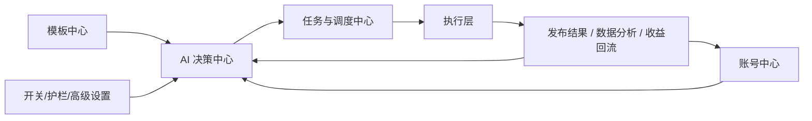

# AI 控制台核心模块详细设计文档

## 1. 文档定位

本文档细化 4 个对生产系统最关键的控制台模块：

- 模板中心
- AI 决策中心
- 账号中心
- 开关、护栏与高级设置中心

这 4 个模块的设计原则是：

- 不复制旧软件的人工大表单
- 让 AI 执行有边界、有模板、有解释、有人工兜底
- 让运营改“目标和策略”，而不是天天改底层参数
- 让技术只在低频场景下接触高级引擎配置

本文档是开发文档，目标是直接指导：

- 前端页面与交互
- 后端 API 与表结构
- Agent / Orchestrator 接入方式
- 权限与审计

---

## 2. 四大模块在系统中的角色



角色分工：

- 模板中心
  提供 AI 和人工都能复用的标准配置资产
- AI 决策中心
  定义目标、权重、放量、止损和决策解释
- 账号中心
  承接账号运营、账号健康、MCN 绑定与结算视图
- 开关/护栏/高级设置中心
  决定系统能不能做、能做到什么边界、底层怎么跑

---

## 3. 模块一：模板中心

## 3.1 为什么必须独立

旧软件的问题是把这些内容全部堆在主页面：

- 视频处理参数
- 水印参数
- 发布参数
- 上传通道
- 描述模板
- 平台模式

这会导致：

- 日常运营页面越来越长
- 参数重复填写
- AI 无法稳定复用配置
- 一次修改影响不可控

因此模板中心必须独立，让“主页面只选模板，不改底层参数”。

## 3.2 模板中心目标

- 统一管理所有可复用配置资产
- 支持版本化、审批、发布、回滚
- 支持多层继承和局部覆盖
- 让 Orchestrator 引用 `template_id`，而不是输出整坨底层参数

## 3.3 模板类型定义

建议第一阶段支持 8 类模板：

1. `source_fetch_template`
   剧源提取模板
2. `collection_template`
   采集模板
3. `processing_template`
   视频处理模板
4. `watermark_template`
   水印模板
5. `publish_template`
   发布模板
6. `schedule_template`
   发布时间与节奏模板
7. `account_group_template`
   账号分组与投放模板
8. `manual_review_template`
   人工审核规则模板

## 3.4 模板对象模型

建议核心对象：

- `template_id`
- `template_type`
- `template_name`
- `scope_level`
- `scope_value`
- `status`
- `version`
- `parent_template_id`
- `config_json`
- `validation_rules_json`
- `rollout_policy_json`
- `created_by`
- `approved_by`
- `published_at`
- `updated_at`

字段说明：

- `scope_level`
  `system / org / business_line / account_group / account / experiment`
- `status`
  `draft / review / active / deprecated / archived`
- `parent_template_id`
  用于模板继承
- `config_json`
  具体模板配置内容

## 3.5 模板继承与覆盖规则

建议继承顺序：

```text
system -> org -> business_line -> account_group -> account -> experiment_override
```

规则：

- 默认读取最近一层已激活模板
- 下层只允许覆盖允许覆盖的字段
- 高风险字段不能在实验层直接覆盖
- 执行时要记录“最终解析后的模板快照”

## 3.6 模板中心页面结构

建议拆成 4 个页面：

### 3.6.1 模板列表页

展示：

- 模板名称
- 模板类型
- 作用范围
- 当前版本
- 状态
- 最近更新时间
- 被引用次数
- 最近 7 天成功率

操作：

- 新建模板
- 复制模板
- 发布模板
- 回滚模板
- 查看引用对象
- 查看变更历史

### 3.6.2 模板编辑页

能力：

- 表单编辑
- JSON 高级编辑
- 字段级校验
- 模板预览
- 差异比对

要求：

- 普通运营只能改允许暴露的字段
- 高级字段需管理员或技术权限

### 3.6.3 模板版本对比页

展示：

- 版本号
- 变更人
- 变更时间
- 变更摘要
- 字段 diff
- 回滚入口

### 3.6.4 模板使用分析页

展示：

- 被哪些账号组使用
- 被哪些实验使用
- 被哪些发布批次使用
- 成功率
- 平均播放
- 平均收益
- 风险告警次数

## 3.7 模板中心的关键交互

1. 新建模板草稿
2. 通过验证
3. 提交审核
4. 审核通过后发布
5. AI 和人工执行引用新版本
6. 如出现异常，可按版本快速回滚

## 3.8 模板中心 API 建议

- `GET /api/templates`
- `POST /api/templates`
- `GET /api/templates/{template_id}`
- `PUT /api/templates/{template_id}`
- `POST /api/templates/{template_id}/publish`
- `POST /api/templates/{template_id}/rollback`
- `GET /api/templates/{template_id}/versions`
- `GET /api/templates/{template_id}/usage`
- `POST /api/templates/resolve`

## 3.9 模板中心与 AI 的接入规则

Orchestrator 不应直接产出底层配置，而应产出：

```json
{
  "processing_template_id": "proc_v3_001",
  "watermark_template_id": "wm_default_002",
  "publish_template_id": "pub_mcn_firefly_003",
  "schedule_template_id": "schedule_evening_001"
}
```

这样好处是：

- 决策更稳定
- 执行更可审计
- 模板升级不必改 Agent 输出协议

---

## 4. 模块二：AI 决策中心

## 4.1 当前问题

如果 AI 决策中心只展示“最近决策结果”，它就只是日志页，不是控制中心。

我们需要它具备两类能力：

- 观测 AI
- 配置 AI

## 4.2 AI 决策中心目标

- 配 AI 的业务目标
- 配决策权重
- 配探索、放量和止损
- 看每次决策为什么这么做
- 看哪些规则拦住了决策
- 支持仿真、灰度和回滚

## 4.3 AI 决策中心页面结构

建议拆成 6 个子页：

1. `总控总览`
2. `目标配置`
3. `策略权重`
4. `放量与止损`
5. `决策追踪`
6. `策略记忆与学习`

## 4.4 子页一：总控总览

展示：

- 今日目标模式
- 当前生效策略包
- 今日 AI 生成批次数
- 被规则阻断的任务数
- 自动放量次数
- 自动止损次数
- 等待人工审核数

操作：

- 立即重新规划
- 切换生效策略包
- 暂停自动放量
- 暂停自动发布

## 4.5 子页二：目标配置

目标配置不应是自由文本，而应是结构化配置。

建议对象：

- `objective_profile_id`
- `profile_name`
- `status`
- `target_weights_json`
- `constraint_json`
- `effective_from`
- `effective_to`

建议目标维度：

- 收益最大化
- 起号成功率
- 稳定通过率
- 播放增长
- 风险控制
- 探索新剧/新策略
- MCN 结算确定性

示例：

```json
{
  "revenue_weight": 0.35,
  "warmup_weight": 0.15,
  "stability_weight": 0.20,
  "growth_weight": 0.10,
  "exploration_weight": 0.10,
  "risk_weight": 0.10
}
```

## 4.6 子页三：策略权重

这里管理“AI 如何打分”。

建议支持的权重对象：

- 剧种权重
- 时间窗口权重
- 模板权重
- 账号阶段权重
- 历史表现权重
- 平台热点权重
- MCN 绑定可靠性权重

页面能力：

- 可视化权重滑杆
- 历史版本对比
- 按账号组单独配置
- 按实验阶段单独配置

## 4.7 子页四：放量与止损

这页是 AI 自动系统最核心的控制页之一。

建议拆成两块：

### 放量策略

- 放量触发条件
- 放量对象范围
- 放量倍数上限
- 放量冷却期
- 同剧多账号并发上限
- 单账号日增量上限

### 止损策略

- 连续低播放止损
- 连续失败止损
- 收益跌破阈值止损
- 审核失败率异常止损
- MCN 绑定异常止损
- 手工强制止损

## 4.8 子页五：决策追踪

每次决策应能回放：

- 输入上下文
- 命中的模板
- 命中的记忆
- 目标权重
- 规则拦截项
- 最终执行计划
- 后续实际结果

这页是“AI 可解释性”的核心。

## 4.9 子页六：策略记忆与学习

展示：

- 最近提炼出的经验
- 置信度
- 生效范围
- 失效条件
- 最近被命中次数
- 最近 7 天效果变化

操作：

- 标记采用
- 标记弃用
- 降低权重
- 拉入人工复核

## 4.10 AI 决策中心核心对象

建议增加：

- `objective_profiles`
- `strategy_weight_profiles`
- `scale_policies`
- `stop_loss_policies`
- `decision_simulations`
- `decision_trace_views`

## 4.11 AI 决策中心关键 API

- `GET /api/ai/overview`
- `GET /api/ai/objective-profiles`
- `POST /api/ai/objective-profiles`
- `GET /api/ai/weight-profiles`
- `POST /api/ai/weight-profiles`
- `GET /api/ai/scale-policies`
- `GET /api/ai/stop-loss-policies`
- `POST /api/ai/simulate`
- `GET /api/ai/decisions`
- `GET /api/ai/decisions/{decision_id}`
- `POST /api/ai/decisions/replan`

## 4.12 决策变更的安全要求

- 任何目标和权重变更都必须审计
- 高风险策略支持灰度生效
- 支持设置生效时间
- 支持回滚到上一个版本

---

## 5. 模块三：账号中心

## 5.1 当前问题

旧软件的账号页混合了：

- 浏览器账号
- 设备账号
- `no_device`
- `web_*`
- 登录状态
- 成功失败
- 云端同步

但没有把账号运营和结算链路拆开。

新系统的账号中心必须一分为二：

- 账号运营视图
- MCN / 绑定 / 结算视图

## 5.2 账号中心目标

- 管理账号生命周期
- 管理授权与健康
- 管理账号分组与实验归属
- 管理 MCN 绑定、邀约、收益与结算凭证

## 5.3 账号中心信息模型

建议前端不要把“账号”当成单一对象，而是组合视图：

- 平台账号
- 浏览器授权
- 设备资源
- 账号运营状态
- MCN 成员关系
- 结算凭证

## 5.4 页面结构建议

建议拆成 2 个一级视图。

### 5.4.1 账号运营视图

面向运营和总控，展示：

- 账号名称
- 平台 UID
- 账号阶段
- 账号类型
- 健康状态
- 今日已发
- 近 7 天成功率
- 当前实验组
- 当前放量状态
- 最近异常

操作：

- 暂停 / 恢复
- 调整阶段
- 变更账号组
- 加入实验
- 加入放量池
- 标记重新登录

### 5.4.2 MCN / 绑定 / 结算视图

面向运营、财务和管理员，展示：

- MCN 机构
- owner_code
- Token 状态
- WebSocket / heartbeat 状态
- 绑定状态
- 邀约状态
- 最近校验时间
- 收益快照
- 分佣比例
- 结算凭证状态

操作：

- 立即同步
- 发起邀约
- 轮询邀约记录
- 查看绑定快照
- 查看收益快照
- 查看结算凭证

## 5.5 账号详情页结构

建议 Tab：

1. 基本信息
2. 授权与登录
3. 运营表现
4. 发布历史
5. 实验与放量
6. MCN 绑定
7. 收益与结算
8. 审计日志

## 5.6 账号生命周期状态

建议统一状态：

- `new`
- `imported`
- `authorized`
- `testing`
- `warming`
- `formal`
- `scaling`
- `cooling`
- `paused`
- `disabled`

运营状态不应与 MCN 状态混在一起。

## 5.7 MCN 相关状态

建议单独管理：

- `bind_status`
  `bound / unbound / pending_confirm / unknown`
- `invite_status`
  `none / invited / pending_confirm / confirmed / failed`
- `settlement_proof_status`
  `ready / missing / stale / abnormal`

## 5.8 账号中心关键 API

- `GET /api/accounts`
- `GET /api/accounts/{account_id}`
- `POST /api/accounts/{account_id}/pause`
- `POST /api/accounts/{account_id}/resume`
- `POST /api/accounts/{account_id}/change-stage`
- `POST /api/accounts/{account_id}/relogin`
- `GET /api/accounts/{account_id}/performance`
- `GET /api/accounts/{account_id}/mcn`
- `GET /api/accounts/{account_id}/settlement`

## 5.9 权限建议

- `viewer`
  只读
- `operator`
  可改运营状态，不可改高风险 MCN 绑定动作
- `finance`
  可查看收益和结算，不可改运营状态
- `admin`
  可改绑定、同步、邀约和高风险操作

---

## 6. 模块四：开关、护栏与高级设置中心

## 6.1 为什么不能只做总开关

如果这里只有：

- 采集开关
- 发布开关
- AI 开关

那它只是简单控制面板，不足以支撑 AI 自动系统。

我们还需要：

- 护栏
- 风险阈值
- 引擎参数
- 系统工具

## 6.2 建议正式命名

建议把原“开关与配置中心”升级为：

**“开关、护栏与高级设置中心”**

## 6.3 页面结构建议

建议拆成 4 个子页：

1. `运行开关`
2. `策略与护栏`
3. `高级引擎设置`
4. `系统工具箱`

## 6.4 子页一：运行开关

这是最直接的运行控制面板。

建议开关：

- 采集开关
- 下载开关
- 剪辑开关
- 发布开关
- AI 决策开关
- 自动放量开关
- 自动止损开关
- MCN 自动同步开关
- 邀约自动轮询开关

要求：

- 显示当前状态
- 显示最近一次变更人
- 显示最近一次变更时间
- 支持紧急一键暂停

## 6.5 子页二：策略与护栏

这页决定 AI 的运行边界。

建议配置项：

- 每日发布上限
- 单账号发布上限
- 起号期每日上限
- 同剧扩量账号数上限
- 放量冷却期
- 禁发时间段
- 审核失败率阈值
- 连续失败熔断阈值
- 连续低播放降量阈值
- MCN 未绑定阻断
- 邀约待确认阻断
- 收益异常触发人工审核

## 6.6 子页三：高级引擎设置

这页承接旧软件中那些低频但必要的底层参数。

建议分类：

### 去重引擎

- 去重算法
- 质量参数
- 图层模式
- 融图配置

### 处理引擎

- 3:4 前处理
- MD5 策略
- CPU / GPU 模式
- FFmpeg 参数

### 发布引擎

- API 上传优先级
- 浏览器上传兜底策略
- 重试次数
- 通道切换规则

### AI 引擎

- Provider
- Model
- Prompt 版本
- 学习周期
- 决策超时

要求：

- 默认折叠
- 仅技术/管理员可改
- 所有变更必须记录审计

## 6.7 子页四：系统工具箱

承接旧软件顶部那些低频操作。

建议放入：

- 扫描设备
- 导入配置
- 导出配置
- 导入收藏
- 导出收藏
- 文件锁清理
- 浏览器环境修复
- 重建 MCN 连接
- Worker 健康检查

## 6.8 配置对象模型

建议增加：

- `feature_switches`
- `guardrail_policies`
- `engine_config_profiles`
- `system_tool_runs`

## 6.9 开关与护栏中心 API

- `GET /api/config/switches`
- `POST /api/config/switches/{switch_key}`
- `GET /api/config/guardrails`
- `POST /api/config/guardrails`
- `GET /api/config/engine-profiles`
- `POST /api/config/engine-profiles`
- `POST /api/tools/run`
- `GET /api/tools/runs`

## 6.10 紧急控制要求

建议提供 3 个紧急动作：

- `一键暂停自动发布`
- `一键暂停自动放量`
- `一键切换规则模式`

---

## 7. 四大模块之间的联动流程

## 7.1 新建自动投放策略

1. 在模板中心创建采集、处理、发布模板
2. 在 AI 决策中心配置目标、权重、放量和止损
3. 在账号中心选择适用账号组和 MCN 约束范围
4. 在护栏中心配置风险边界
5. Orchestrator 开始生成计划并执行

## 7.2 AI 自动放量

1. AI 决策中心命中放量条件
2. 系统读取模板中心的放量模板和发布时间模板
3. 账号中心筛选符合条件且 MCN 绑定正常的账号
4. 护栏中心做边界校验
5. 写入任务批次

## 7.3 触发止损

1. 发布结果或收益回流触发异常
2. AI 决策中心命中止损规则
3. 护栏中心阻断继续放量
4. 人工处理中心生成审核项
5. 账号中心同步账号状态变化

---

## 8. 开发优先级建议

建议分 3 期做。

## Phase 1

- 账号中心拆成“运营视图 + MCN/结算视图”
- 开关中心拆成“运行开关 + 策略与护栏”
- AI 决策中心补“目标配置 + 决策追踪”

## Phase 2

- 模板中心上线
- AI 决策中心补“策略权重 + 放量与止损”
- 系统工具箱上线

## Phase 3

- 模板继承与版本回滚
- AI 仿真与灰度
- 收益与结算闭环联动

---

## 9. 最终结论

这 4 个模块是新系统从“自动化脚本集合”升级到“AI 自动运营中台”的关键。

如果这 4 个模块做对了：

- 主页面会变短
- AI 会更可控
- 运营会更好上手
- 技术参数不会污染业务页面
- MCN / 结算 / 账号 / 策略会真正打通

如果这 4 个模块做不好：

- 旧软件的大表单问题会重新出现
- AI 只能变成“看起来很智能，实际上不好控”
- 后期越做越乱
