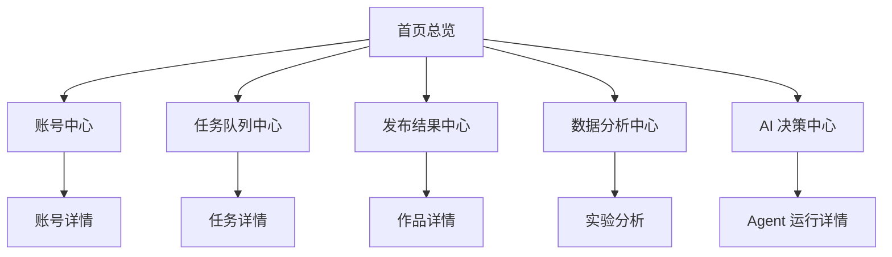

# KS 短剧矩阵系统控制台页面与功能原型文档

## 1. 文档目标

本文档定义 `D:\ks_automation` 下一阶段本地 Web 控制台的页面结构、核心模块、操作流程和最小可用原型范围。

目标：

- 让当前脚本式系统进入“可视化运营”
- 让任务、账号、策略、结果、异常都能被看见和管理
- 为后续 `dashboard/` 开发提供页面蓝图

补充原则：

- 旧版“火视界短剧”界面只作为能力参考，不作为布局参考
- 旧软件的大量人工参数要拆解为模板、策略、护栏和高级设置
- 新界面必须服务 AI 自动控制，而不是回到“人工点按钮跑流程”

---

## 2. 控制台定位

控制台不是单纯看日志，而是要承担这 5 件事：

- 看状态
- 控任务
- 管账号
- 看结果
- 调策略

建议第一版采用：

- 本地 Web 控制台
- Chrome 打开即可使用
- 后端可基于 FastAPI

控制台应承担 4 层职责：

- 观测层
  看系统、看任务、看结果、看收益
- 控制层
  控目标、控策略、控开关、控风险
- 配置层
  配模板、配资源、配 Provider、配 MCN
- 接管层
  处理异常、审核拦截、人工兜底

---

## 2.1 旧软件功能继承原则

对旧软件截图分析后，建议这样处理：

- 保留“能力”
  例如采集、分配、处理、发布、收益、Cookie、作者库、并发控制
- 不保留“页面组织方式”
  旧软件把大量低频参数堆在同一页，这不适合 AI 系统
- 高频配置前置
  目标、模板、护栏、异常处理放前台
- 低频配置收纳
  GPU、MD5、3:4、字体、水印位置、文件锁等收进高级设置
- 人工执行改成人工接管
  默认 AI 自动跑，人工只处理例外

---

## 3. 页面总结构

建议页面导航：

1. 首页总览
2. 账号中心
3. MCN 通讯中心
4. 剧源中心
5. 榜单中心
6. 素材处理中心
7. 任务队列中心
8. 发布结果中心
9. 数据分析中心
10. 策略实验中心
11. 模板中心
12. AI 决策中心
13. 人工处理中心
14. 开关、护栏与高级设置中心
15. 异常告警中心

---

## 4. 总体信息架构图



---

## 5. 首页总览

## 5.1 目标

给运营和技术一个“一眼看系统活不活、今天跑得怎么样”的入口。

## 5.2 关键模块

- 今日任务统计卡片
- 今日发布统计卡片
- 账号健康统计卡片
- MCN 通讯状态卡片
- 队列状态卡片
- 热门剧趋势卡片
- 风险告警卡片

## 5.3 关键指标

- 今日待执行任务数
- 今日运行中任务数
- 今日成功发布数
- 今日失败发布数
- 发布成功率
- 异常账号数
- 熔断账号数
- MCN 在线会话数
- 待确认邀约数
- Top 热门剧

## 5.4 页面原型

```text
+--------------------------------------------------------------+
| 系统总览                                                     |
+--------------------------------------------------------------+
| 今日任务 | 运行中 | 发布成功 | 发布失败 | 异常账号 | 熔断账号 |
+--------------------------------------------------------------+
| 队列状态趋势图            | 热门剧趋势图                    |
+--------------------------------------------------------------+
| 最近告警                  | 今日决策摘要                    |
+--------------------------------------------------------------+
```

---

## 6. 账号中心

## 6.1 目标

集中管理账号、授权、健康、生命周期、分组和当前运行状态。

账号中心要明确拆成两条主线：

- `账号运营`
  管起号、正式运营、放量、健康、实验、暂停
- `MCN/绑定/结算`
  管邀约、绑定、收益、分佣、结算凭证

## 6.2 列表字段建议

- 账号 ID
- 账号名称
- 设备
- 快手 UID
- 账号阶段
- 账号类型
- 登录状态
- MCN 绑定状态
- 健康状态
- 结算凭证状态
- 今日已发
- 近 7 天成功率
- 当前开关状态
- 最近异常

## 6.3 操作建议

- 查看详情
- 暂停账号
- 恢复账号
- 重新登录标记
- 调整账号阶段
- 加入实验组
- 加入放大量组

## 6.4 详情页建议

建议一级视图拆成两栏：

- `账号运营视图`
- `MCN/绑定/结算视图`

详情页建议分 8 个 Tab：

- 基本信息
- 授权信息
- 运营表现
- 发布历史
- 健康与风险
- 实验与放量
- MCN 绑定
- 收益与结算
- 审计日志

## 6.5 MCN 通讯与结算子页建议

建议账号中心内置一个 `MCN` 子页，后续也可以独立拆成单页：

- MCN 登录态
- Token 过期时间
- WebSocket / heartbeat 状态
- 最近一次同步时间
- 绑定状态
- 邀约状态
- 收益快照

关键操作建议：

- 立即同步
- 重建连接
- 发起邀约
- 轮询邀约记录
- 查看绑定快照
- 查看结算凭证

页面原型：

```text
+--------------------------------------------------------------------+
| MCN 通讯中心                                                        |
+--------------------------------------------------------------------+
| 登录态 | Token到期 | WS状态 | 最近心跳 | 最近同步 | 待确认邀约数     |
+--------------------------------------------------------------------+
| 账号列表: 账号 | UID | owner_code | 绑定状态 | 邀约状态 | 结算状态     |
+--------------------------------------------------------------------+
| 右侧抽屉: 绑定快照 / 邀约记录 / 收益快照 / 最近异常 / 操作按钮       |
+--------------------------------------------------------------------+
```

---

## 7. 剧源中心

## 7.1 目标

管理 `drama_links`、采集结果和剧源状态。

## 7.2 列表字段建议

- 剧名
- 平台
- 链接模式
- 状态
- 使用次数
- 最后使用时间
- 热度分
- 分配账号/设备
- 下载状态

## 7.3 操作建议

- 新增剧源
- 批量导入
- 标记归档
- 指定给账号/组
- 查看历史表现

---

## 8. 榜单中心

## 8.1 目标

展示各平台短剧热榜与变化趋势。

## 8.2 页面组件

- 平台筛选
- 榜单类型筛选
- 热度趋势图
- 榜单快照表
- 新上榜 / 跌榜提醒

## 8.3 列表字段

- 榜单时间
- 平台
- 榜单类型
- 剧名
- 排名
- 热度
- 关联剧源

---

## 9. 素材处理中心

## 9.1 目标

查看下载、剪辑、去重、质检链路。

## 9.2 列表字段

- 任务 ID
- 账号
- 剧名
- 原素材
- 策略名
- 处理状态
- 耗时
- 输出路径
- 风险评分

## 9.3 关键操作

- 重跑处理
- 切换策略
- 人工标记通过/失败
- 查看输出文件

---

## 10. 任务队列中心

## 10.1 目标

让当前 `task_queue.py` 变成可视化可控。

## 10.2 页面模块

- 队列总体状态
- 状态过滤
- 任务列表
- 任务依赖图
- 熔断状态
- 重试与死信列表

## 10.3 任务列表字段

- 任务 ID
- 批次 ID
- 类型
- 账号
- 剧名
- 优先级
- 状态
- 重试次数
- depends_on
- 创建时间
- 开始时间
- 完成时间
- 错误信息

## 10.4 操作建议

- 手动重试
- 取消任务
- 提升优先级
- 转人工处理
- 查看原始参数
- 查看执行结果 JSON

## 10.5 页面原型

```text
+--------------------------------------------------------------------+
| 队列状态: pending / queued / running / waiting_retry / failed      |
+--------------------------------------------------------------------+
| 筛选栏: 任务类型 | 状态 | 账号 | 批次 | 时间范围                   |
+--------------------------------------------------------------------+
| 任务列表表格                                                     |
| ID | 类型 | 账号 | 剧名 | 优先级 | 状态 | 重试 | 依赖 | 操作      |
+--------------------------------------------------------------------+
| 右侧抽屉: 任务详情 / 参数 / 日志 / 结果 / 依赖链                   |
+--------------------------------------------------------------------+
```

---

## 10.6 批量操作与审计建议

任务中心建议支持批量操作，但必须有审计与确认：

- 批量重试
- 批量取消
- 批量提优先级
- 批量转人工

要求：

- 所有批量操作弹二次确认
- 所有批量操作写 `audit_logs`
- 对 `running` 状态任务默认禁止批量取消，除非管理员确认

---

## 11. 发布结果中心

## 11.1 目标

集中看发布结果、作品链接、验证状态和异常。

## 11.2 列表字段

- 发布时间
- 账号
- 剧名
- 作品 ID
- 分享链接
- 发布通道
- 发布状态
- 验证状态
- MCN 校验状态
- 失败原因
- 24 小时播放

## 11.3 操作建议

- 查看作品详情
- 重新验证
- 标记异常
- 查看关联决策

---

## 11.4 结果详情页建议

详情页建议展示：

- 发布请求摘要
- 发布结果摘要
- 作品链接与作品 ID
- 验证结果
- 关联 `decision_id`
- 关联任务链路
- 最近 7 天表现趋势

---

## 12. 数据分析中心

## 12.1 目标

展示运营结果和策略效果。

## 12.2 分析页面建议

1. 账号分析页
2. 剧种分析页
3. 发布时间分析页
4. 去重策略分析页
5. 通道 A/B 成功率页

## 12.3 核心指标

- 播放量
- 点赞率
- 评论率
- 分享率
- 收益
- CPM
- 发布成功率
- 审核通过率

---

## 13. 策略实验中心

## 13.1 目标

支撑“测试 -> 验证 -> 放大”的运营闭环。

## 13.2 列表字段

- 实验编码
- 实验名称
- 变量
- 组别
- 样本目标
- 样本进度
- 成功指标
- 当前状态
- 是否可放大

## 13.3 操作建议

- 新建实验
- 查看实验详情
- 手动结束实验
- 转为放大策略

## 13.4 详情页建议

展示：

- 实验定义
- 组别分配
- 样本完成率
- 结果比较图
- 结论与建议

---

## 14. 模板中心

## 14.1 目标

把旧软件里容易堆到主页面的处理、水印、发布、采集等参数统一收进模板资产中心。

## 14.2 模板类型建议

- 采集模板
- 剧源提取模板
- 处理模板
- 水印模板
- 发布模板
- 排期模板
- 账号组模板

## 14.3 页面模块

- 模板列表
- 模板编辑器
- 版本历史
- 引用分析
- 版本对比

## 14.4 列表字段

- 模板名称
- 模板类型
- 作用范围
- 当前版本
- 状态
- 最近更新时间
- 被引用次数
- 最近 7 天成功率

## 14.5 操作建议

- 新建模板
- 复制模板
- 发布模板
- 回滚模板
- 查看引用对象
- 查看版本差异

---

## 15. AI 决策中心

## 15.1 目标

AI 决策中心不能只展示结果，还要承接目标配置、权重配置、放量控制、止损控制和决策解释。

## 15.2 页面模块

- 总控总览
- 目标配置
- 策略权重
- 放量与止损
- 决策追踪
- 策略记忆命中情况

## 15.3 关键配置建议

- 目标权重
- 探索比例
- 放量倍率上限
- 放量冷却期
- 止损阈值
- 生效策略包
- 当前 Provider / Prompt 版本

## 15.4 操作建议

- 查看原始输入输出 JSON
- 重新触发决策
- 切换目标策略包
- 模拟一次决策
- 暂停自动放量
- 切换规则模式
- 查看命中的历史记忆

---

## 15.5 决策详情页建议

建议展示：

- 本次总控输入摘要
- 3 个职能 Agent 输出摘要
- 规则阻断项
- 最终执行计划
- 人工审核项
- 关联任务批次

---

## 16. 人工处理中心

## 16.1 目标

把 `waiting_manual`、授权异常、素材异常、规则冲突统一收口，避免人工介入散落在多个页面。

## 16.2 页面模块

- 待处理列表
- 已处理列表
- 按原因筛选
- 按账号筛选
- 处理详情抽屉
- 操作留痕

## 16.3 列表字段

- Review ID
- 来源类型
- 来源对象
- 账号
- 原因
- 建议动作
- 当前状态
- 指派人
- 创建时间

## 16.4 处理动作建议

- 立即重试
- 转人工发布
- 标记重新登录
- 取消任务
- 覆盖规则
- 改派账号

## 16.5 页面原型

```text
+--------------------------------------------------------------------+
| 人工处理中心                                                        |
+--------------------------------------------------------------------+
| 筛选栏: 原因 | 状态 | 账号 | 指派人 | 时间范围                     |
+--------------------------------------------------------------------+
| ReviewID | 来源 | 账号 | 原因 | 建议动作 | 状态 | 指派人 | 操作     |
+--------------------------------------------------------------------+
| 右侧抽屉: 任务上下文 / 决策上下文 / 历史日志 / 处理动作             |
+--------------------------------------------------------------------+
```

---

## 17. 开关、护栏与高级设置中心

## 17.1 目标

给你“6 层开关”和核心策略配置一个统一入口。

但这里不能只做几个总开关，还要承接 AI 系统真正需要的配置分层。

## 17.2 页面拆分建议

- `运行开关`
- `策略与护栏`
- `高级引擎设置`
- `系统工具箱`

## 17.3 建议开关

- 采集开关
- 下载开关
- 剪辑开关
- 发布开关
- AI 决策开关
- 自动放大开关

## 17.4 AI 控制系统配置分层建议

### L1 一次性初始化配置

- 设备接入
- 账号接入
- Cookie / Bearer 初始化
- MCN 接入
- 存储路径
- GPU / 浏览器环境
- 导入导出配置

### L2 业务模板配置

- 采集模板
- 剧源提取模板
- 视频处理模板
- 水印模板
- 发布模板
- 账号分组模板

### L3 AI 策略配置

- 收益优先级
- 起号优先级
- 探索比例
- 实验样本量门槛
- 放大倍率上限
- 自动止损条件
- 热剧跟进策略
- 阶段迁移规则

### L4 运行护栏配置

- 每日发布上限
- 账号发布间隔
- 禁发时间段
- 风险账号限制
- MCN 绑定门禁
- 邀约待确认门禁
- 人工审核触发阈值
- 熔断策略

### L5 高级引擎配置

- 去重算法
- 3:4 前处理
- MD5 策略
- CPU / GPU 模式
- 上传通道优先级
- Worker 并发
- Prompt 版本
- 学习周期

## 17.5 配置项建议

- 并发数
- 发布窗口
- 同账号发布间隔
- 任务最大重试次数
- 通道默认策略
- 去重默认策略
- 实验默认样本量
- 放大阈值

## 17.6 页面结构建议

“开关、护栏与高级设置中心”建议拆成 4 个子页，不要继续做大杂烩：

- `运行开关`
  面向值班与日常控制
- `策略与护栏`
  面向运营和总控
- `高级引擎设置`
  面向技术运维
- `系统工具箱`
  面向低频运维动作

---

## 18. 异常告警中心

## 18.1 目标

把系统异常、账号异常、发布异常统一收口。

## 18.2 告警类型

- 账号授权即将过期
- MCN 会话断开或心跳超时
- 邀约长时间待用户确认
- 发布失败率升高
- 队列积压
- 某策略连续失效
- 设备离线
- 熔断触发

## 18.3 列表字段

- 告警时间
- 告警级别
- 类型
- 来源模块
- 目标对象
- 描述
- 当前状态

---

## 19. 角色视图建议

建议至少支持 3 种视图：

- 运营视图
  重点看剧源、实验、结果、账号表现
- 技术视图
  重点看队列、日志、异常、worker 状态
- 总控视图
  重点看整体 KPI、Agent 决策、风险和开关

---

## 19.1 权限建议

建议最少区分 3 类权限：

- `viewer`
  只能看，不能改
- `operator`
  可处理任务、账号、人工审核
- `admin`
  可改开关、改策略、做批量危险操作

危险操作建议仅 `admin` 可用：

- 批量取消任务
- 覆盖规则
- 修改全局开关
- 修改并发和发布窗口

---

## 20. MVP 页面范围

第一版建议先做：

1. 首页总览
2. 账号中心
3. MCN 通讯中心
4. 模板中心
5. 任务队列中心
6. 发布结果中心
7. 人工处理中心
8. AI 决策中心
9. 开关、护栏与高级设置中心

这 9 页最能直接提高当前系统可运营性。

---

## 21. 前端组件建议

技术建议：

- `React + Ant Design`

通用组件建议：

- `StatCard`
- `StatusTag`
- `QueueTable`
- `TaskDrawer`
- `AgentRunDrawer`
- `ManualReviewDrawer`
- `TrendChart`
- `FilterBar`
- `SwitchPanel`

---

## 22. 页面实时刷新与交互建议

建议按页面重要性区分刷新方式：

- 首页总览
  15~30 秒轮询
- 任务队列中心
  5~10 秒轮询；后续可升级 WebSocket
- 人工处理中心
  10~15 秒轮询
- MCN 通讯中心
  5~10 秒轮询；WebSocket 在线时实时推送
- 发布结果中心
  30 秒轮询
- AI 决策中心
  30~60 秒轮询
- 配置中心
  手动刷新即可

建议交互原则：

- 列表页所有高风险操作都需要二次确认
- 抽屉详情页必须显示最近一次更新时间
- 批量操作执行后必须展示成功/失败明细

---

## 23. 页面与后端接口对应建议

- 首页总览
  - `/api/dashboard/summary`
- 账号中心
  - `/api/accounts`
  - `/api/accounts/{account_id}`
- MCN 通讯中心
  - `/api/mcn/sessions`
  - `/api/mcn/bindings`
  - `/api/mcn/invitations`
  - `/api/mcn/sync`
  - `/api/mcn/heartbeat`
- 模板中心
  - `/api/templates`
  - `/api/templates/{template_id}`
  - `/api/templates/{template_id}/versions`
- 任务队列中心
  - `/api/tasks`
  - `/api/tasks/{task_id}`
  - `/api/tasks/{task_id}/retry`
- 发布结果中心
  - `/api/publish/results`
- 人工处理中心
  - `/api/manual-reviews`
  - `/api/manual-reviews/{review_id}`
  - `/api/manual-reviews/{review_id}/resolve`
- AI 决策中心
  - `/api/ai/overview`
  - `/api/ai/objective-profiles`
  - `/api/ai/weight-profiles`
  - `/api/decisions`
- 开关、护栏与高级设置中心
  - `/api/config/switches`
  - `/api/config/guardrails`
  - `/api/config/engine-profiles`
  - `/api/tools/runs`

---

## 24. 结论

控制台第一版不要追求“什么都能配”，而是要优先把下面这些高频动作可视化：

- 看账号
- 看任务
- 处理异常
- 看结果
- 看决策
- 控开关

只要这 5 件事做顺了，当前 `D:\ks_automation` 就能从“脚本工具”真正进入“可管理的生产系统”。
