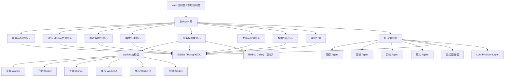
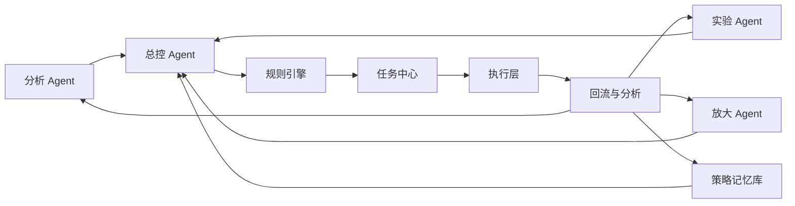
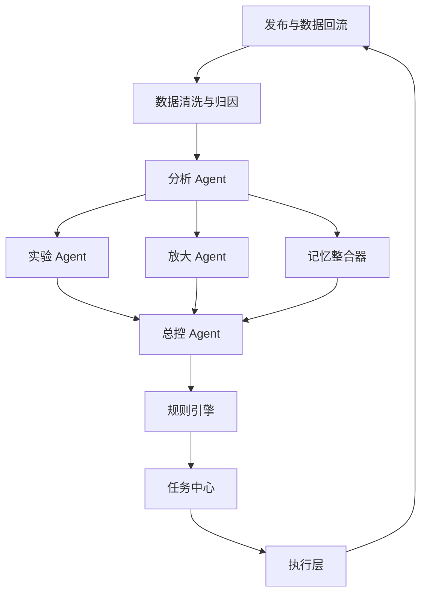
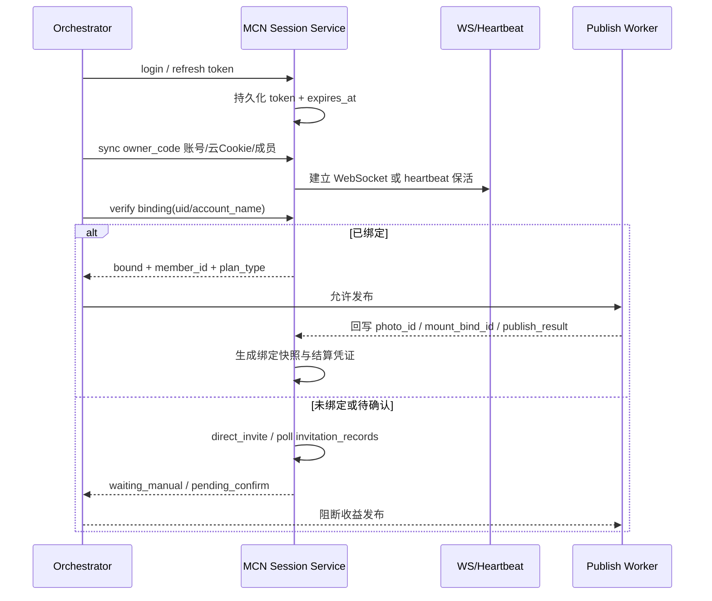
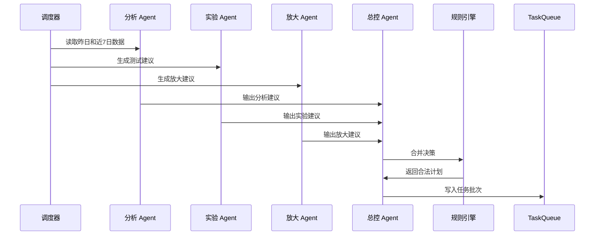

# KS 短剧矩阵系统生产级演进规划文档

## 1. 文档定位

本文档不是从零重新设计，而是**明确以 `D:\ks_automation` 现有工程为基础**，将当前已经实现的单体自动化能力，逐步演进为可生产运行的短剧矩阵系统。

文档目标：

- 基于现有目录、模块、脚本、数据库和文档进行统一规划
- 识别哪些能力已经具备，哪些能力需要补齐，哪些模块需要重构
- 给出生产级架构、4 Agent 协作方式、记忆系统、学习迭代闭环、模块拆分、技术路线和分阶段实施方案

---

## 2. 现有工程基础评估

## 2.1 当前工程结构

当前项目已经具备如下基础目录：

```text
D:\ks_automation
├─ config
├─ core
├─ database
├─ docs
├─ libs
├─ logs
├─ scripts
├─ strategies
└─ tools
```

## 2.2 当前已存在的核心能力

根据现有代码与文档，当前已经具备较强基础，不是空白项目：

- `core/cookie_manager.py`
  账号 Cookie 管理基础
- `core/mcn_client.py`
  MCN 调用基础
- `core/sig_service.py`
  签名相关服务
- `core/drama_collector.py`
  短剧采集基础
- `core/video_downloader.py`
  视频下载基础
- `core/video_processor.py`
  视频处理、剪辑、去重基础
- `core/publisher.py`
  HTTP 发布通道基础
- `core/selenium_publisher.py`
  Selenium 发布保底通道基础
- `core/task_queue.py`
  队列、并发、重试、熔断的雏形
- `core/decision_engine.py`
  已经包含 LangGraph/规则/混合决策雏形
- `strategies/`
  去重策略体系雏形
- `database/sql/`
  SQLite schema 和迁移脚本
- `scripts/run_pipeline.py`
  单链路运行脚本
- `scripts/run_batch.py`
  批量运行脚本

结论：

- 现有工程已经具备 `采集 -> 下载 -> 剪辑/去重 -> 发布 -> 决策` 的基础闭环
- 现在缺的不是“会不会做”，而是“怎么把现有能力升级成矩阵级、生产级、可视化、可持续优化的系统”

---

## 3. 当前系统定位与未来系统定位

## 3.1 当前系统定位

当前更接近：

- 自动化流水脚本集合
- 单机驱动的业务执行系统
- 有决策引擎雏形，但还不是完整中台
- 有任务队列基础，但还不是统一生产调度中心

## 3.2 目标系统定位

目标应升级为：

**“短剧矩阵运营中台 + AI 决策中枢 + 自动执行引擎 + 记忆与学习系统 + 可视化控制台”**

不是只做自动发布，而是做：

- 账号中心
- MCN 通讯与结算中心
- 剧源中心
- 素材中心
- 执行队列中心
- 发布与回流中心
- AI 决策中心
- 策略实验与放大中心
- 记忆与学习中心
- 可视化运维中心

---

## 4. 基于现有代码的总架构

## 4.1 生产级目标架构图



## 4.2 与现有代码的映射关系

### 已有模块与目标模块映射

- `core/cookie_manager.py`
  对应未来 `账号与授权中心` 的底层能力
- `core/mcn_client.py`
  对应未来 `MCN 通讯与结算中心`
- `core/drama_collector.py`
  对应未来 `剧源与榜单中心`
- `core/video_downloader.py`
  对应未来 `素材处理中心` 的下载层
- `core/video_processor.py`
  对应未来 `素材处理中心` 的处理层
- `strategies/*.py`
  对应未来 `去重策略库`
- `core/publisher.py`
  对应未来 `发布通道 A`
- `core/selenium_publisher.py`
  对应未来 `发布通道 B`
- `core/task_queue.py`
  对应未来 `任务与调度中心`
- `core/decision_engine.py`
  对应未来 `AI 决策中枢` 雏形
- `core/db_manager.py`
  对应未来 `数据访问层`

### 当前缺失的关键模块

- 账号生命周期管理
- MCN 通讯与结算中心
- 发布后数据回流中心
- 多维数据分析中心
- 实验管理中心
- 放大策略中心
- 记忆整合器
- 规则引擎独立模块
- Web 控制台
- 配置中心与开关中心

---

## 5. 当前系统问题与演进方向

## 5.1 当前问题

- 模块存在，但偏脚本驱动，缺少统一服务编排
- 决策引擎已有雏形，但还未拆成稳定的多 Agent 分工
- 队列有基础，但任务类型和状态机还不够标准化
- 数据分析与发布回流能力不完整
- MCN 登录、绑定、邀请、结算链路还没有升级成独立中台能力
- 经验还主要在代码和人工逻辑里，没有形成结构化策略记忆
- 缺少控制台，运行状态、异常、队列、策略开关不易管理
- SQLite 适合前期，但矩阵规模上来后需要为 PostgreSQL 预留

## 5.2 总体演进思路

演进原则：

1. 保留现有成熟能力，不推翻重来
2. 先中台化，再 Agent 化，再平台化
3. 先把“执行稳定”做好，再把“AI 更聪明”做好

---

## 6. 4 Agent 生产化设计

## 6.1 现状

`core/decision_engine.py` 已经具备以下雏形：

- LangGraph 可选接入
- 规则 / AI / Hybrid 模式
- 决策结果持久化
- 历史结果反馈

这说明现有工程已经具备做 4 Agent 的基础，不需要另起一个完全不同的框架。

## 6.2 推荐的 4 Agent 架构

### 总控 Agent

定位：唯一有最终调度权的 Agent。

职责：

- 汇总分析 Agent、实验 Agent、放大 Agent 的输出
- 读取当前账号状态、素材库存、任务队列、剧源热度、历史记忆
- 输出最终执行计划
- 下发任务批次

建议落地：

- 基于 `core/decision_engine.py` 重构为 `orchestrator`
- 保留现有 LangGraph 入口，扩展为多节点状态图

### 分析 Agent

定位：数据分析师。

职责：

- 分析账号表现
- 分析剧种表现
- 分析发布时间表现
- 分析去重策略效果

建议落地：

- 新增 `core/analysis_service.py`
- 后续再抽到 `agents/analysis/`

### 实验 Agent

定位：增长实验经理。

职责：

- 生成测试计划
- 分组账号
- 定义样本量
- 判断实验成功条件

建议落地：

- 新增 `core/experiment_engine.py`

### 放大 Agent

定位：放量管理者。

职责：

- 识别已验证有效的方法
- 计算扩量账号数
- 控制复制节奏
- 提供退出条件

建议落地：

- 新增 `core/scale_engine.py`

## 6.3 协作关系图



结论：

- 不要让 4 个 Agent 各自碰任务队列
- 只允许总控 Agent 下发任务
- 其他 Agent 只输出结构化建议

---

## 7. 记忆设计与学习迭代闭环

## 7.1 当前基础

`core/decision_engine.py` 已经明确写入了“self-learning”思路：

- 决策结果持久化
- 后续效果反馈
- 下次决策读取历史上下文

这很好，但目前更偏“单决策历史引用”，还没有形成完整的策略记忆系统。

## 7.2 记忆分层

### 短期记忆

用途：

- 单轮任务状态
- 当前账号决策上下文
- 当前实验运行状态

现有承载：

- LangGraph State
- 当前进程内状态

### 中期记忆

用途：

- 最近 7~30 天账号表现
- 最近实验结果
- 最近去重策略效果

建议存储：

- SQLite 当前表扩展
- 后续迁移 PostgreSQL

### 长期记忆

用途：

- 哪些剧在什么账号阶段表现更好
- 哪些发布时间更优
- 哪些去重策略通过率更高
- 哪些经验已经失效

建议存储：

- 新增 `strategy_memories`
- 新增 `strategy_rules`

## 7.3 学习迭代闭环图



## 7.4 记忆整合器

建议新增：

- `core/memory_consolidator.py`

职责：

- 每日汇总过去 1 天数据
- 每周汇总过去 7 天与 30 天数据
- 提炼成结构化经验
- 给出适用场景、置信度、失效条件

---

## 8. 业务板块架构

## 8.1 账号与授权中心

基于现有：

- `core/cookie_manager.py`
- `core/mcn_client.py`
- `.mcn_token.json`

建议补齐：

- 账号主表
- 账号生命周期状态
- 授权状态
- 健康检查
- 账号标签管理
- MCN 同步状态
- 结算凭证状态

账号状态建议：

- 待录入
- 已录入
- 已授权
- 授权异常
- 测试号
- 起号期
- 正式号
- 放大量
- 衰退中
- 停用

### MCN 通讯与结算子系统

基于现有：

- `core/mcn_client.py`
- `scripts/test_mcn_standalone.py`
- `scripts/migrate_v1.py`

现有代码已经具备以下真实能力，不是从零设计：

- MCN 登录与 Bearer Token 缓存
- 按 `owner_code` 同步云 Cookie / MCN 账号
- 读取火花/萤光成员与收益信息
- `check_account_bound` / `check_all_accounts_binding`
- `verify_mcn`
- `direct_invite`
- `get_invitation_records`

生产化后必须把它升级成独立中心，职责如下：

- 维护 MCN 登录态、Token 刷新与失效重登
- 维护与 MCN 的长连接通讯，优先 WebSocket，失败时降级为轮询 + heartbeat
- 同步 `owner_code` 维度的账号、Cookie、成员、收益和邀约状态
- 在发布前做 MCN 绑定校验，未绑定账号不得进入收益型发布链路
- 对未绑定账号执行“邀约 -> 记录轮询 -> 待确认 -> 重新校验”的闭环
- 把绑定快照、邀约记录、收益快照、本次发布关联关系沉淀为结算凭证

核心业务原则：

- `未绑定 = 不允许走收益发布`
- `已邀请但待用户确认 = 进入 waiting_manual 或 pending_confirm，不自动放行`
- `每次发布都必须能追溯到最近一次绑定校验结果`
- `结算凭证不能只依赖远端接口，必须本地落库留痕`

建议的生产链路：



## 8.2 剧源与榜单中心

基于现有：

- `core/drama_collector.py`
- `scripts/fill_drama_links.py`

建议补齐：

- 榜单快照
- 剧源来源标记
- 热度评分
- 可下载状态
- 多平台统一剧源模型

## 8.3 素材与剪辑中心

基于现有：

- `core/video_downloader.py`
- `core/video_processor.py`
- `strategies/`

建议补齐：

- 处理任务状态表
- 处理结果表
- 去重效果跟踪表
- 模板与参数管理

## 8.4 发布与回流中心

基于现有：

- `core/publisher.py`
- `core/selenium_publisher.py`

建议补齐：

- 发布后确认
- 作品链接回写
- 作品日级指标抓取
- 发布异常归因

## 8.5 数据分析中心

现状：

- 文档里已有设计，但代码层还不完整

建议新增：

- `core/data_analyzer.py`

输出维度：

- 账号日表现
- 剧种表现
- 去重策略表现
- 发布时间表现
- 渠道成功率表现

## 8.6 任务与调度中心

基于现有：

- `core/task_queue.py`

已有亮点：

- 并发控制
- 重试
- 断路器
- 发布窗口控制
- 降级机制

建议升级：

- 增加标准任务状态机
- 增加 batch 概念
- 增加父子任务关系
- 增加手动干预状态
- 增加死信概念

---

## 9. 总控流程设计

## 9.1 日常批处理流程



## 9.2 事件触发流程

触发条件：

- 榜单变化明显
- 某剧突然起量
- 发布失败率升高
- 某策略连续失效
- 某账号突然异常

流程：

- 事件入库
- 触发轻量分析
- 总控 Agent 重新排期

---

## 10. 执行流水线

## 10.1 统一执行链路


## 10.2 与现有任务类型的对应

当前 `core/task_queue.py` 中已有：

- `COLLECT`
- `DOWNLOAD`
- `PROCESS`
- `PUBLISH_A`
- `PUBLISH_B`
- `ANALYZE`

建议后续标准化为：

- COLLECT
- DOWNLOAD
- PROCESS
- QC
- MCN_SYNC
- MCN_BIND_VERIFY
- MCN_INVITE
- MCN_POLL
- PUBLISH_A
- PUBLISH_B
- VERIFY
- ANALYZE
- EXPERIMENT
- SCALE
- FEEDBACK

---

## 11. 规则引擎设计

建议从 `decision_engine.py` 中抽离规则部分，形成独立模块：

- `core/rule_engine.py`

规则分类：

- 账号规则
- 授权规则
- 发布规则
- 任务冲突规则
- 实验成功判定规则
- 放大规则
- 风险规则

示例规则：

- 单账号每日发布上限
- 起号期账号只允许测试策略
- 同一剧同时间窗口扩量账号数上限
- 异常账号禁止自动发布
- 样本量不足不允许进入放大阶段

---

## 12. 数据库演进设计

## 12.1 当前状态

现有 `database/sql/` 已有：

- `schema_sqlite.sql`
- `schema_mode2.sql`
- 多个迁移脚本

说明：

- 当前已经是“可运行数据库”，不是白纸
- 下一步不是推翻 schema，而是扩展业务表和分析表

## 12.2 建议新增表

- `platform_accounts`
- `account_authorizations`
- `account_health_snapshots`
- `mcn_sessions`
- `mcn_account_bindings`
- `mcn_invitations`
- `mcn_income_snapshots`
- `drama_rank_snapshots`
- `media_assets`
- `processing_results`
- `publish_results`
- `account_performance_daily`
- `content_performance_daily`
- `strategy_experiments`
- `experiment_assignments`
- `strategy_memories`
- `strategy_rules`
- `agent_runs`
- `system_events`
- `feature_switches`

## 12.3 数据库路线

建议路线：

- Phase 1~2 继续用 SQLite 快速迭代
- 结构设计从现在开始按 PostgreSQL 兼容思路写
- Phase 3 之后可切 PostgreSQL 做多并发与多实例

---

## 13. 技术细节与推荐技术栈

## 13.1 保持现有语言栈

继续使用：

- Python

原因：

- 现有工程已完全基于 Python
- 核心业务模块已可复用
- Agent、队列、Web API 都适合继续沿用

## 13.2 推荐技术路线

- 核心业务：Python
- API 层：FastAPI
- Agent 编排：LangGraph
- 数据库：SQLite -> PostgreSQL
- 队列：当前 ThreadPool Queue -> 后续 Redis + Celery
- 控制台：React 或简单 FastAPI + HTML 本地面板
- 可观测性：日志 + LangSmith + Prometheus
- MCN 通讯：`requests + websocket-client + polling fallback`

## 13.3 为什么不推翻 `task_queue.py`

因为当前 `task_queue.py` 已经有这些生产价值：

- 并发限制
- 发布窗口
- 账号级断路器
- 重试与退避
- 通道降级

建议：

- 先保留它作为 Phase 1~2 核心队列
- 后续在 Phase 3~4 再平滑迁移 Celery

---

## 14. 控制台规划

## 14.1 最小可用控制台

建议先做本地 Web 控制台，放在后续：

- `dashboard/`

第一版页面：

- 首页总览
- 账号页
- 任务队列页
- 发布结果页
- 剧源页
- 策略实验页
- 开关配置页

## 14.2 开关设计

建议实现 6 层开关：

- L1 采集开关
- L2 下载开关
- L3 剪辑开关
- L4 发布开关
- L5 AI 决策开关
- L6 自动放大开关

---

## 15. 分阶段开发计划

## Phase 1：现有单链路稳定化

目标：

- 跑通稳定单账号 / 小批量链路
- 固化任务状态机
- 固化发布结果回写

重点工作：

- 补齐任务状态字段
- 补齐发布确认
- 补齐基础数据回流
- 统一日志结构

## Phase 2：多账号矩阵底座

目标：

- 账号中心
- 账号状态管理
- 多账号任务编排
- 控制台初版

重点工作：

- 账号主表
- 账号健康检查
- 任务批次
- 手动干预入口

## Phase 3：Agent 中枢成型

目标：

- 4 Agent 结构正式落地
- 规则引擎独立
- 记忆系统初版

重点工作：

- `decision_engine.py` 重构为总控 Agent
- 新增分析/实验/放大 Agent
- 新增策略记忆表

## Phase 4：学习与放大闭环

目标：

- 每日自动分析
- 自动实验
- 自动扩量
- 自动止损

重点工作：

- 记忆整合器
- 动态阈值
- 放大策略管理
- 周报/月报

## Phase 5：平台化与规模化

目标：

- PostgreSQL
- Celery / Redis
- 更完整控制台
- 监控告警

---

## 16. 当前代码的推荐重构顺序

建议不要大改全仓，按下面顺序最稳：

1. `core/task_queue.py`
   先标准化任务模型和状态机
2. `core/publisher.py` / `core/selenium_publisher.py`
   补齐发布后确认与结果回写
3. `core/db_manager.py`
   增加账号、回流、实验、记忆相关表接口
4. `core/decision_engine.py`
   抽总控、规则、分析输入，变成更清晰的 orchestrator
5. `core/data_analyzer.py`
   新建
6. `core/experiment_engine.py`
   新建
7. `core/scale_engine.py`
   新建
8. `dashboard/`
   新建控制台

---

## 17. 可直接复用与必须新做

## 17.1 直接复用

- `drama_collector.py`
- `video_downloader.py`
- `video_processor.py`
- `publisher.py`
- `selenium_publisher.py`
- `task_queue.py`
- `decision_engine.py`
- `strategies/`

## 17.2 必须新增

- `data_analyzer.py`
- `experiment_engine.py`
- `scale_engine.py`
- `memory_consolidator.py`
- `rule_engine.py`
- `dashboard/`
- 新数据表与迁移脚本

## 17.3 必须重构

- `db_manager.py`
- `decision_engine.py`
- `task_queue.py`

---

## 18. 最终结论

`D:\ks_automation` 已经不是一个“要不要做”的项目，而是一个“怎么把现有资产升级成生产系统”的项目。

最重要的判断：

- 现有代码足够作为生产系统底座
- 不应该推翻重写
- 应该以当前 `core + strategies + database + scripts` 为基础逐步中台化
- `decision_engine.py` 应继续作为总控 Agent 的基础，而不是被替换掉
- `task_queue.py` 应继续作为 Phase 1~2 的执行核心
- 新增的数据分析、实验、放大、记忆与控制台，是下一阶段的重点

---

## 19. 下一步建议文档

建议在本文档基础上继续拆出：

1. `数据库详细表结构设计文档`
2. `任务状态机与队列设计文档`
3. `4 Agent 输入输出 JSON 与 Prompt 文档`
4. `控制台页面原型文档`
5. `Phase 1~3 开发排期文档`
