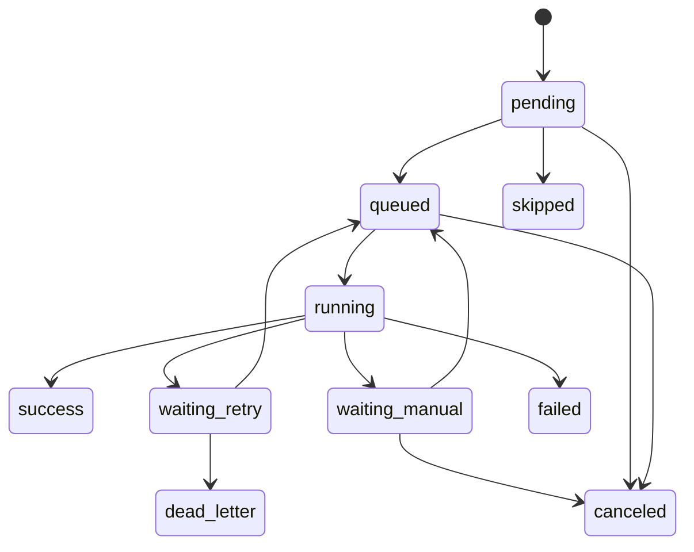
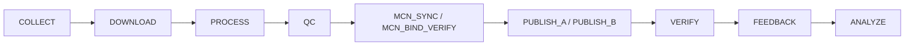
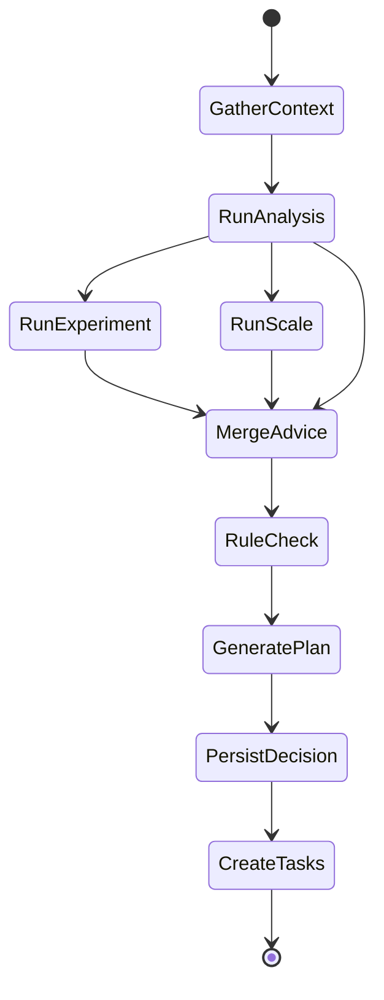
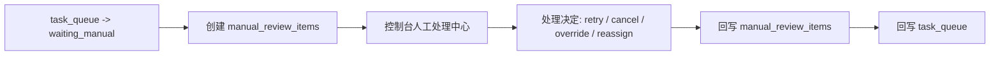

# task_queue + decision_engine 状态机与 Agent 输入输出设计文档

## 1. 文档目标

本文档基于当前：

- `core/task_queue.py`
- `core/decision_engine.py`

对系统的执行状态机、依赖关系、Agent 协作方式、输入输出 JSON 和建议演进方案进行统一设计。

---

## 2. 当前实现基础

## 2.1 `task_queue.py` 当前能力

当前已具备：

- 多任务类型
- 任务依赖 `depends_on`
- 并发限制
- 重试退避
- 账号级断路器
- 通道降级
- 队列状态查询

当前任务类型：

- `COLLECT`
- `DOWNLOAD`
- `PROCESS`
- `PUBLISH_A`
- `PUBLISH_B`
- `ANALYZE`

当前任务状态：

- `pending`
- `running`
- `success`
- `failed`
- `skipped`

## 2.2 `decision_engine.py` 当前能力

当前已具备：

- `DecisionState` 统一状态结构
- LangGraph / 顺序执行双模式
- 4 步节点式决策：
  - 选剧
  - 选策略
  - 决定发布数量
  - 决定发布通道
- 决策历史表 `decision_history`
- 历史结果反馈

---

## 3. 总体设计原则

- 执行系统和 Agent 决策系统必须解耦
- Agent 不直接操作 worker，只能产出结构化建议
- 只有总控 Agent 能将“建议”转换成“任务”
- 所有任务状态变更必须可落库、可回放、可审计
- 当前 `task_queue.py` 不推翻，先标准化升级

## 3.1 执行事实表原则

为避免实现阶段重复写状态，先明确：

- `task_queue`
  当前执行状态事实表
- `publish_results`
  发布事务事实表
- `decision_history`
  最终决策事实表
- `agent_runs`
  Agent 调用轨迹事实表
- `manual_review_items`
  人工接管事实表

结论：

- UI 查“当前任务状态”时，以 `task_queue` 为准
- UI 查“当前待人工处理项”时，以 `manual_review_items` 为准
- UI 查“某次发布成功没有”时，以 `publish_results` 为准

---

## 4. `task_queue` 目标状态机

## 4.1 现状与问题

当前状态足够跑通，但不够表达生产场景中的：

- 等待依赖
- 等待重试
- 等待人工处理
- 死信
- 取消

因此建议扩展为标准状态机。

## 4.2 目标状态定义

- `pending`
  新建任务，尚未进入执行争抢
- `queued`
  已进入可调度队列
- `running`
  正在执行
- `waiting_retry`
  本次失败，等待下一次重试时间
- `waiting_manual`
  需要人工接管
- `success`
  执行成功
- `failed`
  执行失败且无后续补救
- `skipped`
  因依赖失败或策略跳过
- `dead_letter`
  超过重试上限或系统判定无法自动恢复
- `canceled`
  被人工或系统取消

## 4.3 状态流转图



## 4.4 状态流转规则

- `pending -> queued`
  调度器接受任务
- `queued -> running`
  worker 抢到任务
- `running -> success`
  executor 正常返回
- `running -> waiting_retry`
  执行异常，但允许重试
- `running -> waiting_manual`
  出现授权异常、MCN 绑定缺失、邀约待确认、人工确认项、素材异常
- `running -> failed`
  无补救价值
- `waiting_retry -> queued`
  到达重试时间
- `waiting_retry -> dead_letter`
  超过最大重试次数
- `depends_on` 失败时，下游可直接变 `skipped`

---

## 5. 任务模型设计

## 5.1 当前任务模型

当前 `Task` 结构包含：

- `id`
- `task_type`
- `account_id`
- `drama_name`
- `priority`
- `params`
- `status`
- `retry_count`
- `max_retries`
- `created_at`
- `started_at`
- `finished_at`
- `error_message`
- `result`
- `depends_on`

## 5.2 建议扩展字段

建议新增：

- `batch_id`
- `parent_task_id`
- `idempotency_key`
- `queue_name`
- `worker_name`
- `next_retry_at`
- `manual_reason`
- `resource_key`
- `channel_type`
- `strategy_name`
- `decision_id`
- `created_by`

## 5.3 建议任务类型扩展

当前有：

- `COLLECT`
- `DOWNLOAD`
- `PROCESS`
- `PUBLISH_A`
- `PUBLISH_B`
- `ANALYZE`

建议扩展为：

- `COLLECT`
- `DOWNLOAD`
- `PROCESS`
- `QC`
- `MCN_SYNC`
- `MCN_BIND_VERIFY`
- `MCN_INVITE`
- `MCN_POLL`
- `MCN_HEARTBEAT`
- `PUBLISH_A`
- `PUBLISH_B`
- `VERIFY`
- `ANALYZE`
- `EXPERIMENT`
- `SCALE`
- `FEEDBACK`
- `HEALTH_CHECK`

## 5.4 标准流水线



---

## 5.5 幂等与去重规则

生产系统里，重试和重复触发非常常见，所以任务必须支持幂等。

建议：

- 每个任务生成 `idempotency_key`
- 规则建议：
  - `DOWNLOAD`: `account_id + drama_url`
  - `PROCESS`: `account_id + input_asset_id + strategy_name + param_hash`
  - `PUBLISH`: `account_id + output_asset_id + publish_window`
  - `VERIFY`: `account_id + photo_id + snapshot_date`
- 同一 `idempotency_key` 在 `pending/queued/running` 状态下禁止重复创建
- 同一 `idempotency_key` 在 `success` 状态下默认直接复用结果

## 5.6 MCN 前置门禁规则

对收益型发布任务，MCN 相关任务不是可选项，而是发布前门禁：

- `PUBLISH_A / PUBLISH_B` 必须依赖最近一次成功的 `MCN_SYNC`
- `PUBLISH_A / PUBLISH_B` 必须依赖最近一次成功的 `MCN_BIND_VERIFY`
- 若绑定状态为 `unbound`，自动创建 `MCN_INVITE` 或人工审核项，并将发布任务转为 `waiting_manual`
- 若绑定状态为 `pending_confirm`，自动创建 `MCN_POLL`，发布任务保持 `waiting_manual`
- 若 WebSocket 断连且轮询也超时，优先创建 `MCN_HEARTBEAT` / `MCN_SYNC` 高优任务，阻断收益发布

推荐错误码：

- `MCN_SESSION_EXPIRED`
- `MCN_BIND_REQUIRED`
- `MCN_INVITE_PENDING_CONFIRM`
- `MCN_HEARTBEAT_STALE`

---

## 6. 任务优先级设计

建议保留数值越小优先级越高：

- `10`：紧急止损 / MCN 保活 / 授权检查 / 发布确认
- `20`：热门剧补量
- `30`：正常发布
- `50`：下载与处理
- `70`：采集与分析
- `90`：离线回补任务

---

## 7. `decision_engine` 状态机设计

## 7.1 当前 DecisionState

当前输入：

- `account_id`
- `account_name`
- `account_level`
- `account_age_days`
- `today_published`
- `available_dramas`
- `available_strategies`
- `historical_data`

当前输出：

- `selected_drama`
- `selected_strategy`
- `publish_count`
- `publish_channel`
- `reasoning`

## 7.2 推荐演进为 4 Agent 模式

当前 `decision_engine.py` 实际上更接近“单总控单流水”的初版。

建议演进为：

- `AnalysisAgent`
- `ExperimentAgent`
- `ScaleAgent`
- `OrchestratorAgent`

其中：

- `OrchestratorAgent` 继续基于现有 `DecisionEngine`
- 其他 3 个 Agent 输出结构化建议

---

## 8. Agent 协作状态机



说明：

- `GatherContext`
  从 DB 拉账号、剧源、历史、表现数据
- `RunAnalysis`
  输出表现判断
- `RunExperiment`
  输出测试建议
- `RunScale`
  输出放大建议
- `MergeAdvice`
  总控 Agent 合并
- `RuleCheck`
  规则引擎校验
- `GeneratePlan`
  生成当天执行计划
- `PersistDecision`
  写 `decision_history` / `agent_runs`
- `CreateTasks`
  生成 `task_queue` 任务

---

## 8.1 Agent 通用响应协议

所有 Agent 都应使用统一响应外壳，避免总控做特判。

```json
{
  "agent": "analysis",
  "schema_version": "1.0",
  "status": "ok",
  "run_id": "run_20260417_001",
  "confidence": 0.82,
  "findings": [],
  "recommendations": [],
  "rule_rejections": [],
  "error_code": "",
  "error_message": "",
  "meta": {
    "latency_ms": 320,
    "source_count": 28
  }
}
```

字段说明：

- `schema_version`
  输出结构版本
- `status`
  `ok / degraded / rejected / error`
- `confidence`
  本次建议可信度
- `rule_rejections`
  被规则阻断的建议
- `error_code`
  稳定错误码
- `meta`
  非业务主数据

## 8.2 Agent 失败协议

所有 Agent 失败时不应该返回自由文本，而应统一为：

```json
{
  "agent": "experiment",
  "schema_version": "1.0",
  "status": "error",
  "run_id": "run_20260417_002",
  "confidence": 0,
  "findings": [],
  "recommendations": [],
  "rule_rejections": [],
  "error_code": "UPSTREAM_DATA_MISSING",
  "error_message": "required performance snapshot missing",
  "meta": {
    "recoverable": true
  }
}
```

状态定义：

- `ok`
  正常输出
- `degraded`
  部分数据缺失，但仍给出保守建议
- `rejected`
  建议被规则或资源条件拒绝
- `error`
  无法产出建议

## 8.3 总控合并规则

总控 Agent 合并 3 个职能 Agent 输出时，建议按以下优先级：

1. `error`
   不中断全局，但记录 `agent_runs`，必要时降级为规则模式
2. `rejected`
   不纳入执行计划，但保留到 `rule_rejections`
3. `degraded`
   可纳入执行计划，但必须降低优先级或缩小规模
4. `ok`
   正常参与合并

---

## 9. Agent 输入输出设计

## 9.1 分析 Agent 输入

```json
{
  "date": "2026-04-17",
  "account": {
    "account_id": "acc_001",
    "account_stage": "testing",
    "today_published": 2
  },
  "recent_performance": {
    "views_1d": 3200,
    "views_7d_avg": 2800,
    "publish_success_rate_7d": 0.92
  },
  "recent_content": [
    {
      "drama_name": "剧A",
      "strategy_name": "mode6",
      "publish_window": "19:00-21:00",
      "views_24h": 4200
    }
  ]
}
```

## 9.2 分析 Agent 输出

```json
{
  "agent": "analysis",
  "status": "ok",
  "findings": [
    {
      "type": "genre_performance",
      "message": "悬疑类高于甜宠类",
      "confidence": 0.83
    }
  ],
  "recommendations": [
    {
      "action": "prefer_genre",
      "value": "悬疑"
    },
    {
      "action": "reduce_account",
      "target": "acc_003"
    }
  ]
}
```

补充建议：

- 增加 `schema_version`
- 增加 `run_id`
- 增加 `confidence`
- 增加 `error_code`

## 9.3 实验 Agent 输入

```json
{
  "date": "2026-04-17",
  "unknowns": [
    "标题风格哪种更好",
    "19点和21点哪个更优"
  ],
  "available_accounts": [
    "acc_001",
    "acc_002",
    "acc_003"
  ],
  "available_dramas": [
    "剧A",
    "剧B"
  ]
}
```

## 9.4 实验 Agent 输出

```json
{
  "agent": "experiment",
  "status": "ok",
  "plans": [
    {
      "experiment_code": "exp_title_001",
      "variable": "title_style",
      "groups": ["emotion", "suspense"],
      "sample_target": 20,
      "duration_days": 3,
      "success_metric": "views_24h"
    }
  ]
}
```

## 9.5 放大 Agent 输入

```json
{
  "date": "2026-04-17",
  "validated_patterns": [
    {
      "drama_name": "剧A",
      "strategy_name": "mode6",
      "views_lift": 0.31
    }
  ],
  "available_accounts": [
    {
      "account_id": "acc_101",
      "stage": "formal"
    }
  ]
}
```

## 9.6 放大 Agent 输出

```json
{
  "agent": "scale",
  "status": "ok",
  "proposals": [
    {
      "strategy_ref": "剧A+mode6",
      "target_group": "formal_accounts",
      "recommended_account_count": 10,
      "publish_window": "19:00-21:00"
    }
  ]
}
```

## 9.7 总控 Agent 输入

```json
{
  "date": "2026-04-17",
  "account_pool": [],
  "drama_pool": [],
  "analysis_output": {},
  "experiment_output": {},
  "scale_output": {},
  "mcn_context": {
    "session_status": "connected",
    "last_sync_at": "2026-04-17T10:20:00",
    "binding_summary": {
      "bound_accounts": 82,
      "pending_confirm": 6,
      "unbound_accounts": 3
    }
  },
  "feature_switches": {
    "publish_enabled": true,
    "auto_scale_enabled": false
  },
  "historical_data": {},
  "resource_status": {
    "download_queue_depth": 12,
    "process_queue_depth": 6
  }
}
```

## 9.8 总控 Agent 输出

```json
{
  "agent": "orchestrator",
  "status": "ok",
  "decision_summary": {
    "batch_id": "batch_20260417_001",
    "publish_plan_count": 18,
    "blocked_plan_count": 3
  },
  "execution_plan": [
    {
      "account_id": "acc_001",
      "drama_name": "剧A",
      "strategy_name": "mode6",
      "publish_channel": "api",
      "publish_count": 2,
      "priority": 30
    }
  ],
  "manual_review_items": [
    {
      "account_id": "acc_021",
      "reason": "mcn invite pending confirm"
    }
  ]
}
```

---

## 9.9 任务创建协议

总控输出的 `execution_plan` 不应直接交给 worker，需要先转换为标准任务创建协议：

```json
{
  "batch_id": "batch_20260417_001",
  "decision_id": 123,
  "tasks": [
    {
      "task_type": "DOWNLOAD",
      "account_id": "acc_001",
      "drama_name": "剧A",
      "priority": 30,
      "idempotency_key": "download:acc_001:dramaA",
      "params": {
        "drama_url": "https://example.com/dramaA"
      }
    }
  ]
}
```

收益型任务创建时，还应自动补齐依赖：

- 先创建 `MCN_SYNC`
- 再创建 `MCN_BIND_VERIFY`
- 只有绑定校验通过后才创建 `PUBLISH_A / PUBLISH_B`
- 若未通过，则创建 `MCN_INVITE` / `MCN_POLL` 或 `manual_review_items`

---

## 10. `decision_history` 与任务系统衔接

建议流程：

1. 总控 Agent 生成 `DecisionResult`
2. 写入 `decision_history`
3. 为每个执行项生成 `task_queue` 任务链
4. `decision_id` 写回任务参数
5. 发布结果回流后更新 `decision_history` outcome

建议新增字段：

- `decision_id` 写入任务 params
- `publish_result_id` 回写到 `decision_history`

---

## 11. `add_pipeline` 的演进建议

当前 `add_pipeline(account_id, drama_name, drama_url)` 已支持：

- DOWNLOAD
- PROCESS
- PUBLISH_A

建议升级为：

1. 允许传入 `strategy_name`
2. 允许传入 `channel_type`
3. 允许传入 `decision_id`
4. 自动补 `MCN_SYNC`
5. 自动补 `MCN_BIND_VERIFY`
6. 自动补 `VERIFY`
7. 自动补 `FEEDBACK`

目标任务链：

```text
DOWNLOAD -> PROCESS -> QC -> MCN_SYNC -> MCN_BIND_VERIFY -> PUBLISH_A/B -> VERIFY -> FEEDBACK
```

---

## 11.1 人工接管闭环

建议把人工处理从“状态值”升级成完整流程：



推荐动作：

- `retry_now`
- `cancel_task`
- `override_rule`
- `reassign_account`
- `require_relogin`
- `require_manual_publish`

要求：

- 所有人工动作必须写 `audit_logs`
- 所有人工动作必须可回放

---

## 12. 规则引擎插入点

推荐在 3 个地方做规则校验：

1. Agent 决策后、写任务前
2. 任务进入运行前
3. 发布前最后一次检查

规则示例：

- 发布开关关闭时禁止生成发布任务
- 同账号当天超过上限时自动降量
- 起号期账号不能进入放大量任务
- 异常账号只能进入人工审核
- 未绑定 MCN 的账号禁止走收益型发布

---

## 12.1 降级与回退策略

建议在以下情况下自动降级：

- LLM 不可用
  `ai -> hybrid -> rules`
- 分析 Agent 数据不完整
  `analysis -> degraded`
- PUBLISH_A 连续失败
  自动切换到 `PUBLISH_B`
- VERIFY 连续失败
  进入 `waiting_manual`

---

## 13. 手动接管设计

需要支持下列人工状态：

- `relogin_required`
- `manual_publish_required`
- `asset_review_required`
- `risk_review_required`
- `rule_override_required`

建议在 `task_queue` 里增加：

- `manual_status`
- `manual_reason`
- `manual_operator`
- `manual_updated_at`

---

## 14. 监控指标建议

`task_queue` 指标：

- pending 数
- running 数
- waiting_retry 数
- failed 数
- dead_letter 数
- 平均耗时
- 发布成功率
- 通道 A/B 成功率
- 账号级熔断状态

`decision_engine` 指标：

- 决策次数
- 决策耗时
- AI / rules / hybrid 模式占比
- 建议转任务比例
- 决策后 24h 效果

---

## 14.1 关键错误码建议

建议至少统一以下错误码：

- `AUTH_EXPIRED`
- `AUTH_INVALID`
- `ASSET_MISSING`
- `ASSET_QC_FAILED`
- `PUBLISH_CHANNEL_A_FAILED`
- `PUBLISH_CHANNEL_B_FAILED`
- `VERIFY_TIMEOUT`
- `UPSTREAM_DATA_MISSING`
- `RULE_BLOCKED`
- `UNKNOWN_INTERNAL_ERROR`

---

## 15. 落地顺序建议

1. 扩充 `task_queue` 状态机
2. 给 `decision_engine.py` 增加标准输入输出 schema
3. 拆出 `analysis / experiment / scale` 三类服务
4. 补 `VERIFY` 和 `FEEDBACK` 两类任务
5. 让 `decision_history` 与 `publish_results` 互相关联

---

## 16. 结论

当前 `task_queue.py` 和 `decision_engine.py` 已经具备生产化雏形。

最合理的路线是：

- 不推翻当前实现
- 把 `task_queue` 升级成更完整状态机
- 把 `decision_engine` 从单决策流升级成“总控 Agent + 三职能输出”的多 Agent 协作模式
- 让决策、任务、发布结果、数据回流形成闭环
