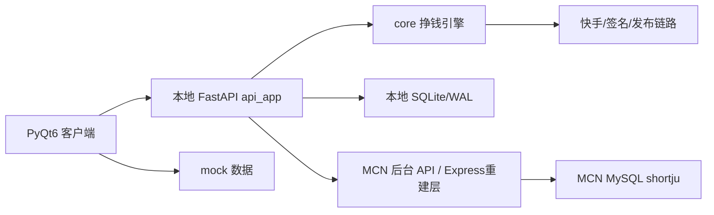

# 快手短剧矩阵运营系统 — 客户端改造完整计划

> **版本**: v1.0 (基于 4 份真实代码审计)
> **出稿日期**: 2026-04-25
> **作者**: 黄老板 + Claude
> **引用**:
> - `docs/产品总体规划.md` (战略)
> - `docs/UI/` 12 张设计图 (视觉)
> - `Claude前端开发完整提示词文档_v3.md` (需求)
> - `CLAUDE.md` (项目记忆)
>
> **本文档为"现有代码审计 + 前端改造落地"的终版. 审计对照真实代码, 非推断.**

---

## 前言 · 定位

本次改造目标不是"换个漂亮的壳", 而是**现在就做商业桌面端软件的最终形态**. 规划文档 §4.2 明确 Phase 3 起 PyQt6, 我们**提前启动**, 避免后期再扔一次.

**硬约束**:
1. 不改 `core/` 业务语义 (Phase 1 挣钱引擎)
2. 不改数据库结构
3. 不提交真实 Cookie / Token / 卡密
4. 不一次性重建, 分 5 Batch 迭代
5. 保留 Streamlit + web/ 作为自用 / 兼容备份

---

## 第一部分 · 最终拍板 (校对)

```
① 技术栈      : PyQt6 / Qt6 + qt_compat.py (为 PySide6 迁移留余地)
② 改造范围    : L3 = UI + 服务层 + FastAPI domain 模块化重构
③ 版本框架    : PLAN_MANUAL / PRO / TEAM 三版本, 功能先全放 PRO, MANUAL/TEAM 占位
④ 现有代码    : Streamlit 保留, web/ 冻结不删, core/ 零语义改动,
                dashboard/api.py 做兼容入口并逐步分拆
⑤ 构建        : 当前仅 dev build, 代码按未来商业分发标准组织
⑥ UI 风格     : 深蓝黑科技风 (docs/UI/ 12 张图 100% 采用), Design Tokens 沉淀
⑦ 开发节奏    : 5 Batch 迭代, 每 Batch 可运行 + 可回滚
⑧ Batch 1     : UI Shell + 三版本 + 权限 + 主题 + mock + 1 条真实只读链路
⑨ 硬约束      : UI 禁止直接 import core.*, 必须走 services/ → api_client → FastAPI
⑩ 验收        : 每 Batch 必须"可运行 + 可冒烟", 不是"代码写完"
```

---

## 第二部分 · 现有代码审计报告

本节是本改造计划的**真实数据基础**, 不是推断.

### 2.1 Streamlit 看板 (`dashboard/streamlit_app.py`, 3261 行, **18 页**)

v6 版本共 18 页 (用户原以为 16 页, 实际近期新增了运营模式 + 熔断监控):

| # | 页面 | 入口函数 | 关键 SQL 表 | 关键 core 依赖 | 复杂度 |
|---|---|---|---|---|---|
| 1 | 🏠 总览 | `page_overview` (259) | `daily_plans` / `task_queue` / `healing_actions` / `publish_daily_metrics` / `autopilot_cycles` | 无 | 简单 |
| 2 | 📋 任务 | `page_tasks` (422) | `daily_plan_items` / `task_queue` | 无 | 中 |
| 3 | 📦 任务监控 | `page_task_monitor` (1871) | `batches` / `strategy_experiments` / `experiment_assignments` | `task_manager` / `app_config` | **复杂** |
| 4 | 🩺 自愈 | `page_healing` (579) | `healing_playbook` / `healing_diagnoses` / `rule_proposals` | 无 | 中 (审批流) |
| 5 | 💎 收益 | `page_income` (693) | `mcn_member_snapshots` / `strategy_rewards` | 无 | 简单 |
| 6 | 👤 账号详情 | `page_account_detail` (750) | `device_accounts` / `mcn_member_snapshots` / 6 张其他 | `mcn_live` / `account_memory` | **复杂** (AI 记忆 3 层) |
| 7 | 🎬 剧详情 | `page_drama_detail` (1198) | `drama_banner_tasks` / `publish_results` | 无 | 简单 |
| 8 | 🔍 全局搜索 | `page_search` (1289) | 4 表 LIKE 查询 | 无 | 简单 |
| 9 | 🛠️ 批量操作 | `page_batch_ops` (1362) | `device_accounts` / `daily_plan_items` / `task_queue` | 无 | 中 (三种 UPDATE) |
| 10 | 📊 导出 | `page_export` (1444) | 7 表聚合 | 无 | 简单 |
| 11 | ✉️ 邀请管理 | `page_invitations` (2147) | `mcn_invitations` / `mcn_account_bindings` | `mcn_business` / `db_manager` | **复杂** (MCN 4-step 流程) |
| 12 | 🎨 Qitian | `page_qitian` (1537) | 无 | `qitian` | 中 (图片生成) |
| 13 | 🔀 去重组合 | `page_dedup_combinations` (1601) | 读 `app_config` | `processor` / `qitian` / `font_pool` | **复杂** (并发视频生成) |
| 14 | ⚙️ 配置 | `page_config` (1843) | `app_config` | 无 | 简单 |
| 15 | 💎 候选池 | `page_candidate_pool` (2392) | `daily_candidate_pool` | 无 | 中 |
| 16 | 🔗 剧库健康 | `page_library_health` (2680) | 8 张镜像表 | 无 | 中 |
| 17 | 🚦 运营模式 | `page_operation_mode` (2944) | `operation_mode_history` | `operation_mode` / `task_pools` | **复杂** (Adaptive 5-tier) |
| 18 | 🔌 熔断监控 | `page_circuit_breakers` (3073) | `circuit_breaker_events` | `circuit_breaker` / `account_drama_blacklist` | **复杂** (3 状态机 + 80004 闭环) |

**覆盖数据库表**: 33 张 (含 6 张 MCN 镜像 + 8 张 v6 新增)
**直接 import core 模块**: 15 个
**迁移工作量估算**: 48-75 工作日 (包含复杂页分阶段实现)

### 2.2 FastAPI 后端 (179 个端点)

**当前结构**:
- `dashboard/app.py` (474 行): 应用入口 + `KSCombinedMiddleware` (Pure ASGI, 单层合并 Auth + Audit + Diagnostic)
- `dashboard/api.py` (4127 行): 主 API, 容纳 120+ 端点
- 6 个模块化子 API: `auth_api.py` (6) / `review_api.py` (4) / `mcn_api.py` (9) / `analytics_api.py` (6) / `stream_api.py` (2) / `pipeline_api.py` (13)
- 7 个 Legacy / SPA 端点 (app.py 内)

**端点 17 domain 分组 (实际)**:

| Domain | 端点数 | 认证率 | 代表端点 |
|---|---|---|---|
| ACCOUNTS | 38 | 100% | `/api/accounts` / `/api/accounts/{id}/profile` / `/api/accounts/{id}/invite` |
| PUBLISH + QUEUE | 22 | 65% | `/api/queue` / `/api/publishes/summary` / `/api/pipeline/*` |
| CONFIG | 15 | 100% | `/api/config/llm/providers` / `/api/config/keywords` |
| AGENTS | 13 | 100% | `/api/agents/summary` / `/api/agents/memories` |
| PIPELINE | 13 | 62% | `/api/pipeline/executor/enqueue` / `/api/pipeline/selector/pool` |
| AUTOPILOT | 11 | 91% | `/api/autopilot/status` / `/api/autopilot/trigger` |
| RULES & UPGRADES | 11 | 100% | `/api/rules/proposals` / `/api/autopilot/upgrades` |
| MCN | 9 | 89% | `/api/mcn/session` / `/api/mcn/invite/{id}` |
| SWITCHES | 9 | 100% | `/api/switches` / `/api/switches/{code}/toggle` |
| ANALYTICS | 7 | 100% | `/api/analytics/overview` / `/api/analytics/by-account` |
| AUTH | 6 | 83% | `/api/auth/login` / `/api/auth/me` |
| EXPERIMENTS | 5 | 100% | `/api/experiments` / `/api/experiments/{code}/start` |
| INCIDENTS | 4 | 100% | `/api/incidents` / `/api/incidents/{id}/retry` |
| REVIEW | 4 | 100% | `/api/review/items` / `/api/review/{id}/resolve` |
| RANKINGS | 3 | 100% | `/api/rankings/external` / `/api/rankings/heatmap` |
| STREAM | 2 | 50% | `/api/stream/events` SSE |
| OVERVIEW | 1 | 100% | `/api/home/overview` |
| LEGACY | 7 | 0% | `/legacy/*` Jinja2 |
| **合计** | **179** | **~85%** | — |

**零死代码**, 每个端点都有明确业务意图. 异常模式: 95% `HTTPException`, 5% `{ok, error}`. 数据访问: 无 ORM, 原生 `DBManager().conn.execute(sql)`.

### 2.3 core/ 模块 (89+ 个, 8 大族)

| 族 | 代表模块 | 一级入口函数 |
|---|---|---|
| **发布** | `publisher.py` (1600 行) | `KuaishouPublisher.publish_video(account_id, video_path, drama_name, ...)` |
|  | `publish_verifier.py` | `verify_published_photo(account_id, photo_id, max_wait_sec)` |
|  | `sig_service.py` | `SigService.sign_payload(payload)` |
|  | `mcn_relay.py` | `submit_via_relay(...)` |
| **下载** | `downloader.py` (1200 行) | `download_drama(drama_name, out_dir?, ...)` |
|  | `collector_on_demand.py` | `ensure_urls_for_drama(drama_name, ...)` |
|  | `drama_pool.py` | `pick_share_urls(drama_name, limit?)` |
|  | `xinhui_resolver.py` | `resolve_share(share_url, cookie_str?)` |
| **处理** | `processor.py` (2350 行) | `process_video(input_path, recipe?, image_mode?, ...)` |
|  | `qitian.py` | `generate(style, width?, height?)` |
|  | `scale34.py` / `watermark.py` / `pattern_animator.py` | ... |
| **账号** | `account_tier.py` (340 行) | `get_account_tier()` / `run_tier_evaluation()` |
|  | `account_memory.py` (620 行) | `record_decision()` / `get_strategy_memory()` / `save_diary_entry()` |
|  | `cookie_manager.py` (280 行) | `CookieManager.load_cookies()` |
|  | `mcn_client.py` / `mcn_business.py` / `mcn_drama_lookup.py` / `mcn_url_realtime.py` | ... |
| **决策** | `candidate_builder.py` (650 行) | `build_candidate_pool(pool_date?, dry_run?)` |
|  | `decision_engine.py` (1320 行) | `DecisionEngine.decide(state)` |
|  | `drama_selector.py` | `select_for_account(account_id, n?, strategy?)` |
|  | `match_scorer.py` | `match_score(account_id, drama_name)` |
|  | `scenario_scorer.py` | `score_scenario(account_id?, drama_name?, task_source?)` |
| **Agent** | `agents/strategy_planner_agent.py` (1400 行) | `run(plan_date?, dry_run?)` |
|  | `agents/burst_agent.py` (340 行) | `detect_burst_candidates()` / `trigger_burst_replication()` |
|  | `agents/analyzer_agent.py` (540 行) | `aggregate_daily_metrics()` / `update_strategy_rewards()` |
|  | `agents/llm_researcher_agent.py` (700 行) | `run(mode='strategy|rules|upgrades|diaries')` |
|  | `agents/controller_agent.py` / `orchestrator.py` / `self_healing_agent.py` / `watchdog_agent.py` | ... |
| **任务** | `task_manager.py` (270 行) | `create_batch()` / `mark_task_complete()` |
|  | `task_queue.py` | `enqueue()` / `dequeue()` |
|  | `executor/pipeline.py` (310 行) | `run_publish_pipeline(task)` |
| **基础** | `db_manager.py` (310 行) | `DBManager()` |
|  | `app_config.py` (200 行) | `cfg().get()` / `cfg().set_()` |
|  | `auth.py` (310 行) | `authenticate()` / `verify_token()` |
|  | `llm_gateway.py` / `notifier.py` / `event_bus.py` / `logger.py` | ... |

**循环依赖风险**: `downloader ↔ collector_on_demand` (services 层需隔离).

### 2.4 React web/ (16 页, 6145 行, **比 Streamlit 更完整**)

| 路径 | 页面 | 行数 | 核心 API |
|---|---|---|---|
| `/` | 总览 | 219 | `/home/overview` |
| `/accounts` | 账号矩阵 | **1759** | `/accounts` + 7 子端点 (stats/lifecycle/tags/bulk-action...) |
| `/agents` | Agent 中枢 | **1038** | `/agents/*` 13 端点, 6 Tab |
| `/configs` | 配置中心 | **1009** | `/config/*` 15 端点, 12 Tab |
| `/switches` | 系统开关 | 417 | `/switches/*` 9 端点, 6 层级联 |
| `/autopilot` | 自动驾驶 | 338 | `/autopilot/*` 11 端点 |
| `/dramas` | 剧源与榜单 | 330 | `/dramas` / `/rankings/*` |
| `/execution` | 执行中心 | 312 | `/execution/*` worker 控制 |
| `/mcn` | MCN 通讯 | 286 | `/mcn/*` 9 端点 |
| `/analytics` | 数据分析 | 259 | `/analytics/*` 7 端点 |
| `/queue` | 任务队列 | 250 | `/queue/*` 4 端点 |
| `/experiments` | A/B 实验 | 199 | `/experiments/*` 5 端点 |
| `/review` | 人工复核 | 159 | `/review/*` 4 端点 |
| `/incidents` | 异常中心 | 147 | `/incidents/*` 4 端点 |
| `/publishes` | 发布结果 | 129 | `/publishes/*` 2 端点 |
| `/login` | 登录 | 100 | `/auth/login` |

### 2.5 关键反转与认知修正

本节记录 4 个审计带来的**认知反转**, 直接影响最终计划:

#### 反转 1 — web/ React **不能只是"冻结"**, 有 7 大独占功能
Streamlit 压根没实现的:
- **Review 人工复核工作台** (决策异常任务审批)
- **Experiments A/B 实验面板** (控制/测试组分配, 样本目标, 成功指标)
- **Agent 图结构浏览** (可视化 LangGraph)
- **Agent 记忆库浏览**
- **Agent 调试台** (实时运行日志, 变量检查)
- **Configs 配置热编辑** (12 Tab, 运行时修改 LLM Provider / Prompt / 规则种子 / 演化 / 实验参数, 改动立即生效)
- **Switches 开关级联 + 账号组覆盖** (6 层树状开关 + 层级总闸 + 级联关闭)

**含义**: PyQt6 新客户端要做 **18 + 7 ≈ 23 页**, 不是 16 或 18.

#### 反转 2 — FastAPI 端点 **179 个**, 不是 40+
原规划 "借机拆分 10 个 router" 远远不够. 按实际 17 个 domain, **新 `api_app/routers/` 至少 15 个文件**, 每文件包装 10-40 个端点.

#### 反转 3 — core/ **89+ 模块**, facade 设计要分层
原规划"每个 UI service 包一个 core 模块"行不通. 实际要做 **Service Facade 分组 → Core Adapter → Core Module** 三层:

```
ui_client/services/PublishService.publish()
  ↓
dashboard/api_app/services/publish_facade.execute_publish()
  ↓
core.executor.pipeline.run_publish_pipeline()
  ↓ (内部串联)
core.downloader → core.processor → core.publisher → core.publish_verifier
```

#### 反转 4 — 总工期 **9-15 周**, 不是原估 8-10 周
Streamlit 迁移估算 48-75 工作日, 加上 PyQt6 吸收 web/ 7 大独有功能 (~20 工作日), 且含真实后端联调, 总工期 **45-75 工作日**. 按每周 5 工作日, 即 9-15 周.

## 第三部分 · 总体架构

### 3.1 四层视图

```
┌─────────────────────────────────────────────────────────────┐
│ L1  ui_client/  (PyQt6 桌面端)                                │
│     pages/(23)  →  services/(11)  →  api_client  →  HTTPS    │
│         ↑           ↑                                         │
│       widgets    mock/(17 JSON)                               │
└─────────────────────────────────────────────────────────────┘
                            ↕  OpenAPI 3.1 + JWT Bearer
┌─────────────────────────────────────────────────────────────┐
│ L2  dashboard/api_app/  (FastAPI 新结构, :8080)               │
│     routers/(15)  →  services/facade/(11)  →  core.*          │
│     schemas/      middleware (KSCombined)                     │
└─────────────────────────────────────────────────────────────┘
                            ↕
┌─────────────────────────────────────────────────────────────┐
│ L3  dashboard/api.py  (兼容入口, 逐步空心化)                  │
│     原 179 端点 → delegate 到 api_app / 保留原行为             │
│     服务: Streamlit :8501 + 旧 React :5173 不中断              │
└─────────────────────────────────────────────────────────────┘
                            ↕
┌─────────────────────────────────────────────────────────────┐
│ L4  core/  (89+ 模块, 零语义改动)                             │
│     publisher / downloader / processor / agents/*             │
│     account_* / mcn_* / decision / task / base                │
└─────────────────────────────────────────────────────────────┘
                            ↕
          SQLite (WAL) / MCN MySQL / 快手 HTTPS
```

### 3.1.1 接入 MCN 后台后的五域视图

原四层视图描述的是本地客户端与现有 FastAPI/core 的关系。加入 MCN 后台重建后, 架构要再明确五个域:



职责边界:

| 域 | 责任 | 禁止做的事 |
|---|---|---|
| PyQt6 客户端 | 展示、交互、权限显隐、任务发起 | 不直接 import `core.*`, 不直接读 Cookie, 不绕过 API 查库 |
| 本地 FastAPI | 客户端 BFF、兼容旧端点、调用 core、聚合 MCN 数据 | 不把跨租户原始数据透传给客户端 |
| core 引擎 | 发布、下载、处理、决策、自愈、Agent | 不感知桌面 UI 状态 |
| MCN 后台 API | 机构、账号、成员、收益、授权、Cookie 状态 | 不允许无租户隔离查询 |
| 数据库 | SQLite 存本地运营数据, MySQL 存 MCN 中台数据 | 不允许客户端直连生产库 |

客户端调用 MCN 数据时, 推荐走:

```
ui_client/services/mcn_service.py
  → api_client
  → dashboard/api_app/routers/mcn_bridge.py
  → services/mcn_facade.py
  → MCN Backend API / MySQL Adapter
```

这样客户端只面对统一 Envelope, 后端负责租户范围、脱敏、兼容和审计。

### 3.2 关键数据流 (一个发布请求)

```
PyQt6 UI "发布" 按钮点击
  ↓ Signal
PublishService.publish_manual(account_id, drama_name, recipe)
  ↓ httpx.post
POST /api/publish/manual
  ↓ router → facade
publish_facade.execute_manual_publish(...)
  ↓ 调 executor
core.executor.pipeline.run_publish_pipeline(task)
  ↓ 内部串联
core.downloader.download_drama → core.processor.process_video
  → core.publisher.KuaishouPublisher.publish_video
  → core.publish_verifier.verify_published_photo
  ↓ 结果
{ok, photo_id, verified}
  ↓ 返回上游
router 封装 Envelope → httpx 解析 → PublishService 返回
  ↓ Signal
UI 刷新 + toast 通知
```

### 3.3 目录结构 (最终版)

**3.3.1 `ui_client/` 新建 (PyQt6 桌面端)**

```
ui_client/
├── __init__.py
├── qt_compat.py                   ★ Qt 抽象 (唯一 PyQt/PySide import 点)
│
├── app/
│   ├── main.py                    # QApplication 入口
│   ├── bootstrap.py               # 启动编排
│   ├── constants.py
│   └── env.py                     # KS_UI_MODE / KS_API_BASE 环境变量
│
├── theme/
│   ├── tokens.py                  ★ Design Tokens 唯一真实来源
│   ├── dark_tech.qss
│   ├── typography.qss
│   └── components.qss
│
├── widgets/                       # 原子组件 (14 个)
│   ├── kpi_card.py
│   ├── plan_badge.py
│   ├── feature_lock_card.py
│   ├── confirm_dialog.py
│   ├── status_dot.py
│   ├── empty_state.py
│   ├── data_table.py              # QAbstractTableModel 封装
│   ├── chart_card.py              # pyqtgraph 封装
│   ├── loading_overlay.py
│   ├── toast.py
│   ├── async_button.py            # QThread 防卡顿
│   ├── tab_widget_lite.py
│   ├── tree_switcher.py           # 开关级联用
│   └── code_viewer.py             # JSON 预览
│
├── pages/
│   ├── base_page.py               # 页面基类 (权限校验/生命周期)
│   ├── shell/
│   │   ├── main_window.py
│   │   ├── sidebar.py
│   │   └── topbar.py
│   │
│   ├── common/                    # 3 版本共用
│   │   ├── config_center.py       # 吸收 web/configs 12 Tab
│   │   ├── subscription.py
│   │   ├── wizard_first_run.py
│   │   └── help.py
│   │
│   ├── manual/                    # 普通版 (10 页, 后期填充)
│   ├── pro/                       # 高级版 (前期承载全功能)
│   │   ├── overview.py            # 对齐 Streamlit 🏠 + web/Home
│   │   ├── accounts.py            # 对齐 web/Accounts (含批量)
│   │   ├── account_detail.py      # 对齐 Streamlit 👤 (AI 记忆 3 层)
│   │   ├── dramas.py
│   │   ├── drama_detail.py
│   │   ├── candidate_pool.py      # Streamlit 💎
│   │   ├── publish.py             # 吸收 Streamlit 📋 + web/Queue
│   │   ├── publish_results.py     # web/Publishes
│   │   ├── burst_radar.py         # UI 图 dfafa821
│   │   ├── income.py              # Streamlit 💎
│   │   ├── analytics.py           # web/Analytics 7 视图
│   │   ├── risk_center.py         # UI 图 3a7d29e8
│   │   ├── ai_advice.py           # 对齐 Streamlit 账号详情 diary
│   │   ├── autopilot.py           # web/Autopilot
│   │   ├── circuit_breakers.py    # Streamlit 🔌 v6 Day 4
│   │   ├── operation_mode.py      # Streamlit 🚦 v6 Day 5-D
│   │   ├── dedup_combinations.py  # Streamlit 🔀 (并发视频生成)
│   │   └── qitian.py              # Streamlit 🎨
│   │
│   └── team/                      # 团队版 (9 页)
│       ├── team_dashboard.py
│       ├── members.py
│       ├── agents_center.py       # 对齐 web/Agents 6 Tab
│       ├── experiments.py         # 对齐 web/Experiments ★ web 独占
│       ├── review_center.py       # 对齐 web/Review ★ web 独占
│       ├── switches.py            # 对齐 web/Switches (级联 + 组覆盖)
│       ├── healing_center.py      # Streamlit 🩺 + web/Incidents
│       ├── audit_logs.py
│       ├── export_reports.py      # Streamlit 📊
│       ├── search.py              # Streamlit 🔍
│       └── library_health.py      # Streamlit 🔗
│
├── services/                      ★ 数据适配层
│   ├── api_client.py              # HTTPX + retry + Envelope parse
│   ├── auth_service.py
│   ├── ui_data_service.py         # 顶层 facade
│   ├── license_service.py
│   ├── permission_service.py      ★ PLAN × FEATURE 矩阵
│   ├── mock_data_service.py
│   ├── accounts_service.py
│   ├── config_service.py
│   ├── publish_service.py
│   ├── matrix_service.py
│   ├── risk_service.py
│   ├── ai_service.py
│   ├── autopilot_service.py
│   ├── team_service.py
│   └── audit_service.py
│
├── mock/                          # 17 JSON 种子
├── assets/
│   ├── icons/
│   ├── fonts/
│   └── images/
└── tests/
    ├── test_permission_matrix.py  ★ 3 tier × 23 page 硬断言
    ├── test_qt_compat.py
    ├── test_services_smoke.py
    └── test_ui_smoke.py           # pytest-qt
```

**3.3.2 `dashboard/api_app/` 新建 (FastAPI 新结构)**

```
dashboard/
├── api.py                         ★ 兼容入口, 内部 include api_app 所有 router
├── app.py                         # (保留, 改进 include_router)
│
└── api_app/
    ├── __init__.py
    ├── main.py                    # app = FastAPI(); include_router(...)
    ├── config.py                  # 环境/CORS/日志
    ├── dependencies.py            # auth / db / current_user
    ├── errors.py                  # 统一异常 + handler
    ├── middleware.py              # trace_id / envelope
    │
    ├── routers/                   # 按 17 domain 重构
    │   ├── auth.py                # /api/auth/*        (6)
    │   ├── overview.py            # /api/home/overview (1)
    │   ├── accounts.py            # /api/accounts/*    (38)
    │   ├── invitations.py         # /api/invitations/* (3)
    │   ├── mcn.py                 # /api/mcn/*         (9)
    │   ├── review.py              # /api/review/*      (4)
    │   ├── publish.py             # /api/publishes + /queue + /pipeline (22)
    │   ├── analytics.py           # /api/analytics/*   (7)
    │   ├── agents.py              # /api/agents/*      (13)
    │   ├── config.py              # /api/config/*      (15)
    │   ├── autopilot.py           # /api/autopilot/*   (11)
    │   ├── switches.py            # /api/switches/*    (9)
    │   ├── experiments.py         # /api/experiments/* (5)
    │   ├── rankings.py            # /api/rankings/*    (3)
    │   ├── incidents.py           # /api/incidents/*   (4)
    │   ├── rules.py               # /api/rules/*       (11)
    │   └── stream.py              # /api/stream/*      (2)
    │
    ├── schemas/                   # Pydantic
    │   ├── common.py              # Envelope / Error / Meta
    │   └── ... (per router)
    │
    └── services/                  # domain facade (包 core/*)
        ├── auth_facade.py
        ├── accounts_facade.py
        ├── publish_facade.py
        └── ... (per domain)
```

**3.3.3 保持不动**

```
core/*                             # 零语义改动
dashboard/streamlit_app.py         # 保留自用
web/*                              # 冻结, 6 个月后决策
tools/* scripts/* docs/* tests/*   # 不动
```

---

## 第四部分 · Design Tokens & 主题

`ui_client/theme/tokens.py` 是设计系统**唯一真实来源**. 任何 QSS 禁止硬编码颜色/圆角:

```python
# ══════ Colors (对齐 docs/UI/b92d4fa0 方案一深蓝黑科技风) ══════
COLOR_BG_MAIN         = "#07111F"
COLOR_BG_SIDEBAR      = "#0A1628"
COLOR_PANEL           = "#0D1B2E"
COLOR_PANEL_ALT       = "#152238"
COLOR_BORDER          = "#1E2F47"
COLOR_DIVIDER         = "#14223A"

# 语义色 (v3 §6 规定)
COLOR_ACCENT          = "#2F80ED"   # 主操作
COLOR_SUCCESS         = "#27AE60"   # 绿
COLOR_WARN            = "#F2C94C"   # 黄
COLOR_DANGER          = "#EB5757"   # 红
COLOR_AI              = "#9B51E0"   # 紫 (AI/决策)
COLOR_PAID            = "#F2994A"   # 橙 (订阅/付费)
COLOR_INFO            = "#56CCF2"   # 蓝 (信息)

# 文字
COLOR_TEXT_PRIMARY    = "#E8F1FF"
COLOR_TEXT_SECONDARY  = "#7E8AA4"
COLOR_TEXT_DISABLED   = "#4A5A75"

# ══════ 形状 ══════
RADIUS_CARD           = 12
RADIUS_BUTTON         = 8
RADIUS_INPUT          = 10
RADIUS_BADGE          = 6

# ══════ 间距 (4px grid) ══════
SPACE_1, SPACE_2, SPACE_3, SPACE_4, SPACE_5, SPACE_6 = 4, 8, 12, 16, 24, 32

# ══════ 阴影 ══════
SHADOW_CARD  = "0 2px 8px rgba(0,0,0,0.25)"
SHADOW_HOVER = "0 4px 16px rgba(47,128,237,0.20)"

# ══════ 字体 ══════
FONT_FAMILY_DEFAULT = '"Microsoft YaHei", "PingFang SC", "Inter", sans-serif'
FONT_FAMILY_MONO    = '"JetBrains Mono", "Consolas", monospace'
FONT_SIZE_XS, SM, MD, LG, XL, XXL = 11, 12, 14, 16, 20, 28

# ══════ 状态映射 ══════
STATUS_COLOR_MAP = {
    "running":  COLOR_SUCCESS,
    "idle":     COLOR_INFO,
    "warning":  COLOR_WARN,
    "error":    COLOR_DANGER,
    "ai":       COLOR_AI,
    "paid":     COLOR_PAID,
    "frozen":   COLOR_TEXT_DISABLED,
}
```

QSS 通过 f-string 或 Jinja 模板替换生成, 禁止硬编码.

---

## 第五部分 · 后端 API 规范

### 5.1 响应格式统一 (Envelope)

所有新端点 (`api_app/routers/*`) 返回 `schemas/common.py::Envelope`:

```python
# 成功
{
  "ok": true,
  "data": {...},
  "meta": {
    "trace_id": "a8f2c...",
    "ts": "2026-04-25T10:30:00+08:00",
    "server_version": "1.0.0"
  }
}

# 失败
{
  "ok": false,
  "error": {
    "code": "AUTH_401",
    "message": "登录已过期",       // 用户可读
    "hint": "请重新登录",          // 建议操作
    "details": {...}              // 仅 dev 返回
  },
  "meta": {...}
}
```

**旧端点 (兼容入口路径) 不强制改**, 但通过 middleware 包装后自动套 Envelope (兼容期).

### 5.2 错误码体系

```
AUTH_401        未登录/token 过期
AUTH_403        权限不足 (tier 不够)
AUTH_423        账号被封禁/冻结
VALIDATION_422  参数校验失败
RESOURCE_404    资源不存在
CONFLICT_409    资源冲突
RATE_LIMIT_429  限流
INTERNAL_500    服务器错误
UPSTREAM_502    上游服务 (MCN/快手) 故障
BUSINESS_XXX    业务错误 (BUSINESS_NO_URL / BUSINESS_BLACKLIST / BUSINESS_MCN_80004 ...)
```

### 5.3 Endpoint 声明规范

```python
@router.get(
    "/api/accounts/list",
    response_model=Envelope[AccountListOut],
    summary="账号列表",
    description="按 tier 筛选账号, 分页返回.",
    tags=["accounts"],
    responses={
        200: {"description": "成功"},
        401: {"model": ErrorEnvelope},
        403: {"model": ErrorEnvelope},
    },
)
async def list_accounts(
    tier: Optional[str] = None,
    page: int = 1,
    size: int = 50,
    _user: dict = Depends(current_user),
) -> Envelope[AccountListOut]:
    ...
```

### 5.4 OpenAPI 自动 + 手写双文档

```
/docs      (Swagger UI, 自动)
/redoc     (ReDoc, 自动)
/openapi.json  (机器可读, 自动)

docs/API_SPEC.md  (手写, 业务语义):
  - 每 domain 一章
  - 关键流程图 (登录 → 发布 → 反馈)
  - 错误处理最佳实践
  - curl 示例
```

### 5.5 版本策略

```
URL 默认: /api/xxx (= v1)
URL v2:  /api/v2/xxx  (破坏性变更时)
Header:  X-API-Version: 1.0

破坏性变更规则:
  字段删除 / 语义改变 → 升 v2 (双版本共存 3 个月)
  新字段 / 新端点    → 不升版本
  响应 Envelope 格式 永不改
```

### 5.6 认证

```
Phase 1 (自用 dev): X-Dev-Token (.env 配置, 单人)
Phase 2+: Authorization: Bearer <JWT>
         + POST /api/auth/heartbeat 每 5min
         + Refresh Token 机制
```

复用现有 `core/auth.py` (issue_token / verify_token / authenticate) 和 `KSCombinedMiddleware`.

### 5.7 日志 & Tracing

```
每请求生成 trace_id (uuid4[:8])
中间件记录: method / path / status / duration_ms / trace_id / user_id
错误必带 trace_id (用户反馈时可定位)
日志文件: logs/api_YYYYMMDD.log (rotating, 14 天)
每 Domain 一个独立 logger (便于按 domain 开 DEBUG)
```

### 5.8 MCN 租户上下文规范

接入 MCN 后, 所有涉及账号、成员、收益、Cookie、任务记录的响应都应带上最小上下文, 方便客户端正确显示当前数据范围:

```json
{
  "ok": true,
  "data": {
    "items": []
  },
  "meta": {
    "trace_id": "a8f2c...",
    "tenant": {
      "organization_id": 1,
      "organization_name": "赤兔众享娱乐",
      "role": "operator",
      "scope_hash": "org1:user946"
    },
    "visibility": {
      "commission_rate_visible": true,
      "commission_amount_visible": true,
      "total_income_visible": false
    }
  }
}
```

客户端处理规则:

| 字段 | 客户端用途 |
|---|---|
| `meta.tenant.organization_id` | 顶栏显示当前机构, 切换机构时清空页面缓存 |
| `meta.tenant.scope_hash` | 缓存 key 的一部分, 防止不同租户数据混入 |
| `meta.visibility.*` | 控制收益金额、分成比例、总收益是否展示 |
| `meta.trace_id` | 异常反馈定位 |

敏感字段脱敏规则:

| 字段类型 | API 返回 | UI展示 |
|---|---|---|
| Cookie | 默认不返回明文 | 只展示“已配置/失效/待更新” |
| Token | 不返回 | 不展示 |
| 手机/支付宝 | 返回脱敏字段 | `138****1234` / `a***@mail.com` |
| 收益金额 | 按权限返回或置空 | 无权限显示 `***` |
| UID | 可返回可见账号 UID | 导出需额外权限 |

---

## 第六部分 · PyQt6 授权风险专章

### 6.1 授权现状

| 项 | 授权 | 风险 |
|---|---|---|
| PyQt6 自身 | GPL v3 + 商业双许可 | **闭源商业分发必须买商业授权** |
| Qt6 (C++) | LGPL v3 / 商业 | 动态链接可 LGPL |
| PySide6 (官方) | LGPL v3 / 商业 | 静态链接需商业, 动态可 LGPL |

### 6.2 分阶段风险

```
Phase 1 (自用 dev)         无风险 ✅
Phase 2 (朋友内测 5 人内)  灰区 (非公开分发, 通常无追究)
Phase 3 (付费 Beta)        ⚠️ 必须决策
Phase 4 (正式发售)         🔴 必须买授权 or 迁 PySide6
```

### 6.3 工程硬约束

**`qt_compat.py` 抽象层** (Batch 1 立即做):

```python
# ui_client/qt_compat.py
import os
QT_BACKEND = os.getenv("KS_QT_BACKEND", "pyqt6")

if QT_BACKEND == "pyqt6":
    from PyQt6.QtCore import Qt, QObject, pyqtSignal as Signal, QTimer, QThread, ...
    from PyQt6.QtWidgets import QApplication, QMainWindow, QWidget, ...
    from PyQt6.QtGui import QIcon, QAction, QPainter, QColor, ...
elif QT_BACKEND == "pyside6":
    from PySide6.QtCore import Qt, QObject, Signal, QTimer, QThread, ...
    from PySide6.QtWidgets import QApplication, QMainWindow, QWidget, ...
    from PySide6.QtGui import QIcon, QAction, QPainter, QColor, ...
else:
    raise RuntimeError(f"unknown QT_BACKEND={QT_BACKEND}")

# 所有 UI 代码统一:
#   from ui_client.qt_compat import QWidget, Qt, Signal
```

**Lint 规则** (pre-commit 硬拦截):

```bash
# 禁止 ui_client 直接 import PyQt6 (qt_compat.py 除外)
! grep -rn "from PyQt6" ui_client --include="*.py" --exclude=qt_compat.py
# 禁止 ui_client 直接 import core.*
! grep -rn "from core\." ui_client/pages ui_client/widgets --include="*.py"
```

### 6.4 License Gate Review (Phase 3 前必做)

```
checklist:
  [ ] 列出所有用到的 Qt 模块 (Widgets / Charts / Network / WebEngine...)
  [ ] 每个模块的授权条款 (https://www.qt.io/licensing/)
  [ ] Nuitka/PyInstaller 打包对授权义务的影响
  [ ] 决策: 买 PyQt6 商业 (~$550/dev/年) or 迁 PySide6 (LGPL 合规成本)
  [ ] 法务咨询 (可选)
```

---

## 第七部分 · 旧 API 兼容策略

### 7.1 四阶段淘汰

```
Stage A (Batch 1-2)  新旧并存
  dashboard/api.py 保留原 179 端点
  新 dashboard/api_app/ 挂载
  app.include_router(legacy)    + app.include_router(new_auth)  + ...

Stage B (Batch 3-4)  新端点完成
  Streamlit / web/ 如仍在用旧端点 → 不动
  新 PyQt6 只调新端点
  旧端点响应头加:
    Deprecation: true
    Sunset: Fri, 01 Nov 2026 00:00:00 GMT
    Link: </docs#new-endpoint>; rel="successor-version"

Stage C (Batch 5 + 1 月)  调用统计
  middleware 记录旧端点命中次数 → 生成报告
  0 调用端点 → 可删

Stage D (Batch 5 + 2 月)  清理
  确认 0 调用 → 移除
  保留 dashboard/api.py 作为导出符号
```

### 7.2 兼容入口实现

```python
# dashboard/api.py 改造后
"""兼容入口: 保留此文件, 不破坏 import 路径"""
from dashboard.api_app.main import app         # 重新导出
from dashboard.api_app.main import *            # 通配导出

# 旧代码如有: from dashboard.api import <symbol>
# 通过 api_app 重导出, 仍 work
```

### 7.3 回归保护

```
tests/test_api_compat.py
  - 179 端点 golden response 快照
  - 每 Batch 完成前跑一次
  - 任何断言失败 → 不能 merge
```

### 7.4 17 domain → 15 新 router 映射

| 旧 domain | 新 router | 端点数 | 关键说明 |
|---|---|---|---|
| AUTH | `routers/auth.py` | 6 | 复用 `core.auth` |
| OVERVIEW | `routers/overview.py` | 1 | `/api/home/overview` |
| ACCOUNTS + INVITATIONS | `routers/accounts.py` | 41 | 合并, invitations 作为 sub-path |
| MCN | `routers/mcn.py` | 9 | 基本照搬 `mcn_api.py` |
| REVIEW | `routers/review.py` | 4 | 基本照搬 |
| PUBLISH + QUEUE + PIPELINE | `routers/publish.py` | 35 | 合并三者, 用 sub-path 分组 |
| ANALYTICS | `routers/analytics.py` | 7 | 基本照搬 |
| AGENTS | `routers/agents.py` | 13 | |
| CONFIG | `routers/config.py` | 15 | 含 LLM / keywords / env |
| AUTOPILOT + RULES | `routers/autopilot.py` | 22 | 合并 autopilot + rules |
| SWITCHES | `routers/switches.py` | 9 | |
| EXPERIMENTS | `routers/experiments.py` | 5 | |
| RANKINGS | `routers/rankings.py` | 3 | |
| INCIDENTS | `routers/incidents.py` | 4 | |
| STREAM | `routers/stream.py` | 2 | SSE |
| LEGACY | (保留 app.py 原位) | 7 | 不挪 |
| **合计** | **15 个 router** | **172 新 + 7 legacy = 179** | — |

---

## 第八部分 · PyQt6 客户端最终页面清单 (30 页 + MCN 镜像能力)

融合 Streamlit 18 页 + web/ 7 大独有功能, 最终 PyQt6 客户端需做 **30 个页面**。接入 MCN 后台后, 其中部分页面要升级为“本地运营 + MCN中台数据”的复合页:

| # | PyQt6 页面 | Streamlit 对应 | web/ 对应 | 归属 tier |
|---|---|---|---|---|
| 1 | 首页总览 | 🏠 总览 | /Home | MANUAL+ |
| 2 | 账号管理 | 👤 账号详情 | /Accounts | MANUAL+ |
| 3 | 剧源管理 | 🎬 剧详情 | /Dramas | MANUAL+ |
| 4 | 候选池 | 💎 候选池 | — | PRO+ |
| 5 | 发布管理 | 📋 任务 | /Queue + /Publishes | MANUAL+ |
| 6 | 发布结果 | (嵌在任务内) | /Publishes | MANUAL+ |
| 7 | 爆款雷达 | (v6 无) | — | PRO+ |
| 8 | 收益分析 | 💎 收益 | /Analytics | MANUAL+ |
| 9 | 数据分析 | — | /Analytics | PRO+ |
| 10 | 风控中心 | (v6 部分) | /Incidents | PRO+ |
| 11 | AI 建议 | (嵌在账号详情) | — | PRO+ |
| 12 | AutoPilot | (间接) | /Autopilot | PRO+ |
| 13 | 熔断监控 | 🔌 熔断监控 | — | PRO+ |
| 14 | 运营模式 | 🚦 运营模式 | — | PRO+ |
| 15 | 去重组合 | 🔀 去重组合 | — | PRO+ |
| 16 | Qitian | 🎨 Qitian | — | PRO+ |
| 17 | 全局搜索 | 🔍 全局搜索 | — | MANUAL+ |
| 18 | 批量操作 | 🛠️ 批量操作 | (分散) | PRO+ |
| 19 | 数据导出 | 📊 导出 | — | PRO+ |
| 20 | 邀请管理 | ✉️ 邀请管理 | /Mcn | PRO+ |
| 21 | 自愈中心 | 🩺 自愈 | /Incidents | PRO+ |
| 22 | 剧库健康 | 🔗 剧库健康 | — | TEAM |
| 23 | **人工复核** ★ web 独占 | — | /Review | TEAM |
| 24 | **A/B 实验** ★ web 独占 | — | /Experiments | TEAM |
| 25 | **Agents 中枢** ★ web 独占 | — | /Agents (6 Tab) | TEAM |
| 26 | **系统开关** ★ web 独占强大 | (v6 仅运营模式) | /Switches (级联) | TEAM |
| 27 | **执行中心** ★ web 独占 | — | /Execution | TEAM |
| 28 | 配置中心 (含 LLM/Prompt/规则) | ⚙️ 配置 | /Configs (12 Tab) | 共用, tier 过滤 |
| 29 | 订阅中心 | — | — | 共用 |
| 30 | 帮助 / 向导 | — | — | 共用 |

**合计 30 个页面** (比原估 23 再多, 因 web/ 部分页拆分详细).

### 8.1 MCN 后台镜像能力映射

以下不是立刻新增 8 个独立页面, 而是要求现有 30 页预留对应能力。能合并的合并, 只有 TEAM/超管场景才拆独立页。

| MCN后台页面 | 客户端承载页 | 是否新增独立页 | 说明 |
|---|---|---|---|
| 概览仪表盘 | `pro/overview.py` | 否 | 加入 MCN账号数、今日执行、成功率 |
| 执行统计 | `pro/analytics.py` | 否 | 加任务执行趋势、UID筛选、成功/失败 |
| 软件账号管理 | `pro/accounts.py` | 否 | 加 MCN状态、签约状态、所属机构、分成比例 |
| KS账号管理 | `team/accounts_device.py` | 可选 | 设备码/KS UID 管理仅 TEAM/超管开放 |
| 机构成员管理 | `team/org_members.py` | 是 | 成员、粉丝、经纪人、续约状态 |
| 账号违规信息 | `pro/risk_center.py` | 否 | 合并违规作品、申诉状态、业务类型 |
| 用户管理 | `team/members.py` | 否 | 角色、上下级、机构、按钮权限 |
| 钱包信息 | `common/profile_wallet.py` | 可选 | 支付宝结算资料 |
| 星火/萤光收益 | `pro/income.py` | 否 | 通过 `program_type` 区分 |
| 短剧收藏池 | `pro/dramas.py` | 否 | 短剧URL、授权码、异常链接 |
| 高转化短剧 | `pro/burst_radar.py` | 否 | 高转化池 + 爆款雷达合并 |
| 短剧链接统计 | `pro/analytics.py` | 否 | 链接级执行成功率 |
| 短剧收藏记录 | `team/library_health.py` | 否 | 账号级收藏统计 |
| 系统配置 | `common/config_center.py` | 否 | 基本设置、机构、公告、默认权限 |
| 云端Cookie管理 | `team/cloud_cookies.py` | 是 | 只展示状态和绑定, 不展示明文 |

新增后的潜在页面上限为 **33 页**:

```
30 个基础客户端页
+ team/org_members.py
+ team/cloud_cookies.py
+ team/accounts_device.py (可选)
= 32~33 页
```

---

## 第九部分 · 5 个 Batch 详细计划

### 9.0 MCN 后端重建协同主线

客户端 5 Batch 不等待 MCN 后端全部完成, 但每个 Batch 要同步落一个最小可用的 MCN 能力。原则: **客户端先接 mock/schema, 后端逐步替换真实实现**。

| 客户端Batch | MCN后端协同目标 | 客户端验收补充 |
|---|---|---|
| Batch 1 | `TenantScope`、机构上下文、权限元数据 mock | 登录后能显示当前机构/角色/权限范围 |
| Batch 2 | 账号列表、机构、分组、收益概览 adapter | 账号页能展示 MCN状态、签约状态、归属机构 |
| Batch 3 | 短剧收藏池、高转化短剧、链接统计 adapter | 剧源页能区分本地剧源和 MCN收藏池 |
| Batch 4 | 风控、违规作品、执行失败、熔断联动 | 风控中心能显示违规作品和账号异常 |
| Batch 5 | 用户权限、机构成员、云Cookie状态、审计日志 | TEAM页能管理成员/权限, Cookie 仅状态展示 |

后端重建优先级与客户端绑定:

```
P0: auth + organizations + tenant-scope + accounts + logs
P1: mcn-authorizations + ks-accounts + org-members + spark + violations
P2: income + spark-income + firefly-income + settlement + wallet
P3: collect-pool + high-income-dramas + drama-statistics + collections
P4: cloud-cookies + bindings + cxt + workers + settings
```

每个 Batch 的接口联调要求:

```
1. mock JSON 必须含 tenant/visibility meta
2. 真实 API 接入前先写 schema contract
3. 涉及收益/Cookie/UID 的页面必须测试无权限态
4. 切换机构时必须清空页面缓存和列表选中态
5. 批量操作必须展示“后端逐条校验”的结果摘要
```

### 🧱 Batch 1 — UI Shell + 真实链路 (Week 1-2, 7-10 工作日)

**目标**: 搭骨架 + 端到端跑通 1 条真实只读链路.

**任务清单 (17 项)**:

```
T1.01  qt_compat.py 抽象层 + pre-commit lint 拦截
T1.02  theme/tokens.py Design Tokens 定稿
T1.03  theme/dark_tech.qss + typography.qss + components.qss
T1.04  widgets/ 14 个原子组件
T1.05  pages/shell/  MainWindow + Sidebar + TopBar
T1.06  pages/base_page.py 页面基类
T1.07  services/api_client.py (httpx + retry + envelope)
T1.08  services/permission_service.py 权限矩阵 (PLAN × FEATURE × 30 页)
T1.09  services/mock_data_service.py + 7 初期 mock JSON
T1.10  services/ui_data_service.py 顶层 facade
T1.11  dashboard/api_app/  main + deps + errors + middleware + schemas/common
T1.12  api_app/routers/overview.py + system.py (/api/home/overview + /health)
T1.13  dashboard/api.py 改造为兼容入口
T1.14  Makefile + pre-commit + pytest-qt 冒烟
T1.15  services/tenant_service.py + TenantScope mock
T1.16  services/mcn_service.py 骨架 (只读: organizations/current-scope)
T1.17  mock/mcn/{tenant_scope,organizations,permissions}.json
```

**新增文件清单** (~38):

```
ui_client/qt_compat.py
ui_client/app/{main,bootstrap,constants,env}.py
ui_client/theme/{tokens.py, dark_tech.qss, typography.qss, components.qss}
ui_client/widgets/*.py (14 个)
ui_client/pages/base_page.py
ui_client/pages/shell/{main_window,sidebar,topbar}.py
ui_client/services/{api_client,auth_service,permission_service,mock_data_service,ui_data_service,license_service,tenant_service,mcn_service}.py
ui_client/mock/*.json (7 个初期)
ui_client/mock/mcn/{tenant_scope,organizations,permissions}.json
ui_client/tests/{conftest,test_permission_matrix,test_ui_smoke}.py
dashboard/api_app/{main,config,dependencies,errors,middleware}.py
dashboard/api_app/routers/{overview,system,auth}.py
dashboard/api_app/schemas/{common,overview,system,auth}.py
dashboard/api_app/services/{overview_facade,auth_facade}.py
Makefile
.pre-commit-config.yaml
pyproject.toml (追加 ruff 规则)
```

**接口清单** (6 真实 + 1 复用):

```
GET  /api/system/health              真实, 服务存活 + 依赖检查
GET  /api/system/version             真实, 构建号 + git sha
GET  /api/home/overview              真实 (复用现 api.py line 110)
GET  /api/config/profile             真实 (读 app_config)
GET  /api/license/status             Mock (Phase 2 接真)
POST /api/auth/login                 真实 (复用 auth_api.py line 109)
POST /api/auth/heartbeat             真实 (新)
GET  /api/mcn/current-scope          Mock, 返回 TenantScope + visibility
GET  /api/organizations/accessible   Mock, 返回可访问 MCN/机构
```

**验收标准** (14 项硬断言):

```
✅ make api-dev          uvicorn :8080 启动, /docs 可访问
✅ make ui-dev           PyQt6 Shell 2 秒内显示主窗口
✅ make smoke            test_ui_smoke.py + test_permission_matrix 全通
✅ make lint             ruff + 禁 PyQt 直接 import + 禁 core import
✅ 主窗口显示 Sidebar, 按 tier 动态过滤菜单
✅ PlanBadge 显示 PRO, 点击跳订阅页
✅ 切 MANUAL 版 → 侧栏只显 10 个 manual 菜单
✅ 切 TEAM 版 → 30 页全可见
✅ 首页 KpiCard 显示真实 /api/home/overview 数据
✅ 顶栏显示当前 MCN/机构上下文 (mock 也必须显示)
✅ 切换机构后清空当前页面缓存和选中态
✅ 无权限收益字段显示 `***`, Cookie 字段不出现明文
✅ 断网模拟: 显示错误 toast, 重试按钮可用, 不崩
✅ make streamlit-dev    Streamlit :8501 仍启动 (兼容验证)
```

**工期 & 回滚**:

```
工期: 7-10 工作日
分支: feat/batch-1-shell
合并: merge to main 打 tag v0.1.0-batch1
回滚: git reset --hard v0.0.0-pre-refactor
```

---

### 🏠 Batch 2 — 日常高频 3 页 (Week 3-4, 10-14 工作日)

**目标**: 首页 / 账号 / 配置 3 大高频页闭环, 真数据驱动.

**任务清单 (14 项)**:

```
T2.01  pages/pro/overview.py          完整首页 (UI 图 701f47d4 + e51788cd)
T2.02  pages/pro/accounts.py          账号矩阵 (UI 图 b60b91f3, 吸收 web/Accounts 批量)
T2.03  pages/pro/account_detail.py    账号详情 (Streamlit 👤 7 模块 + AI 记忆 3 Tab)
T2.04  pages/common/config_center.py  配置中心 (吸收 web/Configs 12 Tab)
T2.05  widgets/chart_card.py          pyqtgraph 封装
T2.06  services/accounts_service.py
T2.07  services/config_service.py     按 tier 过滤 section
T2.08  api_app/routers/accounts.py    41 端点完整迁移
T2.09  api_app/routers/config.py      15 端点完整迁移
T2.10  api_app/services/accounts_facade.py + config_facade.py
T2.11  MCN 实时查询后台 QThread (避免 UI 卡顿)
T2.12  测试: 3 页 golden snapshot + e2e 冒烟
T2.13  mcn_facade/accounts_adapter.py 对齐软件账号管理字段
T2.14  accounts.py 增加 MCN状态/签约状态/所属机构/分成比例列配置
```

**接口清单** (65 个, 复用现有):

```
# 首页
GET /api/home/overview
GET /api/rankings/external  /internal  /heatmap
GET /api/analytics/overview?days=7

# 账号 (41 端点)
GET  /api/accounts
GET  /api/accounts/{id}/profile     # 含 AI 记忆 3 层
GET  /api/accounts/{id}/memory      # Layer 2
GET  /api/accounts/{id}/decisions   # Layer 1
GET  /api/accounts/{id}/diary       # Layer 3
POST /api/accounts/{id}/stage       # tier 切换
POST /api/accounts/{id}/tags
POST /api/accounts/bulk-action
... (完整 41 端点见审计)

# 配置 (15 端点)
GET/POST /api/config/*
GET/POST /api/config/llm/providers  /llm/test
GET/POST /api/config/prompts
GET/POST /api/config/keywords/*
GET      /api/config/environment

# MCN 账号补充
GET  /api/mcn/accounts                # BFF聚合, 后端按 TenantScope 过滤
GET  /api/mcn/accounts/{id}/tasks
GET  /api/mcn/organization-stats
POST /api/mcn/accounts/sync-authorization
```

**验收标准**:

```
✅ 首页 KPI 真数据 (13 字段齐, 与 Streamlit/web 对齐)
✅ 首页 7 天收益折线图 (pyqtgraph, 非阻塞)
✅ 账号矩阵分页, tier/status 筛选, 批量操作二次确认
✅ 账号矩阵可切换“本地账号字段 / MCN账号字段”列视图
✅ 普通用户看不到非授权机构账号
✅ 账号详情 7 模块完整 (MCN 实时用 QThread 异步)
✅ AI 记忆 3 Tab 全功能: Layer 2 查 + 重建 / Layer 1 90 天轨迹 / Layer 3 周记审批
✅ 配置中心 12 Tab, 按 tier 动态显隐 AI 区块
✅ 改 LLM Provider 立即生效 (热重载)
✅ MANUAL 访问 AI 配置 → FeatureLockCard
✅ 所有操作写 audit_logs
✅ MCN字段按 visibility 控制分成比例和收益金额
✅ Streamlit 对应页仍可用 (兼容验证)
```

---

### 🎬 Batch 3 — 业务核心 5 页 (Week 5-7, 12-16 工作日)

**目标**: 发布流程闭环 + 剧源 + 爆款雷达.

**页面**:
- 剧源管理
- 候选池
- 发布管理 (Streamlit 📋 + web/Queue + web/Publishes)
- 发布结果
- 爆款雷达 (新, 对齐 v3 §4)

**任务 (16 项)**:

```
T3.01  pages/pro/dramas.py
T3.02  pages/pro/drama_detail.py
T3.03  pages/pro/candidate_pool.py    (Streamlit 💎 6 维评分)
T3.04  pages/pro/publish.py           (吸收 Queue 10 状态 KPI + Streamlit 任务)
T3.05  pages/pro/publish_results.py   (web/Publishes)
T3.06  pages/pro/burst_radar.py       (UI 图 dfafa821)
T3.07  pages/manual/publish_simple.py (MANUAL 简化发布)
T3.08  widgets/drama_card.py          封面卡
T3.09  widgets/mode_switch.py         auto/manual 模式 (UI 图 efcb49ec)
T3.10  services/publish_service.py
T3.11  services/dramas_service.py
T3.12  services/matrix_service.py
T3.13  api_app/routers/publish.py     35 端点 (queue+publishes+pipeline)
T3.14  端到端: PyQt 发起 → pipeline → publisher → mock 成功
T3.15  mcn_facade/collect_pool_adapter.py 对齐短剧收藏池/授权码/异常链接
T3.16  high_income_dramas_adapter.py 对齐高转化短剧和链接统计
```

**接口** (~50 个, 全部复用):

```
# Queue
GET  /api/queue?status=&type=&account=&page=
POST /api/queue/bulk-retry  /bulk-cancel
GET  /api/queue/{task_id}

# Publishes
GET  /api/publishes  /publishes/summary

# Dramas
GET  /api/dramas
GET  /api/dramas/authors
POST /api/admin/refresh_all
GET  /api/admin/refresh_status

# Pipeline (13 端点)
GET/PUT /api/pipeline/config/*
POST    /api/pipeline/executor/enqueue
GET     /api/pipeline/selector/pool
POST    /api/pipeline/selector/pick
GET     /api/pipeline/events

# Matrix + Rankings
GET /api/rankings/external /internal /heatmap

# MCN 短剧池
GET  /api/mcn/collect-pool
POST /api/mcn/collect-pool/deduplicate-preview
GET  /api/mcn/high-income-dramas/links
GET  /api/mcn/statistics/drama-links
```

**验收**:

```
✅ 发布管理显示今日 plan + 队列 10 状态 KPI
✅ 手动发布能发起 1 条 PUBLISH task (mock 成功)
✅ 批量发布二次确认 + 后台 QThread
✅ 候选池展示 6 维评分堆叠柱图 (pyqtgraph)
✅ 爆款雷达 MANUAL 锁卡 / PRO 显 30+ drama_card
✅ 剧源支持搜索 + 加黑名单
✅ 剧源页可显示 MCN 收藏池来源, 并标记 URL为空/异常/中文链接
✅ 高转化短剧与爆款雷达统一展示, 不重复建两套逻辑
✅ core/* 零改动
```

---

### 🛡 Batch 4 — AI + 自愈 + 复杂页 (Week 8-10, 12-16 工作日)

**目标**: PRO 独占高级功能 + v6 复杂页.

**页面** (7 个):
- 风控中心
- AI 建议 (审批 diary + rule_proposals)
- AutoPilot 控制台
- 熔断监控 (含 80004 闭环)
- 运营模式 (Adaptive 5-tier)
- 去重组合 (并发视频生成)
- Qitian

**任务 (15 项)**:

```
T4.01  pages/pro/risk_center.py       (UI 图 3a7d29e8 + a41d4b13)
T4.02  pages/pro/ai_advice.py         (diary 审批 + rule_proposals 批准/驳回)
T4.03  pages/pro/autopilot.py         (status + cycles + 一键触发)
T4.04  pages/pro/circuit_breakers.py  (3 状态机 + 80004 闭环)
T4.05  pages/pro/operation_mode.py    (Adaptive 5-tier 策略)
T4.06  pages/pro/dedup_combinations.py (QThreadPool 并发生成)
T4.07  pages/pro/qitian.py
T4.08  widgets/risk_card.py
T4.09  widgets/score_donut.py         pyqtgraph 甜甜圈
T4.10  services/risk_service.py
T4.11  services/ai_service.py
T4.12  services/autopilot_service.py
T4.13  api_app/routers/{incidents,autopilot,rules,switches}.py
T4.14  mcn_facade/violations_adapter.py 对齐账号违规信息
T4.15  risk_center.py 增加违规作品/申诉状态/业务类型 Tab
```

**接口** (~55 个, 全部复用):

```
# Incidents + Switches (已实现)
GET  /api/incidents  /summary
POST /api/incidents/{id}/retry  /acknowledge
GET  /api/switches
POST /api/switches/{code}/toggle  /bulk
POST /api/switches/layer/{L}/master  /cascade-off

# AI (新)
GET  /api/ai/advice/pending
POST /api/ai/advice/{id}/approve  /reject
GET  /api/ai/memory/{account_id}    # 复用 /api/accounts/{id}/memory
GET  /api/ai/diary/{account_id}

# Autopilot (11 端点)
GET  /api/autopilot/status  /cycles  /diagnoses  /actions  /playbook  /reports
POST /api/autopilot/trigger  /report/generate

# Rules (11 端点)
GET  /api/rules/proposals  /evolution
POST /api/rules/proposals/{pid}/approve  /reject
POST /api/autopilot/upgrades/scan

# MCN违规
GET /api/mcn/violations/photos
GET /api/mcn/spark/violation-dramas
```

**验收**:

```
✅ 风控中心 8 类紧急事件 (UI 图 3a7d29e8)
✅ 一键修复显示"预期结果", 不盲修
✅ 风控中心展示 MCN 违规作品, 支持按机构/账号/业务类型过滤
✅ AI 建议审批写 healing_playbook
✅ AutoPilot 暂停/恢复影响真实 controller
✅ 熔断监控 3 状态机可视化, 手动 reset
✅ 80004 黑名单 stats + list + remove
✅ 运营模式 5 档 Adaptive 切换 + 历史
✅ 去重组合并发生成 N×M 样本, 进度条实时
✅ 操作全写 audit_logs
```

---

### 👥 Batch 5 — Team 版 + web 独占 + 剩余 (Week 11-15, 15-20 工作日)

**目标**: TEAM 独占 + 吸收 web/ 7 大独占功能.

**页面** (13 个):
- 团队看板 / 成员管理
- 机构成员 / 云端 Cookie 状态
- 人工复核 ★ web 独占
- A/B 实验 ★ web 独占
- Agents 中枢 (6 Tab) ★ web 独占
- 系统开关 (级联 + 账号组覆盖) ★ web 强化
- 执行中心 ★ web 独占
- 自愈中心
- 全局搜索
- 批量操作
- 数据导出
- 邀请管理
- 剧库健康
- 订阅中心

**任务 (18 项)**:

```
T5.01  pages/team/team_dashboard.py
T5.02  pages/team/members.py
T5.03  pages/team/review_center.py     (web/Review 完整移植)
T5.04  pages/team/experiments.py       (web/Experiments 完整移植)
T5.05  pages/team/agents_center.py     (web/Agents 6 Tab: 实时/历史/图结构/记忆/规则/调试)
T5.06  pages/team/switches.py          (web/Switches 级联 + 组覆盖)
T5.07  pages/team/execution_center.py  (web/Execution: worker 启停 + 熔断)
T5.08  pages/team/healing_center.py    (Streamlit 🩺)
T5.09  pages/team/search.py            (Streamlit 🔍)
T5.10  pages/team/batch_ops.py         (Streamlit 🛠️)
T5.11  pages/team/export_reports.py    (Streamlit 📊 + CSV/XLSX)
T5.12  pages/team/invitations.py       (Streamlit ✉️ MCN 完整邀请流程)
T5.13  pages/team/library_health.py    (Streamlit 🔗)
T5.14  pages/team/audit_logs.py
T5.15  pages/common/subscription.py    订阅中心 (Phase 4 付费跳转占位)
T5.16  pages/team/org_members.py       MCN机构成员管理
T5.17  pages/team/cloud_cookies.py     只读状态 + 绑定/配额, 禁明文
T5.18  api_app/routers/mcn_admin.py    机构成员/云Cookie/默认权限 BFF
```

**接口** (~65 个):

```
# Agents (13)  Experiments (5)  Review (4)  Rankings (3)
# Analytics (7)  MCN (9)  Invitations (3)
# Audit + 导出 (新)
GET  /api/audit/logs?actor=&action=&from=&to=
GET  /api/audit/export?format=csv|xlsx

# Team (新)
GET  /api/team/members
POST /api/team/members  /members/{id}/role

# MCN Admin
GET  /api/mcn/org-members
GET  /api/mcn/cloud-cookies/status
POST /api/mcn/cloud-cookies/batch-update-owner
GET  /api/mcn/default-permissions
```

**验收**:

```
✅ 团队版 30 页全可见
✅ 人工复核 4 操作 (retry/cancel/skip/override)
✅ A/B 实验创建/启动/停止, 分配追踪
✅ Agents 6 Tab 全实现 (图结构用树状占位, 后升级)
✅ Switches 6 层树 + 级联关闭 + 组覆盖
✅ 执行中心 Worker 启停, 熔断状态
✅ 批量邀请 MCN 4-step 闭环 + 轮询
✅ 机构成员支持机构/分组/用户/经纪人筛选
✅ 云端 Cookie 页面不出现明文 Cookie, 导出也不包含明文字段
✅ 导出 CSV + XLSX (openpyxl)
✅ MANUAL/PRO 访问 TEAM 页 → 锁卡
```

---

## 第十部分 · 回滚策略

### 10.1 分支 & Tag

```
main                           稳定主线
  └─ feat/batch-1-shell        每 Batch 独立分支
  └─ feat/batch-2-daily
  └─ feat/batch-3-biz
  └─ feat/batch-4-ai
  └─ feat/batch-5-team

每 Batch 完成 → PR → review → merge → tag:
  v0.0.0-pre-refactor          改造前基线
  v0.1.0-batch1                Shell + 真实链路
  v0.2.0-batch2                高频 3 页
  v0.3.0-batch3                业务核心 5 页
  v0.4.0-batch4                AI/自愈 7 页
  v1.0.0-ga                    全完成
```

### 10.2 三级回滚

```
Level 1 (全量回滚, ~10 分钟)
  git reset --hard v0.X.0-batchN
  make api-restart + make ui-restart

Level 2 (仅前端, UI 有 bug)
  git checkout v0.X.0 -- ui_client/
  make ui-restart
  # 后端新功能仍用, UI 回老版

Level 3 (仅后端, API 有 bug)
  git checkout v0.X.0 -- dashboard/api_app/
  make api-restart
  # UI 新版降级调老端点
```

### 10.3 兼容保证

任何 Batch 出问题, 以下必须仍可用:

```
✓ Streamlit :8501          (备用 UI)
✓ 旧 /api/* 端点           (兼容入口)
✓ core/*                   (业务引擎)
✓ autopilot 后台           (不中断)
```

### 10.4 热回滚预案

```
紧急场景: 正式运营时 UI 崩
  Plan A: UI 切 MOCK 模式 (KS_UI_MODE=mock)
  Plan B: 启动 Streamlit 顶替
  Plan C: 直连 DB 查数据 (scripts/*)
```

---

## 第十一部分 · Makefile & 工具

```makefile
.PHONY: help
help:
	@echo "KS Automation 改造期命令:"
	@echo "  make api-dev           启动 FastAPI :8080"
	@echo "  make ui-dev            启动 PyQt6"
	@echo "  make ui-dev-mock       PyQt6 (mock 模式)"
	@echo "  make streamlit-dev     启动 Streamlit :8501 (兼容)"
	@echo "  make autopilot-start   启动 autopilot 常驻"
	@echo "  make smoke             冒烟测试"
	@echo "  make lint              ruff + qt_compat 检查 + core import 检查"
	@echo "  make test              全量 pytest"
	@echo "  make api-docs          打开 /docs"
	@echo "  make api-compat        跑 test_api_compat.py"
	@echo "  make clean             清理 __pycache__ / .pyc"

# Dev
api-dev:
	uvicorn dashboard.api_app.main:app --reload --port 8080

ui-dev:
	python -m ui_client.app.main

ui-dev-mock:
	KS_UI_MODE=mock python -m ui_client.app.main

streamlit-dev:
	python -m streamlit run dashboard/streamlit_app.py --server.port 8501

autopilot-start:
	python -m scripts.run_autopilot --log-level INFO

# QA
smoke:
	pytest ui_client/tests/test_ui_smoke.py -v
	pytest tests/test_api_compat.py -v

lint:
	ruff check .
	! grep -rn "from PyQt6" ui_client --include="*.py" --exclude=qt_compat.py
	! grep -rn "from core\." ui_client/pages ui_client/widgets --include="*.py"
	mypy ui_client dashboard/api_app

test:
	pytest -v --cov=ui_client --cov=dashboard/api_app

api-compat:
	pytest tests/test_api_compat.py -v

# Docs
api-docs:
	python -m webbrowser http://localhost:8080/docs

# Build (Phase 4 启用)
build-dev:
	@echo "Phase 4 启用 Nuitka"
build-prod:
	@echo "Phase 4 启用 Nuitka + VMProtect + Themida"
```

### Pre-commit

```yaml
# .pre-commit-config.yaml
repos:
  - repo: https://github.com/astral-sh/ruff-pre-commit
    rev: v0.6.0
    hooks:
      - id: ruff
      - id: ruff-format

  - repo: local
    hooks:
      - id: no-direct-pyqt6-import
        name: "禁止 ui_client 直接 import PyQt6"
        entry: bash -c '! grep -rn "from PyQt6" ui_client --include="*.py" --exclude=qt_compat.py'
        language: system
        pass_filenames: false
      - id: no-core-import-in-ui
        name: "禁止 ui_client 直接 import core"
        entry: bash -c '! grep -rn "from core\\." ui_client/pages ui_client/widgets --include="*.py"'
        language: system
        pass_filenames: false
```

---

## 第十二部分 · 开工 Checklist (Batch 1 前置)

```
环境:
  [ ] Python 3.12 (对齐现项目)
  [ ] PyQt6 6.7+                 (pip install PyQt6)
  [ ] httpx 0.27+                (API client)
  [ ] pyqtgraph 0.13+            (图表)
  [ ] pytest-qt                  (UI 测试)
  [ ] ruff + mypy + pre-commit

协作:
  [ ] git tag v0.0.0-pre-refactor 打当前基线
  [ ] 新分支 feat/batch-1-shell
  [ ] docs/API_SPEC.md 初版骨架

冻结:
  [ ] docs/UI/ 12 图锁定 (Batch 2+ 设计参考)
  [ ] theme/tokens.py 定版, Batch 内不改
  [ ] permission_service 矩阵定版 (PLAN × 30 页), Batch 内不改

确认:
  [ ] 本计划 (docs/客户端改造完整计划v1.md) 用户点头
  [ ] Batch 1 工期 7-10 天接受
  [ ] Envelope 响应格式 {ok, data|error, meta} 接受
  [ ] qt_compat 强制抽象 + lint 拦截接受
  [ ] dashboard/api.py 兼容入口 (不删旧) 接受
```

---

## 附录 A · Streamlit 18 页 → PyQt6 映射 (完整迁移清单)

| Streamlit 页 | 行号 | PyQt6 页面 | 工期 | 关键模块 |
|---|---|---|---|---|
| 🏠 总览 | 259 | `pro/overview.py` | 1-2 天 | Batch 2 |
| 📋 任务 | 422 | `pro/publish.py` (合 Queue) | 2-3 天 | Batch 3 |
| 📦 任务监控 | 1871 | `pro/publish.py` Tab | 2-3 天 | Batch 3 |
| 🩺 自愈 | 579 | `team/healing_center.py` | 2-3 天 | Batch 5 |
| 💎 收益 | 693 | `pro/income.py` | 1 天 | Batch 2 |
| 👤 账号详情 | 750 | `pro/account_detail.py` | **8-10 天** | Batch 2 (3 阶段) |
| 🎬 剧详情 | 1198 | `pro/drama_detail.py` | 1-2 天 | Batch 3 |
| 🔍 全局搜索 | 1289 | `team/search.py` | 1 天 | Batch 5 |
| 🛠️ 批量操作 | 1362 | `team/batch_ops.py` | 2-3 天 | Batch 5 |
| 📊 导出 | 1444 | `team/export_reports.py` | 1-2 天 | Batch 5 |
| ✉️ 邀请管理 | 2147 | `team/invitations.py` | **5-7 天** | Batch 5 |
| 🎨 Qitian | 1537 | `pro/qitian.py` | 2-3 天 | Batch 4 |
| 🔀 去重组合 | 1601 | `pro/dedup_combinations.py` | **6-8 天** | Batch 4 |
| ⚙️ 配置 | 1843 | `common/config_center.py` | 1 天 (含在 Batch 2) | Batch 2 |
| 💎 候选池 | 2392 | `pro/candidate_pool.py` | 3-4 天 | Batch 3 |
| 🔗 剧库健康 | 2680 | `team/library_health.py` | 3-4 天 | Batch 5 |
| 🚦 运营模式 | 2944 | `pro/operation_mode.py` | **5-6 天** | Batch 4 |
| 🔌 熔断监控 | 3073 | `pro/circuit_breakers.py` | **5-6 天** | Batch 4 |
| **合计** | | | **48-75 天** | |

## 附录 B · React web/ 16 页 → PyQt6 映射

| web/ 页 | 文件行数 | PyQt6 页面 | 独占? | 工期 |
|---|---|---|---|---|
| /Home | 219 | 合并 `pro/overview.py` | ✗ | 含在 Batch 2 |
| /Accounts | 1759 | `pro/accounts.py` (批量能力) | ✗ | 含在 Batch 2 |
| /Agents | 1038 | `team/agents_center.py` | **★ 独占 (6 Tab)** | 5 天 Batch 5 |
| /Configs | 1009 | `common/config_center.py` (12 Tab) | **★ 独占** | 含在 Batch 2 |
| /Switches | 417 | `team/switches.py` | ★ 强化独占 | 3 天 Batch 5 |
| /Autopilot | 338 | `pro/autopilot.py` | ✗ | 含在 Batch 4 |
| /Dramas | 330 | `pro/dramas.py` | ✗ | 含在 Batch 3 |
| /Execution | 312 | `team/execution_center.py` | **★ 独占** | 3 天 Batch 5 |
| /Mcn | 286 | 合并 `team/invitations.py` | ✗ | 含在 Batch 5 |
| /Analytics | 259 | `pro/analytics.py` | ✗ | 2 天 Batch 2-3 |
| /Queue | 250 | 合并 `pro/publish.py` | ✗ | 含在 Batch 3 |
| /Experiments | 199 | `team/experiments.py` | **★ 独占** | 4 天 Batch 5 |
| /Review | 159 | `team/review_center.py` | **★ 独占** | 3 天 Batch 5 |
| /Incidents | 147 | `pro/risk_center.py` | ✗ | 含在 Batch 4 |
| /Publishes | 129 | `pro/publish_results.py` | ✗ | 1 天 Batch 3 |
| /Login | 100 | `pages/login.py` | ✗ | 含在 Batch 1 |

## 附录 C · FastAPI 179 端点 → UI services 映射 (摘要)

| UI Service | 核心方法 | 调用 API 端点 (样例) | 后端 Facade → Core |
|---|---|---|---|
| `AuthService` | `login()` / `me()` / `heartbeat()` | `/api/auth/*` | `auth_facade` → `core.auth` |
| `OverviewService` | `get_summary()` / `get_timeline()` | `/api/home/overview` / `/api/analytics/*` | `overview_facade` → `core.data_insights` + `core.incident_center` |
| `AccountsService` | `list()` / `detail()` / `freeze()` / `invite()` / `memory()` / `diary()` | `/api/accounts/*` (41) | `accounts_facade` → `core.account_tier` + `account_memory` + `cookie_manager` |
| `PublishService` | `manual()` / `bulk()` / `queue()` / `results()` | `/api/queue/*` + `/api/publishes/*` + `/api/pipeline/*` (35) | `publish_facade` → `core.executor.pipeline` |
| `MatrixService` | `candidates()` / `burst_radar()` / `experiments()` | `/api/rankings/*` + `/api/experiments/*` + `/api/dramas/*` | `matrix_facade` → `core.candidate_builder` + `match_scorer` + `drama_selector` |
| `ConfigService` | `get()` / `set()` / `llm_providers()` / `prompts()` | `/api/config/*` (15) | `config_facade` → `core.app_config` + `core.llm_gateway` |
| `RiskService` | `incidents()` / `fix()` / `breakers()` / `blacklist()` | `/api/incidents/*` + `/api/autopilot/playbook` + (新 `/breakers/*`) | `risk_facade` → `core.incident_center` + `core.circuit_breaker` + `core.account_drama_blacklist` |
| `AIService` | `advice()` / `memory()` / `diary()` / `approve()` / `reject()` | `/api/rules/proposals` + `/api/accounts/{id}/diary` + `/memory` | `ai_facade` → `core.account_memory` + `core.llm_researcher_agent` |
| `AutopilotService` | `status()` / `trigger()` / `cycles()` / `reports()` | `/api/autopilot/*` (11) | `autopilot_facade` → `core.agents.controller_agent` + `strategy_planner_agent` |
| `TeamService` | `members()` / `agents_list()` / `switches()` / `experiments()` | `/api/agents/*` + `/api/switches/*` + `/api/team/*` | `team_facade` → `core.agents.registry` |
| `AuditService` | `logs()` / `export()` | `/api/auth/audit-logs` + `/api/audit/export` | `audit_facade` → `core.auth` |

## 附录 D · 17 domain → 15 新 router 合并说明

```
旧 17 domain              →  新 15 router
─────────────────────────     ─────────────────────────
AUTH                      →  auth.py
OVERVIEW                  →  overview.py
ACCOUNTS + INVITATIONS    →  accounts.py   (合并, invitations sub-path)
MCN                       →  mcn.py
REVIEW                    →  review.py
PUBLISH + QUEUE + PIPELINE→  publish.py   (合并, sub-path 分组)
ANALYTICS                 →  analytics.py
AGENTS                    →  agents.py
CONFIG                    →  config.py
AUTOPILOT + RULES         →  autopilot.py (合并)
SWITCHES                  →  switches.py
EXPERIMENTS               →  experiments.py
RANKINGS                  →  rankings.py
INCIDENTS                 →  incidents.py
STREAM                    →  stream.py
LEGACY                    →  (app.py 保留原位)
```

---

## 签字确认

```
□ 技术栈 PyQt6 + qt_compat 抽象              确认
□ L3 重构 (UI + services + FastAPI)          确认
□ 三版本骨架, 全功能先放 PRO                  确认
□ Streamlit 保留 / web/ 冻结 / core 零改      确认
□ Dev build only, 代码按商业标准             确认
□ 深蓝黑科技风 12 图采用                     确认
□ 5 Batch 节奏 (共 9-15 周)                  确认
□ Envelope 响应格式                         确认
□ 旧 api.py 做兼容入口                       确认
□ Batch 1 工期 7-10 天接受                   确认
```

**全部 ✅ → 进入 Batch 1 开工 (T1.01 → T1.14 顺序执行, 每日 demo)**

---

**版本历史**:
- v1.0 (2026-04-25) — 初版, 基于 4 份真实代码审计 (Streamlit / FastAPI 179 / core 89+ / web React 16)

**下次 review**: Batch 1 完成后, 根据实际工程 feedback 微调 Batch 2+.
