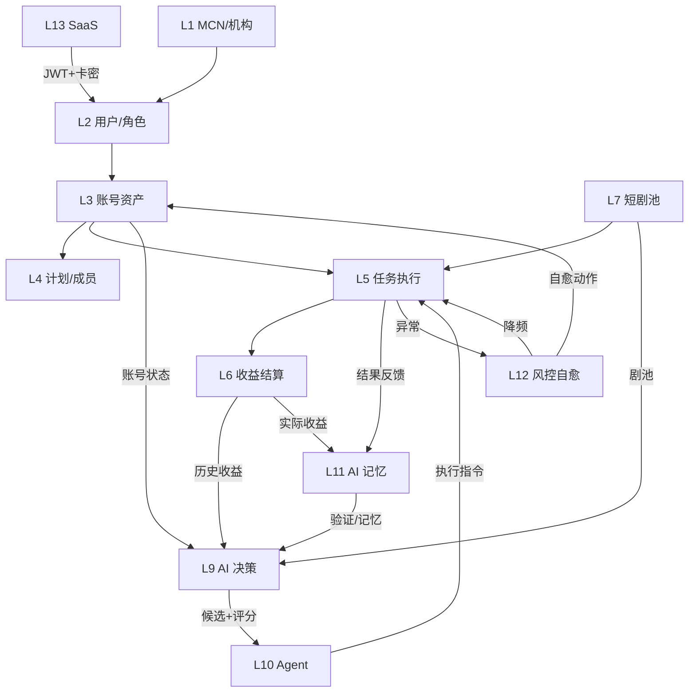

# 服务器后端完整蓝图 (含 AI 全自动化)

> **版本**: v1.0
> **出稿日期**: 2026-04-25
> **定位**: 本文档 = **KS184 后端蓝图 (L0-L8)** + **我们系统的 AI 自动化扩展 (L9-L13)**
> **基础文档**: `D:/KS184/mcn/analysis/BACKEND_REBUILD_BLUEPRINT.md`
> **配套文档**:
> - `docs/客户端改造完整计划v2.md` (用户端 PyQt6)
> - `docs/后端开发技术文档与接口规范v1.md` (接口契约)
> - `CLAUDE.md` (项目记忆)
>
> **本文档讲清楚**: 我们系统相对 KS184 的**核心差异** = AI 全自动化层, 以及这层怎么和 KS184 原有的 MCN 租户/账号/收益层融合.

---

## 前言 · 定位与增量

### KS184 原蓝图覆盖 (L0-L8, 不含 AI)

```
L0 平台层           超管 / 全局配置 / 服务状态
L1 租户机构层 ★     MCN / 机构 / 组织 / 机构 Cookie   ← 数据隔离边界
L2 用户权限层       用户 / 角色 / 页面权限 / 按钮权限
L3 账号资产层       软件账号 / KS账号 / 云 Cookie / 设备码
L4 计划业务层       星火 / 萤光 / 荧光 / 违规 / 邀约
L5 任务执行层       短剧链接 / 执行记录 / 成功失败
L6 收益结算层       本月 / 历史 / 收益明细 / 分成
L7 内容资产层       短剧收藏池 / 高转化短剧 / 收藏记录
L8 运维审计层       日志 / 公告 / 系统设置 / 健康检查
```

KS184 的后台本质是**多租户 MCN 业务中台** + **CRUD 运营后台** — 手动选剧, 手动发布, 人工盯盘.

### 我们系统新增 (L9-L13, AI 全自动化)

```
L9  AI 决策层       候选池 / 匹配评分 / 爆款雷达 / 账号分层 / 决策引擎
L10 Agent 自动化    9 大 Agent + ControllerAgent 统一调度
L11 AI 记忆层       3 层记忆 (决策历史 / 策略记忆 / 周记)
L12 风控自愈层       熔断器 / 健康评分 / playbook 自愈规则
L13 客户端 SaaS 层  卡密 / 硬件指纹 / JWT / 心跳 / 订阅
```

### 核心差异一句话

> **KS184 = 手动运营后台 (¥2000-5000 买断)**
> **我们 = KS184 全部能力 + AI 自动驾驶 + SaaS 分发**

差异化价值:
1. **数据驱动 AI 决策** — 不靠拍脑袋, 靠 publish_outcome 累积样本反馈
2. **爆款雷达预判** — 不是追随数据, 是提前识别潜力剧
3. **自愈自动化** — 熔断 + playbook 规则, 减少人工干预
4. **持续云服务** — 规则/作者池/协议热更新, 非买断即走

---

## 第一部分 · 完整分层架构 (L0-L13)

### 1.1 14 层全景图

```
┌─────────────────────────────────────────────────────────────────┐
│ L13  客户端 SaaS 层    卡密 / 硬件指纹 / JWT / 心跳 / 订阅 / 版本 │  ★ 新
├─────────────────────────────────────────────────────────────────┤
│ L12  风控自愈层         熔断器 / 健康评分 / playbook 规则 / 降频  │  ★ 新
├─────────────────────────────────────────────────────────────────┤
│ L11  AI 记忆层          Layer 1 决策历史 / Layer 2 策略 / Layer 3 周记 │  ★ 新
├─────────────────────────────────────────────────────────────────┤
│ L10  Agent 自动化层     9 大 Agent + Controller + Orchestrator   │  ★ 新
├─────────────────────────────────────────────────────────────────┤
│ L9   AI 决策层          候选池 / 匹配 / 爆款雷达 / 决策引擎       │  ★ 新
├─────────────────────────────────────────────────────────────────┤
│ L8   运维审计层         日志 / 公告 / 系统设置 / 健康检查          │  KS184 原
├─────────────────────────────────────────────────────────────────┤
│ L7   内容资产层         短剧收藏池 / 高转化 / 收藏记录             │  KS184 原
├─────────────────────────────────────────────────────────────────┤
│ L6   收益结算层         本月 / 历史 / 明细 / 分成                  │  KS184 原
├─────────────────────────────────────────────────────────────────┤
│ L5   任务执行层         短剧链接 / 执行记录 / 成功失败             │  KS184 原
├─────────────────────────────────────────────────────────────────┤
│ L4   计划业务层         星火 / 萤光 / 荧光 / 违规 / 邀约          │  KS184 原
├─────────────────────────────────────────────────────────────────┤
│ L3   账号资产层         软件账号 / KS账号 / 云 Cookie / 设备码     │  KS184 原
├─────────────────────────────────────────────────────────────────┤
│ L2   用户权限层         用户 / 角色 / 页面权限 / 按钮权限           │  KS184 原
├─────────────────────────────────────────────────────────────────┤
│ L1 ★ 租户机构层         MCN / 机构 / 组织 / 机构 Cookie            │  KS184 原 (核心)
├─────────────────────────────────────────────────────────────────┤
│ L0   平台层             超管 / 全局配置 / 服务状态                 │  KS184 原
└─────────────────────────────────────────────────────────────────┘
```

**MCN (L1) 仍是系统的核心业务边界** — 所有 L3-L7 的数据都通过 L1 租户隔离, AI 层 (L9-L11) 的决策也默认在单租户内.

### 1.2 层间数据流 (含 AI)



**关键闭环**:
1. L9 → L10 → L5 : AI 决策 → Agent 执行 → 发布
2. L5 → L6 → L11 → L9 : 结果 → 收益 → 记忆 → 反哺决策
3. L5 → L12 → L3 : 异常 → 自愈 → 账号保护

---

## 第二部分 · L1 MCN/租户层 (KS184 原, 沿用)

> 此层**完全沿用 KS184 原蓝图**, 详见原文档 §2 / §5.2. 本文档仅强调 AI 扩展时必须尊重的边界.

### 2.1 MCN 作为 AI 决策边界

```
AI 默认按租户隔离:
  StrategyPlanner 只对本 organization_id 下的账号排期
  BurstAgent 检测的爆款, 按租户范围返回
  AI 记忆 (L11) 按 (organization_id, account_id) 双键存储
  熔断器 (L12) 按 organization_id 分桶计数

跨租户行为 (仅限超管触发):
  全平台爆款大盘 (跨所有 MCN 聚合趋势)
  系统级 playbook 规则升级 (影响全平台)
  LLM 成本 / QPS 监控 (全局指标)
```

### 2.2 关键字段沿用

```sql
-- 来自 KS184 原蓝图, 我们系统所有 AI 层表必须带一个:
organization_id   -- MCN/机构
owner_user_id     -- 所有者
assigned_user_id  -- 指派给哪个用户
```

---

## 第三部分 · L9 AI 决策层 (新增)

### 3.1 职责

把 "哪天用哪个账号发哪部剧用什么策略" 这个决策**从人工拍脑袋变成算法评分**.

### 3.2 核心模块

#### 3.2.1 候选池 (Candidate Builder)

**文件**: `core/candidate_builder.py` (650 行)
**入口**: `build_candidate_pool(pool_date, dry_run) → dict`

**5 层漏斗**:
```
L1 base_pool         mcn_drama_library (134k 剧库镜像)        47,741 剧
L2 url_available     INNER JOIN mcn_wait_collect_videos       2,488 (有 URL)
L3 not_blacklisted   LEFT JOIN drama_blacklist 过滤             2,470
L4 violation_lock    LEFT JOIN spark_violation_dramas 过滤      1,529
L5 scored            6 维加权打分 → TOP 30 入池                    30
```

**6 维评分** (weights 可配置):

| 维度 | 权重 | 来源 |
|---|---|---|
| freshness (新鲜度) | 40 | wait_collect_videos.created_at 24h/48h 滚动 |
| url_ready (链路就绪) | 20 | 去重 URL 数 + CDN 直链比例 |
| commission (佣金) | 15 | drama_banner_tasks.commission_rate |
| heat (全网热度) | 10 | mcn_drama_library.income_desc log10 |
| matrix (矩阵历史) | 10 | 近 7 天本矩阵 publish 成功次数 |
| penalty (软扣) | - | violation_count 软扣 + blacklist 软扣 |

**硬锁** (composite_score = -9999):
- `spark_violation_dramas.violation_count >= 5`
- `drama_blacklist.status='active'`

**每日 07:45 自动生成** (见 L10 ControllerAgent step 17h).

#### 3.2.2 匹配评分 (Match Scorer)

**文件**: `core/match_scorer.py` (240 行)
**入口**: `match_score(account_id, drama_name, penalty?) → float`

```python
# 账号 × 剧 二维笛卡尔积打分
score = tier_weight(account)           # 账号分层权重
      + income_bonus(account)          # 账号历史收益
      + heat_bonus(drama)              # 剧热度
      + diversity_bonus                # 避免账号重复发
      - cooldown_penalty               # 冷却期
      - recent_fail_penalty            # 近期失败
      # §31 新增
      + affinity_signal                # AI 记忆 L2 偏好
      - avoid_penalty                  # AI 记忆 L2 避雷
      + trust_signal                   # AI 置信度
      + novelty_bonus                  # 组合新颖性
      + high_income_bonus              # MCN 官方高转化加分
      - blacklist_penalty              # 黑名单软扣
      - violation_penalty              # 违规软扣
      + freshness_bonus                # 时效新鲜加分
```

**典型结果**: 13 账号 × 30 剧 = 390 对, 按 score 降序, 贪心分派 → 约 30 条 plan_item.

#### 3.2.3 爆款雷达 (Burst Radar)

**文件**: `core/agents/burst_agent.py` (340 行)
**入口**: `detect_burst_candidates(lookback_hours=24) → list[dict]`

**检测维度**:
- 近 24h 播放增长率 > 阈值
- 近 24h 收益 > ¥X
- 竞争度 (同剧其他账号发布密度) 低
- 官方高转化榜命中

**触发**: 每 30min 由 ControllerAgent step 15 扫描.

#### 3.2.4 账号分层 (Account Tier)

**文件**: `core/account_tier.py` (340 行)
**6 状态机**: `new → testing → warming_up → established → viral → frozen`

**迁移规则** (基于 success_rate + income):
```
testing → warming_up:     ≥3 success AND success_rate ≥ 50% (近 7 天)
warming → established:    ≥10 success AND 月均 ≥ ¥3
established → viral:      日均 ≥ ¥5
任意 → frozen:            连续失败 N 次 (watchdog 触发)
frozen → testing:         冷却 48h 自动解冻
```

#### 3.2.5 决策引擎 (Decision Engine)

**文件**: `core/decision_engine.py` (1320 行)
**模式**: `AI` / `RULES` / `HYBRID` (默认 HYBRID)

**LangGraph 编排 4 节点**:
- `select_drama_node` (选剧)
- `select_strategy_node` (选 recipe)
- `decide_publish_node` (决定发不发)
- `decide_channel_node` (决定渠道)

**LLM 接入**: `core/llm_gateway.py` — Hermes / DeepSeek / OpenAI 统一抽象.

### 3.3 新增数据模型

```sql
-- 每日候选池 (5 层漏斗 + 6 维评分产物)
CREATE TABLE daily_candidate_pool (
    id INTEGER PRIMARY KEY AUTOINCREMENT,
    pool_date DATE NOT NULL,
    organization_id INTEGER,                      -- L1 租户隔离
    drama_name TEXT NOT NULL,
    banner_task_id TEXT,
    biz_id INTEGER,
    commission_rate REAL,
    freshness_tier TEXT,                          -- 'today' / 'within_48h' / 'legacy'
    w24h_count INTEGER, w48h_count INTEGER,
    cdn_count INTEGER, pool_count INTEGER,
    income_numeric REAL,
    violation_status TEXT,                        -- 'none' / 'flagged' / 'restricted'
    score_freshness REAL, score_url_ready REAL, score_commission REAL,
    score_heat REAL, score_matrix REAL, score_penalty REAL,
    composite_score REAL,
    status TEXT DEFAULT 'pending',                -- 'pending' / 'assigned' / 'finished'
    notes TEXT,
    created_at TIMESTAMP DEFAULT (datetime('now','localtime')),
    UNIQUE(pool_date, drama_name, organization_id)
);

-- 账号 × 剧 评分历史 (可选, 用于回溯)
CREATE TABLE match_score_history (
    id INTEGER PRIMARY KEY AUTOINCREMENT,
    account_id INTEGER NOT NULL,
    drama_name TEXT NOT NULL,
    organization_id INTEGER,
    score_total REAL,
    breakdown_json TEXT,                          -- JSON: 各维度分项
    computed_at TIMESTAMP
);

-- 爆款检测结果
CREATE TABLE burst_detections (
    id INTEGER PRIMARY KEY AUTOINCREMENT,
    drama_name TEXT NOT NULL,
    organization_id INTEGER,
    views_24h INTEGER, growth_pct REAL,
    income_24h REAL, competition_score REAL,
    recommended_accounts TEXT,                    -- JSON array
    detected_at TIMESTAMP,
    acted_upon INTEGER DEFAULT 0,                 -- 是否已触发跟发
    UNIQUE(drama_name, organization_id, date(detected_at))
);

-- 账号分层迁移历史
CREATE TABLE account_tier_transitions (
    id INTEGER PRIMARY KEY AUTOINCREMENT,
    account_id INTEGER NOT NULL,
    old_tier TEXT, new_tier TEXT,
    reason TEXT, triggered_by TEXT,               -- 'auto' / 'manual' / 'watchdog'
    transitioned_at TIMESTAMP
);

-- 同步镜像 (从 MCN 业务系统每日拉取)
CREATE TABLE mcn_drama_library (...);              -- 134k 剧库全量镜像
CREATE TABLE mcn_wait_collect_videos (...);        -- 22.9k 高转化待采集
CREATE TABLE mcn_url_pool (...);                   -- 1.8M 短链池
CREATE TABLE spark_violation_dramas_local (...);   -- 2760 违规库
CREATE TABLE mcn_member_snapshots (...);           -- 580 账号每日收益快照
```

---

## 第四部分 · L10 Agent 自动化层 (新增)

### 4.1 职责

把**原本人工定时点按钮**的操作 (每日上午选剧 / 每 2h 排队 / 每 5min 巡检) 交给 Agent 自动跑.

### 4.2 9 大 Agent

| # | Agent | 文件 | 频率 | 职责 |
|---|---|---|---|---|
| 1 | **StrategyPlanner** | `strategy_planner_agent.py` (1400 行) | 每日 08:00 | 读候选池 + 账号 tier, 生成 daily_plan_items |
| 2 | **TaskScheduler** | `task_scheduler_agent.py` | 每 2h | 把到期 plan_items 入 task_queue |
| 3 | **Watchdog** | `watchdog_agent.py` (220 行) | 每 5min | 失败率 / 冻结账号 / 取消 stuck |
| 4 | **Analyzer** | `analyzer_agent.py` (540 行) | 每日 17:00 | 聚合指标, 更新 strategy_rewards + L11 记忆 |
| 5 | **LLMResearcher** | `llm_researcher_agent.py` (700 行) | 每 12h | 调 LLM 生成新规则 + 升级建议 + 周记 |
| 6 | **BurstAgent** | `burst_agent.py` (340 行) | 每 30min | 爆款检测 + 全矩阵跟发 |
| 7 | **MaintenanceAgent** | `maintenance_agent.py` (350 行) | 每 1h | Cookie 刷新 / MCN token / 库清理 / 配额回补 |
| 8 | **SelfHealingAgent** | `self_healing_agent.py` (280 行) | 每 5min | 异常诊断 + 执行 playbook |
| 9 | **ControllerAgent** | `controller_agent.py` (300 行) | 每 60s | 主循环, 调度上述 8 个 Agent + 17 个子步骤 |

### 4.3 ControllerAgent 主循环 (17 步)

```
每 60 秒一轮, 每步各自 cooldown:

 1. 采集系统快照 → autopilot_cycles
 2. 查失败 → SelfHealing 触发
 3. 每小时 ThresholdAgent
 4. 每 24h Orchestrator
 5. 每 24h ReportAgent
 6. 每 6h UpgradeAgent
 7. 每 12h MCN cookie sync
 8. 每 24h MCN drama 全量同步
 9. 每 6h MCN member snapshot
10. Watchdog (每 5min)
11. TaskScheduler (每 2h)
12. StrategyPlanner (每日 08:00)
13. Analyzer + tier_eval (每日 17:00)
14. LLMResearcher (每 12h)
15. BurstAgent (每 30min)
16. MaintenanceAgent (每 1h)
17a-h. 各类同步 cron (04:00-07:45 每日)
  17a  sync_mcn_full
  17b  sync_url_pool
  17c  sync_spark_drama
  17d  sync_wait_collect (每 6h)
  17e  sync_account_bindings
  17f  sync_spark_violation
  17g  sync_wait_collect_incremental
  17h  build_candidate_pool (07:45 在 planner 前)
```

### 4.4 Agent 调度粒度

```
Dry-run 模式:     所有 Agent 都支持 --dry-run, 仅写日志不改库
Per-tenant:      通过 organization_id 过滤, 默认按租户隔离
Manual trigger:  管理员可手动触发 (/api/admin/agents/{name}/trigger)
Replay:          历史 run_id 可重放 (/api/admin/agents/replay/{run_id})
```

### 4.5 新增数据模型

```sql
-- Agent 运行记录
CREATE TABLE agent_runs (
    id INTEGER PRIMARY KEY AUTOINCREMENT,
    run_id TEXT UNIQUE,                           -- UUID
    agent_name TEXT NOT NULL,
    organization_id INTEGER,
    trigger_type TEXT,                            -- 'schedule' / 'manual' / 'replay'
    triggered_by INTEGER,                         -- user_id (manual 时)
    started_at TIMESTAMP, finished_at TIMESTAMP,
    status TEXT,                                  -- 'running' / 'success' / 'failed' / 'canceled'
    input_json TEXT, output_json TEXT,
    error_message TEXT,
    cycle_id INTEGER                              -- 关联 autopilot_cycles
);

-- Agent 批次 (一次 ControllerAgent cycle 产生多个 run)
CREATE TABLE agent_batches (
    id INTEGER PRIMARY KEY AUTOINCREMENT,
    batch_id TEXT UNIQUE,
    total_runs INTEGER, success_runs INTEGER,
    started_at TIMESTAMP, finished_at TIMESTAMP
);

-- Agent 记忆 (可持久化的中间状态, 供下次运行用)
CREATE TABLE agent_memories (
    id INTEGER PRIMARY KEY AUTOINCREMENT,
    agent_name TEXT, memory_type TEXT,
    content_json TEXT,
    pinned INTEGER DEFAULT 0,                     -- 置顶不遗忘
    valid INTEGER DEFAULT 1,                      -- 管理员可无效化
    created_at TIMESTAMP, updated_at TIMESTAMP
);

-- Agent 决策 (LLM 决策的结果快照)
CREATE TABLE agent_decisions (
    id INTEGER PRIMARY KEY AUTOINCREMENT,
    run_id TEXT,                                  -- 关联 agent_runs
    node_name TEXT,                               -- LangGraph 节点名
    input_state_json TEXT, output_state_json TEXT,
    llm_provider TEXT, llm_model TEXT,
    tokens_in INTEGER, tokens_out INTEGER,
    cost_cents REAL,
    latency_ms INTEGER,
    created_at TIMESTAMP
);

-- AutoPilot 主循环健康度
CREATE TABLE autopilot_cycles (
    id INTEGER PRIMARY KEY AUTOINCREMENT,
    cycle_id INTEGER UNIQUE,
    organization_id INTEGER,
    started_at TIMESTAMP, finished_at TIMESTAMP,
    duration_ms INTEGER,
    status TEXT,                                  -- 'ok' / 'degraded' / 'error' / 'stuck_reset'
    steps_executed INTEGER, steps_skipped INTEGER,
    errors_json TEXT
);

-- AutoPilot 诊断流 (摘要, 给客户端看)
CREATE TABLE autopilot_diagnoses (
    id INTEGER PRIMARY KEY AUTOINCREMENT,
    organization_id INTEGER,
    diagnosis_type TEXT,                          -- 'account_issue' / 'drama_issue' / 'system_issue'
    severity TEXT,                                -- 'low' / 'medium' / 'high' / 'critical'
    summary TEXT,                                 -- 人话摘要
    affected_object TEXT,
    detected_at TIMESTAMP,
    resolved_at TIMESTAMP,
    auto_resolved INTEGER DEFAULT 0
);

-- AutoPilot 自动动作记录
CREATE TABLE autopilot_actions (
    id INTEGER PRIMARY KEY AUTOINCREMENT,
    organization_id INTEGER,
    action_type TEXT,                             -- 'relogin' / 'throttle' / 'freeze' / 'retry'
    target_type TEXT, target_id TEXT,
    triggered_by_diagnosis_id INTEGER,
    result TEXT,                                  -- 'success' / 'failed'
    executed_at TIMESTAMP
);

-- AutoPilot 日报 / 周报
CREATE TABLE autopilot_reports (
    id INTEGER PRIMARY KEY AUTOINCREMENT,
    organization_id INTEGER,
    period TEXT,                                  -- 'daily' / 'weekly'
    start_date DATE, end_date DATE,
    summary_text TEXT,                            -- LLM 生成的人话摘要
    stats_json TEXT,                              -- 结构化指标
    generated_at TIMESTAMP
);
```

### 4.6 Agent 对 MCN 租户的处理

```python
# 每个 Agent 默认带 organization_id 参数

def run(organization_id: Optional[int] = None, dry_run: bool = False):
    if organization_id is None:
        # 超管触发: 遍历所有租户
        for org in list_all_organizations():
            _run_for_org(org.id, dry_run)
    else:
        _run_for_org(organization_id, dry_run)
```

---

## 第五部分 · L11 AI 记忆层 (新增)

### 5.1 三层记忆架构

```
Layer 3  account_diary_entries   (文本级, LLM 每 12h 自然语言总结)
Layer 2  account_strategy_memory (聚合级, 每账号 1 行, Analyzer 每日更新)
Layer 1  account_decision_history(事件级, append-only, 每决策 1 行)
```

### 5.2 核心决策闭环

```
Planner 生成 plan_item
    ↓ 同步写 decision_history (Layer 1) - hypothesis/expected/confidence
    ↓
Task 执行完成
    ↓ Analyzer 跑 verdict - 对比预期 vs 实际
    ↓ 自动分 4 类: correct / over_optimistic / under_confident / wrong
    ↓
Analyzer 每日 17:00 重建 Layer 2
    ↓ preferred_recipes / preferred_image_modes / avoid_drama_ids
    ↓ ai_trust_score = correct / total (≥3 样本才有)
    ↓
LLMResearcher 每 12h 生成 Layer 3 diary
    ↓ Hermes 输入 L1 + L2 → 4 段: summary/review/lessons/strategy
    ↓
下次 Planner 读 Layer 2 → match_scorer 4 信号输入 → 更精准决策
```

### 5.3 match_scorer 4 个 AI 记忆信号

```python
score = ... (基础分项)
      + affinity_signal (0~+15)       # 该账号对此 recipe/image_mode 历史命中率
      - avoid_penalty (0~-50)         # 该账号历史 over_optimistic/wrong 的剧直接扣
      + trust_signal (-10~+10)        # AI 对该账号历史判断准确率校准
      + novelty_bonus (0 or +8)       # 从未试过的 (recipe, image_mode) 组合加分
```

### 5.4 Verdict 自动判定

```
actual.status='failed'       → 'wrong'
0.5 ≤ actual/expected ≤ 2.0  → 'correct'
actual/expected < 0.5        → 'over_optimistic'  (AI 过度乐观)
actual/expected > 2.0        → 'under_confident'  (AI 低估)
缺少 income 数据             → 'pending'
success + income=0 + age<48h → 'pending' (MCN 收益滞后保护)
```

### 5.5 新增数据模型

```sql
-- Layer 1: 决策历史 (append-only)
CREATE TABLE account_decision_history (
    id INTEGER PRIMARY KEY AUTOINCREMENT,
    decision_id TEXT UNIQUE,
    account_id INTEGER NOT NULL,
    organization_id INTEGER,
    drama_name TEXT,
    recipe TEXT, image_mode TEXT,
    hypothesis TEXT,                              -- 决策依据
    confidence REAL,                              -- 0-1
    expected_income REAL, expected_views INTEGER,
    task_id TEXT,                                 -- 关联 task_queue
    plan_item_id INTEGER,
    actual_income REAL, actual_views INTEGER,
    verdict TEXT,                                 -- correct/over_optimistic/under_confident/wrong/pending
    notes TEXT,
    decided_at TIMESTAMP,
    verdict_at TIMESTAMP
);

-- Layer 2: 策略记忆 (每账号 1 行, 可更新)
CREATE TABLE account_strategy_memory (
    account_id INTEGER PRIMARY KEY,
    organization_id INTEGER,
    total_decisions INTEGER DEFAULT 0,
    correct_count INTEGER DEFAULT 0,
    ai_trust_score REAL,                          -- correct/total (≥3 样本)
    income_7d REAL, income_30d REAL,
    preferred_recipes TEXT,                       -- JSON: {recipe: hit_rate}
    preferred_image_modes TEXT,                   -- JSON
    avoid_drama_ids TEXT,                         -- JSON array
    avoid_recipes TEXT,                           -- JSON
    updated_at TIMESTAMP
);

-- Layer 3: 周记 (LLM 生成, 可审批)
CREATE TABLE account_diary_entries (
    id INTEGER PRIMARY KEY AUTOINCREMENT,
    account_id INTEGER, organization_id INTEGER,
    week_start DATE, week_end DATE,
    summary TEXT,                                 -- LLM 输出 4 段:
    performance_review TEXT,
    lessons_learned TEXT,
    next_week_strategy TEXT,
    raw_llm_output TEXT,                          -- 备份
    approved INTEGER DEFAULT 0,
    approved_by INTEGER, approved_at TIMESTAMP,
    generated_at TIMESTAMP
);

-- 策略奖励矩阵 (多臂老虎机 Bandit 用)
CREATE TABLE strategy_rewards (
    id INTEGER PRIMARY KEY AUTOINCREMENT,
    account_tier TEXT, recipe TEXT, image_mode TEXT,
    organization_id INTEGER,
    total_trials INTEGER DEFAULT 0,
    total_reward REAL DEFAULT 0,
    avg_reward REAL,
    last_updated TIMESTAMP,
    UNIQUE(account_tier, recipe, image_mode, organization_id)
);
```

### 5.6 记忆边界与隐私

```
跨账号记忆: 默认隔离 (account_id 绑定)
跨租户记忆: 默认隔离 (organization_id 绑定)
记忆合并 (TEAM 级): app_config 可选
  ai.memory.strategy.scope = "account" | "organization" | "team"

LLM 使用:
  发送到 LLM 的内容不含 Cookie / Token / 手机号 / 支付宝
  只含脱敏后的 (account_id, 分层, 近 7 天 verdict 统计)
  LLM 返回不直接写库, 必须经 Analyzer 校验后落 Layer 3 (approved=0)
```

---

## 第六部分 · L12 风控自愈层 (新增)

### 6.1 两大子系统

1. **熔断器 (Circuit Breaker)** — 防雪崩式故障
2. **Playbook 自愈** — 规则库驱动的自动修复

### 6.2 熔断器 (core/circuit_breaker.py)

**模式**: CLOSED (正常) / OPEN (熔断中) / HALF_OPEN (探测恢复)

**监控目标** (4 大默认 breaker):
- `mcn_relay_submit` — MCN :50002 代签
- `mcn_sync_fluorescent` — MCN 收益拉取
- `kuaishou_publish` — 快手发布 API
- `kuaishou_upload` — 快手上传 API

**配置** (app_config):
```
breaker.{name}.fail_threshold       5 次连续失败触发
breaker.{name}.cooldown_sec         300 秒冷却
breaker.{name}.half_open_test       1 次探测请求
```

### 6.3 Playbook 规则库 (core/agents/self_healing_agent.py)

**规则表**:
```sql
CREATE TABLE healing_playbook (
    id INTEGER PRIMARY KEY AUTOINCREMENT,
    code TEXT UNIQUE,                             -- 规则标识
    name TEXT,                                    -- 人读名
    symptom_pattern TEXT,                         -- 正则或关键词匹配
    remedy_action TEXT,                           -- 执行动作
    confidence REAL,                              -- 规则置信度
    enabled INTEGER DEFAULT 1,
    cooldown_hours INTEGER,
    success_count INTEGER DEFAULT 0,
    fail_count INTEGER DEFAULT 0,
    last_triggered_at TIMESTAMP,
    llm_analyzed_at TIMESTAMP,
    proposed_by TEXT,                             -- 'seed' / 'llm' / 'manual'
    created_at TIMESTAMP
);
```

**12 个种子规则**:

| code | 症状 | 动作 |
|---|---|---|
| `cookie_invalid` | 登录失效 | 触发 COOKIE_REFRESH |
| `rate_limited_429` | 429 限流 | 24h 冷却 |
| `sig3_signature_error` | sig3 失败 | 6h 冷却 + critical alert |
| `video_hls_download_fail` | HLS 下载失败 | 重采集 |
| `task_stuck_running_1h` | running > 1h | 重排上游 |
| `mcn_verify_failed` | MCN HMAC 失败 | refresh captain token |
| `kuaishou_auth_expired_109` | result=109 | 立即刷新 Cookie |
| `kuaishou_short_link_rate_limited` | 短链限流 | 30 分钟 COOLDOWN_DRAMA |
| `mcn_blacklist_hit` | 黑名单命中 | 阻断任务 |
| `account_violation_burst` | 24h 内同账号 ≥3 张违规图 | enqueue FREEZE_ACCOUNT |
| `circuit_breaker_opened` | breaker 打开 | 通知 + 延迟重试 |
| `no_urls_available` | 无 URL | 触发 collector_on_demand |

### 6.4 LLM 驱动的规则进化

**LLMResearcher 每 12h 做 2 件事**:

1. `propose_new_rules_from_unmatched(hours=24)`:
   - 查近 24h failed tasks, 找**未匹配任何 playbook 的错误聚类**
   - 聚类数 ≥3 → 调 Hermes 分析 → 生成 `rule_proposals` (status=pending)
   - 管理员在 UI 审批

2. `propose_upgrades_for_low_confidence()`:
   - 查 `success_count + fail_count ≥ 5 AND success_rate < 0.5` 的老规则
   - 调 Hermes → 建议: refine_pattern / change_action / adjust_params / deprecate
   - 写 `upgrade_proposals`

### 6.5 新增数据模型

```sql
-- 熔断器事件流 (状态转换)
CREATE TABLE circuit_breaker_events (
    id INTEGER PRIMARY KEY AUTOINCREMENT,
    breaker_name TEXT, organization_id INTEGER,
    old_state TEXT, new_state TEXT,
    reason TEXT, consec_fails INTEGER,
    occurred_at TIMESTAMP
);

-- 自愈诊断 (何时何处发现问题)
CREATE TABLE healing_diagnoses (
    id INTEGER PRIMARY KEY AUTOINCREMENT,
    playbook_code TEXT,                           -- 关联 healing_playbook
    organization_id INTEGER,
    evidence_json TEXT,                           -- 触发证据
    severity TEXT, confidence REAL,
    auto_resolved INTEGER DEFAULT 0,
    resolved_at TIMESTAMP,
    diagnosed_at TIMESTAMP
);

-- 自愈动作执行记录
CREATE TABLE healing_actions (
    id INTEGER PRIMARY KEY AUTOINCREMENT,
    diagnosis_id INTEGER,
    action_type TEXT, target_type TEXT, target_id TEXT,
    status TEXT,                                  -- 'pending' / 'running' / 'success' / 'failed'
    result_json TEXT,
    started_at TIMESTAMP, finished_at TIMESTAMP
);

-- LLM 生成的规则提议 (待审批)
CREATE TABLE rule_proposals (
    id INTEGER PRIMARY KEY AUTOINCREMENT,
    proposal_id TEXT UNIQUE,
    target_playbook_id INTEGER,                   -- 对现有规则的升级; null=新规则
    symptom_pattern TEXT, remedy_action TEXT,
    llm_confidence REAL, llm_rationale TEXT,
    status TEXT DEFAULT 'pending',                -- pending / approved / rejected
    decided_by INTEGER, decided_at TIMESTAMP,
    applied_at TIMESTAMP,                         -- 批准后何时生效
    created_at TIMESTAMP
);

-- LLM 生成的升级提议
CREATE TABLE upgrade_proposals (
    id INTEGER PRIMARY KEY AUTOINCREMENT,
    proposal_id TEXT UNIQUE,
    target_playbook_id INTEGER,
    suggestion_type TEXT,                         -- 'refine_pattern' / 'change_action' / 'adjust_params' / 'deprecate'
    new_config_json TEXT,
    llm_rationale TEXT,
    status TEXT DEFAULT 'pending',
    decided_by INTEGER, decided_at TIMESTAMP,
    applied_at TIMESTAMP,
    created_at TIMESTAMP
);

-- 账号×剧黑名单 (80004 闭环)
CREATE TABLE account_drama_blacklist (
    id INTEGER PRIMARY KEY AUTOINCREMENT,
    account_id INTEGER, drama_name TEXT,
    organization_id INTEGER,
    reason TEXT, source TEXT,                     -- 'mcn_80004' / 'manual' / 'violation'
    block_count INTEGER DEFAULT 1,
    first_blocked_at TIMESTAMP, last_blocked_at TIMESTAMP,
    expires_at TIMESTAMP,                         -- null = 永久
    UNIQUE(account_id, drama_name, organization_id)
);

-- 运营模式 Adaptive 5-tier
CREATE TABLE operation_mode_history (
    id INTEGER PRIMARY KEY AUTOINCREMENT,
    organization_id INTEGER,
    old_mode TEXT, new_mode TEXT,                 -- startup/growth/volume/matrix/scale
    account_count INTEGER,
    reason TEXT,
    transitioned_at TIMESTAMP
);
```

### 6.6 风控边界

```
租户隔离:
  breaker 按 (breaker_name, organization_id) 分桶
  playbook 规则可系统级 (对所有租户生效), 也可租户级 (单 MCN 独有)
  
客户端可见度 (DO NOT, 见 客户端改造完整计划v2.md):
  ❌ 不让用户看熔断器状态
  ❌ 不让用户看 playbook_code / confidence 等原始字段
  ✅ 客户端看到: "系统检测到异常, 已自动降频保护" (人话)
```

---

## 第七部分 · L13 客户端 SaaS 层 (新增)

> 详细协议见 `docs/后端开发技术文档与接口规范v1.md`. 本节只讲数据模型.

### 7.1 职责

把软件从"本地工具"变成"**授权制 SaaS 分发**":
- 卡密激活 (买断 + 订阅混合)
- 硬件指纹绑定 (防拷贝)
- JWT + 心跳 (防破解)
- 版本 tier (MANUAL/PRO/TEAM 三档)
- 订阅续费 + 提醒

### 7.2 新增数据模型

```sql
-- 卡密主表
CREATE TABLE licenses (
    id INTEGER PRIMARY KEY AUTOINCREMENT,
    license_key TEXT UNIQUE NOT NULL,             -- XXXX-YYYY-ZZZZ-WWWW
    plan TEXT NOT NULL,                           -- 'manual' / 'pro' / 'team'
    plan_duration_days INTEGER,                   -- 365 / null(买断)
    issued_at TIMESTAMP NOT NULL,
    expires_at TIMESTAMP,                         -- null = 永久
    status TEXT DEFAULT 'unused',                 -- 'unused' / 'active' / 'expired' / 'revoked'
    
    -- 绑定信息
    bound_user_id INTEGER,
    bound_fingerprint TEXT,                       -- sha256 截断
    activated_at TIMESTAMP,
    
    -- 订单关联
    order_id INTEGER,
    
    -- 元数据
    batch_id TEXT,                                -- 批量生成时的批次号
    note TEXT,
    created_by INTEGER,                           -- 发卡管理员
    created_at TIMESTAMP
);
CREATE INDEX idx_licenses_status ON licenses(status);
CREATE INDEX idx_licenses_fingerprint ON licenses(bound_fingerprint);
CREATE INDEX idx_licenses_user ON licenses(bound_user_id);

-- 硬件指纹记录 (一个 license 可能换机过, 保留历史)
CREATE TABLE device_fingerprints (
    id INTEGER PRIMARY KEY AUTOINCREMENT,
    license_id INTEGER NOT NULL,
    fingerprint_hash TEXT NOT NULL,               -- sha256[:32]
    os_info TEXT, client_version TEXT,
    first_seen_at TIMESTAMP, last_seen_at TIMESTAMP,
    revoked_at TIMESTAMP,                         -- 换机时老指纹作废
    UNIQUE(license_id, fingerprint_hash)
);

-- 激活/登录事件流
CREATE TABLE license_events (
    id INTEGER PRIMARY KEY AUTOINCREMENT,
    license_id INTEGER NOT NULL,
    event_type TEXT,                              -- 'activated' / 'login' / 'heartbeat' / 'rebind' / 'revoked'
    fingerprint_hash TEXT,
    ip_addr TEXT,                                 -- 可用于地理异常检测
    user_agent TEXT,
    at TIMESTAMP
);

-- 心跳记录 (高频, 可分区)
CREATE TABLE license_heartbeats (
    id INTEGER PRIMARY KEY AUTOINCREMENT,
    license_id INTEGER NOT NULL,
    at TIMESTAMP,
    client_version TEXT,
    ip_addr TEXT
);
-- Phase 5+ 考虑改 Redis 或 TimescaleDB

-- 订阅 (续费关系)
CREATE TABLE subscriptions (
    id INTEGER PRIMARY KEY AUTOINCREMENT,
    license_id INTEGER NOT NULL,
    user_id INTEGER,
    plan TEXT,
    starts_at TIMESTAMP, ends_at TIMESTAMP,
    auto_renew INTEGER DEFAULT 0,
    status TEXT,                                  -- 'active' / 'expiring' / 'expired' / 'canceled'
    created_at TIMESTAMP
);

-- 订单
CREATE TABLE orders (
    id INTEGER PRIMARY KEY AUTOINCREMENT,
    order_id TEXT UNIQUE,
    user_id INTEGER,
    plan TEXT, duration_days INTEGER,
    amount REAL, currency TEXT DEFAULT 'CNY',
    payment_method TEXT,                          -- 'alipay' / 'wechatpay' / 'manual'
    status TEXT,                                  -- 'pending' / 'paid' / 'refunded' / 'canceled'
    paid_at TIMESTAMP,
    license_id INTEGER,                           -- 付款后生成卡密
    created_at TIMESTAMP
);

-- 疑似破解/盗版追溯
CREATE TABLE license_anomalies (
    id INTEGER PRIMARY KEY AUTOINCREMENT,
    anomaly_type TEXT,                            -- 'same_fingerprint_multiple_licenses' / 'geo_jump' / 'abnormal_pattern'
    license_id INTEGER, user_id INTEGER,
    fingerprint_hash TEXT, ip_addr TEXT,
    details_json TEXT,
    severity TEXT,                                -- 'low' / 'medium' / 'high'
    status TEXT DEFAULT 'pending',                -- 'pending' / 'investigating' / 'confirmed' / 'dismissed'
    detected_at TIMESTAMP
);
```

### 7.3 激活流程 (时序)

```
[客户端 exe 首启]
  1. 用户输 license_key + phone
  2. 客户端算 fingerprint = sha256(cpu_id + motherboard_sn + disk_serial)[:32]
  3. POST /api/client/auth/activate

[服务端]
  4. 校验 license_key 存在 + status='unused'
  5. 若 license.bound_fingerprint 非空且不匹配 → 409 CONFLICT
  6. 若 license.expires_at < now → 402 AUTH_402
  7. 创建 user (如不存在, 按 phone 查找)
  8. UPDATE licenses SET bound_user_id=?, bound_fingerprint=?, status='active', activated_at=?
  9. INSERT device_fingerprints, license_events('activated')
  10. 签 JWT (30min) + refresh_token (30d)
  11. 返 { token, refresh_token, user, plan, expires_at }

[客户端]
  12. 保存 token + refresh_token 到本地 (SQLCipher 加密)
  13. 启心跳定时器 (5min)

[每 5min 心跳]
  POST /api/client/auth/heartbeat
  {fingerprint, client_ts}
    → 验 JWT + 验 fingerprint 匹配 + 验 license.expires_at > now
    → UPDATE license_heartbeats
    → 返 {server_time, plan, expires_at, features, notice?}
```

### 7.4 换机策略

```
用户换电脑 → 旧机器 fingerprint 不匹配新机器

Phase 1-3 (自用 + 内测): 人工支持
  用户联系客服 → 管理员点 /api/admin/licenses/{id}/rebind → 清 bound_fingerprint

Phase 4+ (正式): 客户自助
  POST /api/client/license/rebind
  body: {license_key, phone, sms_verification_code, new_fingerprint}
  限制: 90 天内最多 2 次换机, 每次需短信验证
```

### 7.5 SaaS 层对 L1-L8 的关系

```
一个 license → 一个 user → 对应 MCN (L1) 角色

  MANUAL license  → user.role='viewer' (在某个 MCN 下, 只管自己的账号)
  PRO license     → user.role='operator' (自己的小工作室)
  TEAM license    → user.role='admin' (自己开一个 MCN 机构, 可加成员)

多个 TEAM license 可共享一个 MCN (同工作室多角色)
```

---

## 第八部分 · 页面扩展 (原 14 页 → 22 页)

### 8.1 KS184 原蓝图 14 页 (沿用)

> 详见 KS184 蓝图 §4.

```
数据概览: 概览仪表盘 / 执行统计
账号管理: 软件账号 / KS账号 / 机构成员 / 账号违规 / 用户管理
收益管理: 钱包 / 萤光 (月/历史/明细) / 星火 (月/历史/明细)
短剧管理: 收藏池 / 高转化 / 链接统计 / 收藏记录
外部项目: CXT 用户 / 视频 / 统计
系统管理: 系统配置 / 云端 Cookie
```

### 8.2 新增 AI 管理页 (8 页)

| # | 新增页面 | 模块 | 权限 |
|---|---|---|---|
| 15 | **AutoPilot 控制台** | L10 Agent | super_admin / operator |
| 16 | **AI 决策引擎** | L9 AI | super_admin / ai_admin |
| 17 | **候选池监控** | L9 AI | super_admin / operator |
| 18 | **Agent 运行监控** | L10 Agent | super_admin / ai_admin |
| 19 | **AI 记忆浏览** | L11 AI 记忆 | super_admin / operator |
| 20 | **自愈 Playbook 管理** | L12 风控 | super_admin |
| 21 | **规则提议审批** | L12 + LLM | super_admin |
| 22 | **熔断器监控** | L12 风控 | super_admin / operator |

### 8.3 新增 SaaS 运营页 (4 页)

| # | 新增页面 | 模块 | 权限 |
|---|---|---|---|
| 23 | **卡密管理** | L13 SaaS | super_admin / billing_admin |
| 24 | **订单管理** | L13 SaaS | super_admin / billing_admin |
| 25 | **客户端版本管理** | L13 SaaS | super_admin |
| 26 | **破解追溯** | L13 SaaS | super_admin |

### 8.4 加强的 LLM 配置页 (1 页, 原属系统配置)

| # | 页面 | 功能 |
|---|---|---|
| 27 | **LLM Provider 配置** | Hermes / DeepSeek / OpenAI 切换 + API Key 管理 + 成本监控 |

**合计**: 原 14 页 + 新增 13 页 = **27 个管理页** (后台管理员用, 不含用户端 22 页).

---

## 第九部分 · API 扩展清单

### 9.1 KS184 原 API (沿用, 约 60 个)

> 详见 KS184 蓝图 §6. 本节只列新增.

### 9.2 新增 /api/admin/* (管理员 API, ~55 个)

#### AI 决策 (10)
```http
GET    /api/admin/ai/candidate-pool?date=
POST   /api/admin/ai/candidate-pool/rebuild
GET    /api/admin/ai/candidate-pool/funnel-stats
GET    /api/admin/ai/burst-detections
POST   /api/admin/ai/burst-detections/{id}/trigger
GET    /api/admin/ai/match-scores?account_id=
POST   /api/admin/ai/match-scores/recompute
GET    /api/admin/ai/account-tiers
POST   /api/admin/ai/account-tiers/run-evaluation
GET    /api/admin/ai/decision-engine/config
```

#### Agent 管理 (10)
```http
GET    /api/admin/agents/list
GET    /api/admin/agents/summary
GET    /api/admin/agents/runs?status=&agent=&limit=
GET    /api/admin/agents/runs/{run_id}
GET    /api/admin/agents/batches
POST   /api/admin/agents/{name}/trigger
POST   /api/admin/agents/replay/{run_id}
GET    /api/admin/agents/memories
POST   /api/admin/agents/memories/{id}/pin
POST   /api/admin/agents/memories/{id}/invalidate
POST   /api/admin/agents/consolidate-memory
GET    /api/admin/agents/decisions
```

#### AutoPilot 监控 (8)
```http
GET    /api/admin/autopilot/status?organization_id=
GET    /api/admin/autopilot/cycles?limit=
GET    /api/admin/autopilot/diagnoses?severity=
GET    /api/admin/autopilot/actions
GET    /api/admin/autopilot/playbook
POST   /api/admin/autopilot/trigger
POST   /api/admin/autopilot/report/generate
GET    /api/admin/autopilot/reports
```

#### 自愈与规则 (10)
```http
GET    /api/admin/healing/playbook
POST   /api/admin/healing/playbook           # 手动添加规则
PUT    /api/admin/healing/playbook/{code}
DELETE /api/admin/healing/playbook/{code}
POST   /api/admin/healing/playbook/{code}/toggle
GET    /api/admin/healing/diagnoses
GET    /api/admin/healing/actions
GET    /api/admin/rules/proposals
POST   /api/admin/rules/proposals/{id}/approve
POST   /api/admin/rules/proposals/{id}/reject
GET    /api/admin/rules/upgrades
POST   /api/admin/rules/upgrades/{id}/approve
POST   /api/admin/rules/upgrades/scan
```

#### 熔断器 (5)
```http
GET    /api/admin/circuit-breakers
GET    /api/admin/circuit-breakers/{name}
POST   /api/admin/circuit-breakers/{name}/reset
GET    /api/admin/circuit-breakers/events
GET    /api/admin/circuit-breakers/mcn-snapshot
```

#### AI 记忆 (6)
```http
GET    /api/admin/memory/decisions?account_id=
GET    /api/admin/memory/strategy?account_id=
POST   /api/admin/memory/strategy/{account_id}/rebuild
GET    /api/admin/memory/diaries?account_id=
POST   /api/admin/memory/diaries/{id}/approve
POST   /api/admin/memory/diaries/generate
```

#### 卡密管理 (10)
```http
POST   /api/admin/licenses/generate          # 批量生成
body:  {count, plan, duration_days, batch_id, note}
GET    /api/admin/licenses?status=&plan=
GET    /api/admin/licenses/{id}
POST   /api/admin/licenses/{id}/revoke
POST   /api/admin/licenses/{id}/rebind       # 帮用户换机
POST   /api/admin/licenses/{id}/extend       # 续期
GET    /api/admin/licenses/{id}/events
GET    /api/admin/licenses/{id}/heartbeats
GET    /api/admin/licenses/stats
GET    /api/admin/licenses/anomalies
```

#### 订单财务 (5)
```http
GET    /api/admin/orders?status=&date_from=&date_to=
GET    /api/admin/orders/{id}
POST   /api/admin/orders/{id}/refund
POST   /api/admin/orders/manual              # 手动开单
GET    /api/admin/finance/summary            # 日/月营收
```

#### 客户端版本 (5)
```http
GET    /api/admin/client-versions
POST   /api/admin/client-versions            # 发布新版
PUT    /api/admin/client-versions/{version}/grayscale  # 灰度比例
POST   /api/admin/client-versions/{version}/force
GET    /api/admin/client-versions/install-stats
```

#### LLM 配置 (6)
```http
GET    /api/admin/llm/providers
POST   /api/admin/llm/providers
PUT    /api/admin/llm/providers/{code}
GET    /api/admin/llm/prompts
PUT    /api/admin/llm/prompts/{key}
POST   /api/admin/llm/test                   # 测试调用
GET    /api/admin/llm/usage                  # 成本统计
```

#### 全体监控 (6)
```http
GET    /api/admin/monitoring/online-clients  # 实时在线客户数
GET    /api/admin/monitoring/api-health
GET    /api/admin/monitoring/mcn-health
GET    /api/admin/monitoring/db-health
GET    /api/admin/monitoring/alerts
POST   /api/admin/monitoring/alerts/{id}/ack
```

### 9.3 /api/client/* (用户端, 86 个)

> 完整清单见 `docs/后端开发技术文档与接口规范v1.md` §4.

### 9.4 合计

```
KS184 原 API:          ~60
新增 /api/admin/*:     ~75
新增 /api/client/*:    ~86
───────────────────────────
总计:                  ~220 个接口
```

---

## 第十部分 · 租户隔离 (AI 层扩展)

### 10.1 原蓝图规则 (沿用)

```
所有业务表必须带: organization_id / owner_user_id / assigned_user_id
所有查询必须 applyTenantScope() 追加条件
所有批量操作必须 validatePayloadOwnership() 逐条校验
```

### 10.2 AI 层新增隔离

```
L9 AI 决策层:
  daily_candidate_pool       WHERE organization_id = ?
  match_score_history        WHERE organization_id = ?
  burst_detections           WHERE organization_id = ?
  account_tier_transitions   WHERE account IN (organization 下的 account)

L10 Agent 层:
  agent_runs                 WHERE organization_id = ? (或 NULL=平台级)
  agent_batches              同上
  autopilot_cycles           WHERE organization_id = ?
  autopilot_actions          WHERE organization_id = ?

L11 AI 记忆层:
  account_decision_history   WHERE account IN scope
  account_strategy_memory    WHERE account IN scope
  account_diary_entries      WHERE account IN scope
  strategy_rewards           WHERE organization_id = ?

L12 风控自愈层:
  healing_diagnoses          WHERE organization_id = ?
  healing_actions            同上
  circuit_breaker_events     WHERE organization_id = ?
  account_drama_blacklist    WHERE account IN scope
  
  healing_playbook           系统级 (所有租户共享, 超管才能改)
  rule_proposals             系统级 (超管审批)

L13 SaaS 层:
  licenses                   WHERE bound_user_id IN scope
  orders                     WHERE user_id IN scope
  subscriptions              同上
```

### 10.3 新增高风险接口

| 接口 | 风险 | 隔离要求 |
|---|---|---|
| `/api/admin/agents/{name}/trigger` | 可能影响全平台 | 必须带 `organization_id` 参数; 不指定则仅超管可用 |
| `/api/admin/healing/playbook POST` | 加新规则影响全平台 | 仅超管 |
| `/api/admin/memory/diaries/generate` | LLM 成本大 | 限流 + 超管 |
| `/api/admin/licenses/generate` | 发卡涉及财务 | billing_admin + 审计 |
| `/api/admin/llm/providers PUT` | 动 LLM key | 仅超管 + 审计 |

---

## 第十一部分 · 权限体系扩展

### 11.1 原 4 种角色 (KS184 沿用)

```
super_admin    level=100    全平台
operator(团长) level=50     自己 MCN + 下属
captain(队长)  level=30     自己 + 下属 normal
normal_user    level=10     仅自己
```

### 11.2 新增 3 种角色 (SaaS 运营需要)

```
ai_admin        level=70     AI 模块管理员
                             - 可查所有 Agent 运行
                             - 可审批规则提议
                             - 可动 LLM 配置
                             - 不能发卡, 不能动财务

billing_admin   level=60     财务 / 发卡
                             - 可查所有订单
                             - 可生成/吊销卡密
                             - 可手动开单
                             - 不能动 AI 配置, 不能动系统开关

customer_service level=40    客服
                             - 可查用户/订单
                             - 可帮用户激活/换机
                             - 可发通知
                             - 不能改系统, 不能看源数据
```

### 11.3 页面权限矩阵 (27 页 × 7 角色)

```
页面 / 角色                    super  operator  captain  normal  ai_adm  billing  cs
─────────────────────────────────────────────────────────────────────────────────
(KS184 原 14 页)
数据概览                        ✓      ✓         ✓        ✓       ✓       ✓        ✓
软件账号                        ✓      ✓         ✓        view   -       -        -
KS账号                          ✓      ✓         view    -       -       -        -
机构成员                        ✓      ✓         view    -       -       -        -
账号违规                        ✓      ✓         view    -       -       -        -
用户管理                        ✓      ✓         -        -       -       -        view
钱包                            ✓      view     view    view   -       ✓        view
萤光/星火收益                    ✓      ✓         ✓        scope  -       view    -
短剧收藏池 / 高转化 / 统计         ✓      ✓         view    -       -       -        -
收藏记录                        ✓      ✓         view    -       -       -        -
CXT 外部项目                    ✓      ✓         -        -       -       -        -
系统配置                        ✓      view     -        -       ✓       -        -
云端 Cookie                     ✓      view     -        -       -       -        -

(新增 AI 8 页)
AutoPilot 控制台                 ✓      ✓         view    -       ✓       -        -
AI 决策引擎                      ✓      -         -        -       ✓       -        -
候选池监控                        ✓      ✓         view    -       ✓       -        -
Agent 运行监控                    ✓      -         -        -       ✓       -        -
AI 记忆浏览                       ✓      ✓         scope  -       ✓       -        -
Playbook 管理                    ✓      -         -        -       ✓       -        -
规则提议审批                      ✓      -         -        -       ✓       -        -
熔断器监控                        ✓      ✓         -        -       ✓       -        -

(新增 SaaS 4 页)
卡密管理                         ✓      -         -        -       -       ✓        view
订单管理                         ✓      -         -        -       -       ✓        view
客户端版本管理                    ✓      -         -        -       -       -        -
破解追溯                         ✓      -         -        -       -       -        -

LLM Provider 配置                ✓      -         -        -       ✓       -        -
```

---

## 第十二部分 · 安全要求扩展

### 12.1 KS184 原安全要求 (沿用)

> 见 KS184 蓝图 §11 (Cookie 加密 / UID 白名单 / 批量逐条鉴权 / 审计日志 / 最小权限 / 敏感导出限制).

### 12.2 AI 层新增安全要求

#### 12.2.1 LLM API Key 保护
```
存储: KMS 或 vault 加密, 数据库只存 key_id
调用: 服务端代理, 从不返回明文给任何客户端 (包括超管)
轮换: 每 90 天或疑似泄露立即轮换
监控: 异常用量告警 (单小时调用 > 1000 次)
```

#### 12.2.2 Prompt 注入防护
```
用户输入 → LLM: 必经 sanitize_prompt_input()
  - 剥离 "忽略以前指令" / "你现在是..." 等注入模板
  - 长度限制 (用户输入 < 2000 字符)
  - 关键字过滤

LLM 输出 → 写库: 必经 validate_llm_output()
  - JSON schema 校验
  - 白名单动作 (只允许 preset 的 action 类型)
  - 危险关键词检测 (不允许 DELETE / DROP / rm / shutdown)
```

#### 12.2.3 Agent 手动触发权限
```
/api/admin/agents/{name}/trigger:
  - 必须带 organization_id (除非超管)
  - 频率限制: 同 agent 10 min 内最多 5 次
  - 每次触发必写 audit_logs + 短信通知超管 (critical agents)
```

### 12.3 SaaS 层新增安全要求

#### 12.3.1 卡密防破解
```
服务端:
  license_key 生成: UUID4 + base32 编码 + 校验位
  存储: license_key 本身不 hash (需支持查询), 但附加 HMAC 签名
  激活: 首次激活强制绑定 fingerprint, 不可逆
  心跳: 失败 3 次 → 标记 suspicious, 24h 无心跳 → status='expired'

客户端 (Phase 4 加固):
  Nuitka 编译 (防 .pyc 解)
  关键模块 Rust .pyd (license / crypto / heartbeat)
  VMProtect 虚拟化
  Themida 加壳
  每卡密独立 UUID 编译 (水印追溯)

检测机制:
  同 fingerprint 多 license → license_anomalies
  同 IP 多 license → 监控
  地理跳变 (2 小时内从北京到美国) → 监控
  调用模式异常 (突然大量 API 调用) → 监控
```

#### 12.3.2 硬件指纹规则
```
组成:
  CPU Serial ID
  Motherboard SN
  Disk Serial
  哈希: sha256(sorted_concatenation)[:32]

不用:
  MAC 地址 (易篡改)
  计算机名 (易修改)
  IP 地址 (变化)

存储:
  服务端只存 sha256[:32]
  不存原始组件 ID
```

---

## 第十三部分 · 性能与扩容

### 13.1 当前容量 (Phase 1-2)

```
后端单机 (4C16G):
  数据库: SQLite WAL (写并发受限)
  API 响应 P95: < 500ms
  QPS 上限: 500
  心跳并发: ~100 在线客户

AI 层开销:
  candidate_builder 每日 1 次: ~1s
  LLM 调用每 12h: ~17s/次 × N 账号
  Analyzer 每小时 1 次: ~2s
  整体 CPU 峰值: 60%
```

### 13.2 Phase 2 扩容 (100-500 付费)

```
硬件: 升 8C32G
数据库: SQLite → PostgreSQL 16 主从
缓存: Redis 7 (JWT blacklist / 候选池缓存 / 心跳)
消息队列: Celery + Redis (Agent 异步执行)

性能目标:
  API P95: < 300ms
  QPS: 2000
  心跳并发: ~1000
```

### 13.3 Phase 5 规模化 (2000+ 付费)

```
重写: FastAPI → Go (Gin / Echo) 
  - 10k+ 心跳并发不卡
  - 内存占用 1/5
  - Python 业务代码先稳定, 再迁

数据库: PG Cluster + 读写分离
Redis: Cluster 分片
部署: K8s + GSLB 多 region

Agent 层独立:
  核心 Agent (Planner / Analyzer) 留 Python
  高频轻量 (Watchdog / Heartbeat) 迁 Go
  LLM 调用挂独立服务 (Python + asyncio)
```

### 13.4 监控指标 (Prometheus)

```
# KS184 原有
ks_api_requests_total
ks_api_errors_total
ks_db_connections
ks_publish_total
ks_mcn_sync_duration

# AI 层新增
ks_agent_runs_total{agent_name, status}
ks_agent_duration_seconds{agent_name}
ks_autopilot_cycles_total{status}
ks_candidate_pool_size{date}
ks_llm_calls_total{provider, model}
ks_llm_cost_cents_total{provider}
ks_llm_latency_seconds{provider}
ks_circuit_breaker_state{name}
ks_circuit_breaker_transitions_total{name, new_state}
ks_healing_actions_total{playbook_code, result}

# SaaS 层新增
ks_licenses_active
ks_licenses_expiring_7d
ks_online_clients                     # 当前在线客户数
ks_heartbeat_rate_per_second
ks_heartbeat_failure_rate
ks_anomalies_total{type, severity}
ks_revenue_daily_cents
```

### 13.5 告警规则

```yaml
# KS184 原有 + 以下新增:

- alert: AgentStuck
  expr: time() - ks_agent_last_success_time > 3600
  severity: warning

- alert: LLMCostSurge
  expr: rate(ks_llm_cost_cents_total[1h]) > 10000  # ¥100/h
  severity: critical

- alert: CircuitBreakerOpen
  expr: ks_circuit_breaker_state == 2  # OPEN
  severity: warning

- alert: AutoPilotCyclesFailing
  expr: rate(ks_autopilot_cycles_total{status="error"}[10m]) > 0.1
  severity: critical

- alert: LicenseAnomaly
  expr: rate(ks_anomalies_total{severity="high"}[5m]) > 0
  severity: warning

- alert: HighBrokenLicenses
  expr: ks_heartbeat_failure_rate > 0.05
  severity: warning  # 可能被大量用户离线或破解
```

---

## 第十四部分 · 开发优先级 (扩展 KS184 P0-P4)

### 14.1 KS184 原优先级 (P0-P4, 沿用)

```
P0: auth / organizations / tenant-scope / accounts / logs
P1: mcn-authorizations / ks-accounts / org-members / spark / violations
P2: income / spark-income / firefly-income / settlement / wallet
P3: collect-pool / high-income / statistics / collections
P4: cloud-cookies / cxt / workers / settings
```

### 14.2 我们系统新增 (P5-P9)

```
P5: AI 基础设施 (~2-3 周)
  - core.llm_gateway (Hermes / DeepSeek / OpenAI 抽象)
  - core.app_config (动态配置热更)
  - core.agents/base (Agent 基类 + registry)
  - core.decision_engine (LangGraph 编排骨架)
  - core.candidate_builder (5 层漏斗)
  - core.match_scorer (基础评分)

P6: AI 记忆系统 (~1-2 周)
  - core.account_memory (L1/L2/L3)
  - core.account_tier (6 状态机)
  - core.agents.analyzer_agent (verdict + 记忆更新)
  - core.agents.llm_researcher_agent (周记生成)

P7: 风控自愈 (~2 周)
  - core.circuit_breaker (4 breaker 默认)
  - core.agents.self_healing_agent (12 playbook 规则)
  - core.agents.watchdog_agent (5min 巡检)
  - core.account_drama_blacklist (80004 闭环)
  - rule_proposals / upgrade_proposals 表 + 审批流

P8: SaaS 卡密 + 客户端接口 (~3-4 周)
  - 卡密表 + 生成算法
  - 激活 / 心跳 / refresh 接口
  - 硬件指纹绑定 + rebind
  - /api/client/* 86 个客户端接口 (完整见后端接口规范 v1)
  - 换机流程 + 短信验证

P9: 爆款雷达 + 运营模式 (~2 周)
  - core.agents.burst_agent (30min 检测)
  - core.agents.strategy_planner_agent (每日 08:00)
  - core.agents.task_scheduler_agent (2h / 事件驱动)
  - core.agents.maintenance_agent (1h)
  - core.agents.controller_agent (60s 主循环)
  - core.operation_mode (Adaptive 5-tier)
```

### 14.3 完整时间表估算

```
Phase α (KS184 基础) P0-P4:   8-12 周
Phase β (AI 扩展) P5-P9:      10-13 周
   ├─ P5 AI 基础设施           2-3 周
   ├─ P6 AI 记忆               1-2 周
   ├─ P7 风控自愈              2 周
   ├─ P8 SaaS + 客户端接口     3-4 周
   └─ P9 Agent 编排             2 周
                              ─────────
总计: 18-25 周 (4-6 个月)
```

实际路径: **已有 core/ 89+ 模块已实现 P5-P9 大部分** (见 CLAUDE.md). 剩余工作集中在:
1. 把业务接口化 (封装为 `/api/client/*` + `/api/admin/*`)
2. SaaS 卡密系统 (新建)
3. L1 租户隔离加固 (现有代码部分未带 organization_id)

---

## 第十五部分 · 数据口径校验 (扩展 KS184 §9)

KS184 原蓝图发现若干口径不一致 (星火/萤光账号数 / owner 执行次数 / MySQL 版本). 我们系统新增以下校验项:

| 项目 | 可能不一致点 | 校验方法 |
|---|---|---|
| 候选池 top_list | `composite_score` 和各分维度 sum 是否等于 | 断言 `abs(total - sum) < 0.01` |
| Agent run 状态 | `agent_runs.status='success'` 但 `output_json.ok=false` | Analyzer 每日校验, 不一致触发 alert |
| 决策 verdict | `actual_income` 为 null 却判 `over_optimistic` | 规则: actual_income 必须非 null 才能判 optimistic/confident |
| 熔断器统计 | `circuit_breaker_events` vs `snapshot_all()` 差异 | 每小时定时校验 |
| 卡密状态 | `status='active'` 但 `expires_at < now` | 每 5min 扫 + 自动改 status='expired' |
| 心跳 vs 在线 | `license_heartbeats` 最后 10 min 内有记录 = 在线 | 实时指标定义 |
| LLM 成本 | `llm_cost_cents_total` 和 LLM provider dashboard | 每日对账 |

---

## 第十六部分 · 接入现有前端兼容 (扩展 KS184 §8)

### 16.1 KS184 原兼容原则 (沿用)

```
- URL 尽量不变
- 字段先兼容后优化
- 权限后端兜底
- 收益口径显式化 (program_type 标明 spark/firefly/fluorescent)
- MySQL 5.7 兼容语法
```

### 16.2 我们系统新增兼容原则

```
- 客户端 PyQt6 (v3 文档 22 页): 直接对接 /api/client/* (新设计, 不兼容历史)
- 管理后台 (27 页): 部分沿用 KS184 原 URL, 新页走 /api/admin/*
- 现有 Streamlit + web/ React: 冻结, 不对接新 API (v2 计划已废弃运营端概念, 但历史代码保留)

双版本共存策略:
  V1 兼容: /api/<path>        保留 KS184 原格式 {success, data, message}
  V2 新版: /api/v2/<path>     改为 Envelope {ok, data, meta}
  
  现有前端默认 V1, 新客户端默认 V2
  6 个月后 V1 逐步 deprecated
```

---

## 第十七部分 · 交付建议 (扩展 KS184 §13)

### 17.1 KS184 第一阶段验收 (沿用)

```
- 登录可用 / 账号列表 / MCN 隔离 / 收益按权限 / 批量逐条鉴权 / 日志 / Cookie 脱敏
```

### 17.2 我们系统额外验收

```
[P5 AI 基础]
  ✓ /api/admin/ai/candidate-pool/rebuild 可手动触发, 返 funnel_stats
  ✓ /api/admin/agents/list 列出 9 Agent
  ✓ LLM provider 可配置, /api/admin/llm/test 可测试调用
  ✓ Agent dry-run 模式不写库

[P6 AI 记忆]
  ✓ 发布完成 48h 后, Analyzer 自动写 verdict
  ✓ Layer 2 策略记忆 ≥ 3 样本自动算 trust_score
  ✓ Layer 3 周记 LLM 生成可审批

[P7 风控自愈]
  ✓ 4 默认 breaker 能触发 OPEN → HALF_OPEN → CLOSED 转换
  ✓ 12 playbook 规则种子可手动触发
  ✓ rule_proposals 生成后可审批, 审批后自动应用

[P8 SaaS]
  ✓ 激活 → 心跳 → refresh 完整流程跑通
  ✓ 硬件指纹绑定生效, 换机需客服
  ✓ 卡密过期自动 status='expired'
  ✓ 客户端 /api/client/* 86 个接口覆盖用户端 22 页需求

[P9 Agent 编排]
  ✓ ControllerAgent 60s 主循环 17 步全跑通
  ✓ 每日 08:00 StrategyPlanner 自动排任务
  ✓ 每日 17:00 Analyzer 自动更新记忆
  ✓ 爆款雷达每 30min 扫描
```

---

## 第十八部分 · 目录结构 (后端完整布局)

```
backend/ (或 dashboard/api_app/)
├── main.py                              # FastAPI app 装配
├── config.py
├── dependencies.py                      # auth / license / tenant-scope
├── errors.py                            # 统一 Envelope
├── middleware.py
│
├── routers/
│   ├── client/                          # /api/client/*     (86 个)
│   │   ├── auth.py  license.py  overview.py  ...
│   │
│   └── admin/                           # /api/admin/*      (~75 新 + ~60 沿用)
│       │
│       ├── legacy/                      # 沿用 KS184 原 API (~60)
│       │   ├── auth.py  users.py  roles.py
│       │   ├── organizations.py  user_organizations.py
│       │   ├── accounts.py  ks_accounts.py  groups.py
│       │   ├── mcn_authorizations.py  org_members.py
│       │   ├── spark.py  firefly.py  fluorescent.py
│       │   ├── income.py  settlement.py  wallet.py
│       │   ├── collect_pool.py  high_income.py  statistics.py
│       │   ├── cxt.py
│       │   ├── cloud_cookies.py  bindings.py
│       │   └── settings.py  announcements.py  logs.py
│       │
│       ├── ai/                          # AI 新增 (~35)
│       │   ├── candidate_pool.py
│       │   ├── burst_detections.py
│       │   ├── match_scores.py
│       │   ├── account_tiers.py
│       │   ├── decision_engine.py
│       │   ├── agents.py
│       │   ├── autopilot.py
│       │   ├── healing.py
│       │   ├── rules.py
│       │   ├── circuit_breakers.py
│       │   ├── memory.py
│       │   └── llm.py
│       │
│       ├── saas/                        # SaaS 新增 (~25)
│       │   ├── licenses.py
│       │   ├── orders.py
│       │   ├── subscriptions.py
│       │   ├── client_versions.py
│       │   └── anomalies.py
│       │
│       └── monitoring/                   # 监控 (~15)
│           ├── online_clients.py
│           ├── api_health.py
│           ├── mcn_health.py
│           ├── db_health.py
│           └── alerts.py
│
├── schemas/                              # Pydantic
│   ├── common.py                         # Envelope / ErrorEnvelope
│   ├── client/                           # 客户端视图
│   └── admin/
│       ├── legacy/                       # 沿用
│       ├── ai/
│       ├── saas/
│       └── monitoring/
│
├── services/                             # domain facade (包 core/*)
│   ├── client/                           # 客户端 facade (高级抽象, 脱敏)
│   └── admin/
│       ├── legacy/                       # 沿用 KS184
│       ├── ai/
│       ├── saas/
│       └── monitoring/
│
├── middleware/
│   ├── auth.middleware.py
│   ├── tenant_scope.middleware.py        # L1 租户隔离
│   ├── permission.middleware.py
│   ├── audit_log.middleware.py
│   ├── envelope.middleware.py            # 统一 Envelope 格式
│   ├── rate_limit.middleware.py
│   └── trace_id.middleware.py
│
├── workers/                              # Celery 异步 (Phase 2+)
│   ├── sync_income.worker.py
│   ├── sync_mcn_auth.worker.py
│   ├── task_execution.worker.py
│   ├── agent_runner.worker.py            # Agent 异步执行
│   ├── llm_call.worker.py                # LLM 调用隔离
│   └── heartbeat_aggregator.worker.py    # 心跳聚合 (Phase 2+)
│
└── utils/
    ├── sanitize.py                       # 客户端字段脱敏
    ├── error_mapper.py                   # 原始错误 → 用户可读
    ├── tier_mapper.py                    # tier → 用户可见 status
    ├── idempotency.py
    └── rate_limit.py

# core/ (业务引擎, 89+ 模块, 不变)
core/
├── agents/                               # 9 大 Agent
├── publisher.py, downloader.py, processor.py
├── candidate_builder.py, match_scorer.py
├── account_tier.py, account_memory.py
├── circuit_breaker.py
├── decision_engine.py, llm_gateway.py
├── ... (详见 CLAUDE.md 模块清单)
```

---

## 附录 A · 完整层级关系图

```
┌───────────────────────────────────────────────────────────────────┐
│                      用户端 PyQt6 客户端 (22 页)                    │
│                 v3 文档定义, 对外卖 (MANUAL/PRO/TEAM)                │
└───────────────────────────────────────────────────────────────────┘
                            ↕ /api/client/* (86 接口)
                            ↕ JWT + 卡密 + 硬件指纹
┌───────────────────────────────────────────────────────────────────┐
│                      管理后台 (27 页)                               │
│              创始人/超管/客服/财务/AI 管理员 用                       │
└───────────────────────────────────────────────────────────────────┘
                            ↕ /api/admin/* (~135 接口)
                            ↕ dev token + RBAC
┌───────────────────────────────────────────────────────────────────┐
│                   FastAPI 服务端 (routers + services)               │
│                                                                    │
│  ┌────────────────────────────────────────────────────────────┐   │
│  │ L13 SaaS      卡密 / 指纹 / JWT / 心跳                        │   │
│  ├────────────────────────────────────────────────────────────┤   │
│  │ L12 风控自愈   熔断器 / playbook / 自动修复                   │   │
│  ├────────────────────────────────────────────────────────────┤   │
│  │ L11 AI 记忆    Layer 1 决策史 / Layer 2 策略 / Layer 3 周记   │   │
│  ├────────────────────────────────────────────────────────────┤   │
│  │ L10 Agent     9 Agent + ControllerAgent 60s 主循环           │   │
│  ├────────────────────────────────────────────────────────────┤   │
│  │ L9  AI 决策   候选池 / 匹配 / 爆款雷达 / 账号分层              │   │
│  ├────────────────────────────────────────────────────────────┤   │
│  │ L8  运维审计   日志 / 公告 / 配置 / 健康        (KS184 原)     │   │
│  │ L7  内容资产   短剧收藏 / 高转化 / 收藏记录      (KS184 原)     │   │
│  │ L6  收益结算   本月 / 历史 / 明细 / 分成         (KS184 原)     │   │
│  │ L5  任务执行   短剧链接 / 执行 / 成败           (KS184 原)     │   │
│  │ L4  计划业务   星火 / 萤光 / 荧光 / 违规 / 邀约   (KS184 原)     │   │
│  │ L3  账号资产   软件账号 / KS / Cookie / 设备码   (KS184 原)     │   │
│  │ L2  用户权限   用户 / 角色 / 页面 / 按钮         (KS184 原)     │   │
│  │ L1  MCN/机构   租户 / 机构 / 组织 / 机构 Cookie  (KS184 原 ★)   │   │
│  │ L0  平台       超管 / 全局 / 服务状态           (KS184 原)     │   │
│  └────────────────────────────────────────────────────────────┘   │
└───────────────────────────────────────────────────────────────────┘
                            ↕
                   core/ (89+ 业务模块, 零改)
                            ↕
              SQLite WAL (Phase 1-2) / PostgreSQL (Phase 3+)
              Redis (Phase 2+)
              外部: MCN MySQL / 快手 HTTPS / LLM Provider
```

## 附录 B · 数据表完整清单 (原 + 新)

```
KS184 原 (约 45 张):
  admin_users, roles, page_permissions, button_permissions,
  user_page_permissions, user_button_permissions, default_role_permissions,
  operation_logs,
  organizations, user_organizations, organization_cookies, mcn_authorizations,
  accounts, ks_accounts, account_groups, cloud_cookie_accounts,
  invitation_records, account_task_records,
  org_members, spark_members, firefly_members, fluorescent_members,
  violation_photos,
  income_records, spark_income, firefly_income, income_archives,
  settlement_records, wallet_profiles,
  collect_pool, high_income_dramas, drama_link_statistics, drama_collection_records,
  announcements, system_settings, ...

L9 AI 决策 (新 5):
  daily_candidate_pool, match_score_history, burst_detections,
  account_tier_transitions, mcn_drama_library_local

L10 Agent (新 8):
  agent_runs, agent_batches, agent_memories, agent_decisions,
  autopilot_cycles, autopilot_diagnoses, autopilot_actions, autopilot_reports

L11 AI 记忆 (新 4):
  account_decision_history, account_strategy_memory, account_diary_entries,
  strategy_rewards

L12 风控自愈 (新 8):
  circuit_breaker_events, healing_playbook, healing_diagnoses, healing_actions,
  rule_proposals, upgrade_proposals, account_drama_blacklist, operation_mode_history

L13 SaaS (新 8):
  licenses, device_fingerprints, license_events, license_heartbeats,
  subscriptions, orders, license_anomalies, client_versions

其他同步镜像 (新 5):
  mcn_url_pool, mcn_wait_collect_videos, spark_violation_dramas_local,
  mcn_drama_collections, mcn_member_snapshots

实验 / 运营 (新 3):
  strategy_experiments, experiment_assignments, feature_switches

─────────────────────────────────────
原 45 + 新 41 = 约 86 张表
```

## 附录 C · API 完整清单

```
KS184 原 (约 60 接口):
  /api/auth/*              8   登录/用户/角色/权限/审计
  /api/organizations/*     5   MCN 管理
  /api/accounts/*          10  账号资产
  /api/ks-accounts/*       3   KS 账号
  /api/spark/*             8   星火成员/收益/归档
  /api/firefly/*           5   萤光
  /api/fluorescent/*       3   荧光
  /api/collect-pool/*      5   短剧收藏池
  /api/high-income-dramas/* 3  高转化
  /api/statistics/*        3   统计
  /api/announcements/*     3   公告
  /api/cloud-cookies/*     5   云 Cookie
  ... 其他

新增 /api/admin/* AI (~35):
  /api/admin/ai/*          10
  /api/admin/agents/*      12
  /api/admin/autopilot/*   8
  /api/admin/healing/*     8
  /api/admin/rules/*       5
  /api/admin/circuit-breakers/* 5
  /api/admin/memory/*      6
  /api/admin/llm/*         6

新增 /api/admin/* SaaS (~25):
  /api/admin/licenses/*    10
  /api/admin/orders/*      5
  /api/admin/client-versions/* 5
  /api/admin/monitoring/*  6

新增 /api/client/* (86):
  详见 后端开发技术文档与接口规范 v1

─────────────────────────────────────
原 60 + 新 admin 60 + 新 client 86 ≈ 206 个接口
```

---

## 签字确认

```
□ 本文档 = KS184 原蓝图 (L0-L8) + 我们新增 (L9-L13)                确认
□ MCN (L1) 仍是租户隔离的核心边界, AI 层默认按 organization_id 隔离   确认
□ 9 大 Agent + ControllerAgent 60s 主循环 17 步                       确认
□ 3 层 AI 记忆 (决策史/策略/周记) + 4 信号反哺 match_scorer           确认
□ 熔断器 + 12 种子 playbook + LLM 驱动规则进化                         确认
□ SaaS 卡密 + 硬件指纹 + JWT + 心跳 + 3 版本 tier                     确认
□ 7 种角色权限 (原 4 + 新 3: ai_admin / billing_admin / customer_service)  确认
□ 管理后台 27 页 (KS184 14 + AI 8 + SaaS 4 + LLM 1)                  确认
□ 合计约 206 接口 (原 60 + 新 admin 60 + 新 client 86)                确认
□ 数据表约 86 张 (原 45 + 新 41)                                      确认
□ 开发路径 P0-P4 (KS184) + P5-P9 (AI/SaaS), 总工期 4-6 月               确认
```

---

## 版本历史

- **v1.0** (2026-04-25) — 初版. 基于 KS184 `BACKEND_REBUILD_BLUEPRINT.md` (L0-L8) 补充 L9-L13 AI 全自动化层. 合并得完整后端蓝图.

## 下次 review

- P5-P9 各模块开发过程中, 本文档对应章节按实际实现微调
- KS184 原蓝图有新版 → 同步升级 L0-L8 部分
- AI 层有新 Agent / 新表 → 追加到对应章节
